# Unit I: Educational Psychology and Human Growth & Development

---

## 📋 Abstract

!!! abstract "Unit Overview"
    This foundational unit introduces **Educational Psychology** as a discipline and explores **Human Growth and Development**. It traces the historical evolution of psychology from philosophy to a scientific discipline, defines educational psychology and its scope, and distinguishes between growth, development, and maturation. The unit comprehensively covers the dimensions and phases of human development from infancy through adolescence, including physical, intellectual, emotional, social, and moral development. Special emphasis is placed on understanding adolescence - its characteristics, problems, and ways to help adolescents. The concept of **Developmental Tasks** and their educational implications are also discussed.

---

## 🎯 Introduction

Understanding **Educational Psychology and Human Growth & Development** is essential because:

- It provides teachers with **scientific knowledge** about learner behavior and learning processes
- Understanding **developmental stages** helps in age-appropriate teaching and curriculum design
- Knowledge of **individual differences** enables personalized instruction
- It helps teachers **prevent and solve** classroom problems scientifically
- Understanding **adolescent psychology** is crucial for secondary school teachers

**Key Learnings in this Unit:**

- Definition and historical development of Psychology as a discipline
- Definition, nature, and scope of Educational Psychology
- Difference between Growth, Development, and Maturation
- Dimensions of human development (Physical, Intellectual, Emotional, Social, Moral)
- Developmental phases from infancy to adolescence
- Special characteristics and problems of adolescents
- Developmental tasks at various life stages

---

## 🔗 Connection to Other Units


| Connected Unit | Connection Point | Relationship |
|----------------|------------------|--------------|
| **Unit II** | Cognitive Development | Attention and memory develop through stages described in this unit |
| **Unit III** | Learning Process | Development stages determine readiness for learning |
| **Unit IV** | Intelligence | Intellectual development is a key dimension covered here |
| **Unit V** | Personality | Personality develops through the stages discussed in this unit |

---

## 📚 Unit Overview

### Topics at a Glance

| Section | Topic | Focus |
|---------|-------|-------|
| 1:00 | **Introduction** | Overview of unit content |
| 1:01 | **Definition of Psychology** | Etymology and modern definition |
| 1:02 | **Historical Development** | Schools of psychology and key contributors |
| 1:03 | **Definition of Educational Psychology** | Applied psychology in education |
| 1:04 | **Nature of Educational Psychology** | Scope and characteristics |
| 1:05 | **Scope of Educational Psychology** | Focal areas and content |
| 1:06 | **General vs Educational Psychology** | Key differences |
| 1:07 | **Significance of Educational Psychology** | Contributions to theory and practice |
| 1:08-1:09 | **Growth and Development** | Definitions and characteristics |
| 1:10 | **Growth vs Development** | Comparison table |
| 1:11-1:12 | **Maturation** | Definition and relationship with growth/development |
| 1:13 | **Dimensions of Development** | Physical, Intellectual, Emotional, Social, Moral |
| 1:14-1:15 | **Developmental Phases** | Stages from prenatal to old age |
| 1:16-1:19 | **Development from Infancy to Adolescence** | Physical, Intellectual, Social, Emotional |
| 1:20 | **Moral Development** | Piaget and Kohlberg's theories |
| 1:21-1:24 | **Adolescence** | Characteristics, problems, and solutions |
| 1:25-1:27 | **Developmental Tasks** | Tasks at various stages and educational implications |

### Key Framework: Evolution of Psychology


### Learning Outcomes

By the end of this unit, you will be able to:

1. **Define** Psychology and Educational Psychology with their scope
2. **Trace** the historical development of psychology as a discipline
3. **Differentiate** between growth, development, and maturation
4. **Explain** the dimensions of human development
5. **Describe** the developmental stages from infancy to adolescence
6. **Analyze** the special characteristics and problems of adolescents
7. **Apply** knowledge of developmental tasks in educational settings
8. **Evaluate** the significance of educational psychology for teachers

---

## 🗺️ Topic Connection Map

```mermaid
flowchart TB
    subgraph PSYCHOLOGY["🎓 PSYCHOLOGY FOUNDATIONS"]
        P1[1:01 Definition]
        P2[1:02 Historical Development]
        P3[1:03 Educational Psychology]
        P4[1:04-1:07 Nature, Scope, Significance]
        P1 --> P2 --> P3 --> P4
    end
    
    subgraph GROWTH["📈 GROWTH & DEVELOPMENT"]
        G1[1:08 Growth]
        G2[1:09 Development]
        G3[1:10 Comparison]
        G4[1:11-1:12 Maturation]
        G1 --> G3
        G2 --> G3
        G3 --> G4
    end
    
    subgraph DIMENSIONS["🔄 DIMENSIONS & PHASES"]
        D1[1:13 Dimensions]
        D2[1:14-1:15 Phases]
        D3[1:16-1:19 Development Stages]
        D4[1:20 Moral Development]
        D1 --> D2 --> D3 --> D4
    end
    
    subgraph ADOLESCENCE["👤 ADOLESCENCE & TASKS"]
        A1[1:21-1:22 Characteristics]
        A2[1:23 Problems]
        A3[1:24 Solutions]
        A4[1:25-1:27 Developmental Tasks]
        A1 --> A2 --> A3 --> A4
    end
    
    PSYCHOLOGY --> GROWTH
    GROWTH --> DIMENSIONS
    DIMENSIONS --> ADOLESCENCE
```



---

## 📖 CONTENT

## 1:00 Introduction

!!! info "Information"
    In this Unit, Meaning and Definition of Psychology, Historical Development of Psychology and its emergence as a separate discipline, Definition of Educational Psychology, its scope and importance, Meaning and definition of the terms 'Growth' and 'Development', their characteristics, Comparison between Growth and Development, Meaning of Maturation and its relationship with growth and development, Dimensions of human development, Developmental Phases of Human Development, Physical and Intellectual Development from Infancy to Adolescence, Special characteristics of Adolescence, Problems of Adolescence, Developmental Tasks and Tasks at various stages of Development are to be discussed at length.

**Topics Covered:**

| Area | Key Topics |
|------|------------|
| **Psychology** | Definition, Historical development, Schools of psychology |
| **Educational Psychology** | Definition, Nature, Scope, Significance |
| **Growth & Development** | Definitions, Characteristics, Comparison, Maturation |
| **Human Development** | Dimensions, Phases, Developmental characteristics |
| **Adolescence** | Characteristics, Problems, Helping strategies |
| **Developmental Tasks** | Tasks at various stages, Educational implications |

> **Bridge →** Let's begin by understanding what Psychology means and how it evolved as a discipline.

---

## 1:01 Definition of 'Psychology'

!!! quote "Definition"
    **Psychology** is "a science that systematically studies and attempts to explain observable behaviour and its relationship to unseen 'mental' processes (experiences) that go on inside the organism and to external events in the environment."

The goals of psychology are **description, explanation, prediction and control** of behaviour including subjective experiences.

### 1:01:1 Etymology of Psychology

| Greek Word | Meaning |
|------------|---------|
| **Psyche** | Soul |
| **Logus** | Science/Knowledge |

!!! note "Key Points 📌"
    - **Literal meaning**: Science of the Soul (now given up)
    - **Modern definition**: Science of Behaviour
    - **Behaviour includes**: Observable overt activities + Covert mental activities

### 1:01:2 Goals of Psychology


!!! example "Example"
    If a student fails in monthly math tests, psychology helps:
    
    - **Predict**: He will likely fail in annual exams
    - **Explain**: Lack of interest, motivation, negative attitude
    - **Control**: Plan behavior changes to improve performance

> **Bridge →** How did psychology evolve from philosophy to become an independent science?

---

## 1:02 Historical Development of Psychology

### 1:02:1 Evolution of Psychology Definitions


### 1:02:2 Major Schools of Psychology

| School | Founder/Proponent | Key Ideas |
|--------|-------------------|-----------|
| **Hormic Psychology** | William McDougall | Behaviour driven by purpose/instinct; emotions linked to instincts; sentiments are motives |
| **Structuralism** | Titchner | Mind has 3 states: Cognitive, Affective, Conative; uses introspection |
| **Behaviourism** | J.B. Watson | S-R formula; environment determines behaviour; denies role of mind |
| **Gestalt Psychology** | Wertheimer, Kohler, Koffka | Whole is more than sum of parts; perception and learning focus |
| **Psychoanalysis** | Sigmund Freud | Unconscious mind; Id, Ego, Super Ego; childhood experiences shape personality |
| **Individual Psychology** | Alfred Adler | Birth order influences personality |
| **Analytical Psychology** | Carl Jung | Past experiences; therapeutic value of religion |
| **Cognitive Psychology** | Jean Piaget | Stages of cognitive development |
| **Humanistic Psychology** | Carl Rogers, Maslow | Self-actualization; human potential |

### 1:02:3 Three Domains of Mind (Structuralism)


!!! example "Example: Mental Act vs Physical Act"
    | Physical Act | Mental Act |
    |--------------|------------|
    | Iron moves towards magnet | Cat moves towards milk |
    | No thinking/feeling/willing | Involves thinking (knows it's milk), feeling (likes milk), willing (moves towards it) |

### 1:02:4 Freud's Structure of Personality


### 1:02:5 Key Contributors to Psychology

| Contributor | Contribution |
|-------------|--------------|
| **E.H. Weber** | Forerunner of psychology experiments; Weber's Law |
| **G.T. Fechner (1860)** | Elements of Psycho-physics |
| **Wilhelm Wundt (1879)** | First psychology lab at Leipzig, Germany; Founder of Structuralism |
| **Sir Francis Galton** | Individual differences; statistical techniques |
| **Ivan Pavlov** | Conditioned reflexes (Classical conditioning) |
| **E.L. Thorndike** | Trial and Error theory; Laws of learning; Multifactor theory of Intelligence |
| **J.M. Cattell** | Quantitative methods; psychology lab at Columbia |
| **E.B. Titchner** | Structural school in America |
| **G. Stanley Hall** | Systematic study of child psychology in US |
| **Jean Piaget** | Theory of cognitive development |
| **Sigmund Freud** | Father of Modern Psychology; Psychoanalysis |
| **Alfred Binet (1905)** | Mental age concept; first intelligence test |
| **B.F. Skinner** | Operant conditioning |
| **Wechsler** | Adult Intelligence Scale |

!!! tip "Exam Tip 📝"
    **Key Year**: Wilhelm Wundt established the **first psychology laboratory** at **Leipzig, Germany** in **1879** - this marks psychology's emergence as a separate discipline.

> **Bridge →** How is psychology applied specifically to education?

---

## 1:03 Definition of Educational Psychology

!!! quote "Definition"
    **Educational Psychology** is defined as that branch of psychology which is concerned with **psychological researches as applied to any or all aspects of educational processes and practices**. It is related to problems like learning, teaching, and training.

!!! quote "Definition by Kolesnik"
    Educational Psychology tries to solve different problems faced in the educative process by **applying principles and laws of psychology** in educational situations, so as to make education more **effective and efficient**.

!!! quote "Definition by Redden"
    Education is the deliberate process of **modifying one's behaviour** (knowledge, skills, and attitude) through a sequence of systematically planned experiences to achieve predetermined goals.

### 1:03:1 Educational Psychology Formula

```
Educational Psychology = Science of modifying learner's behaviour 
                       → To refine personality 
                       → To create efficient and responsible citizen
```

!!! note "Key Points 📌"
    - **Classroom** is the laboratory for educational psychologists
    - Psychology is the **science of behaviour**
    - Education is the process of **modifying behaviour**
    - Educational Psychology combines both

> **Bridge →** What is the nature and scope of Educational Psychology?

---

## 1:04 Nature of Educational Psychology

!!! info "Information"
    Educational Psychology has established itself as an **independent field of study** covering most educational problems.

**Areas Covered:**

| Area | Focus |
|------|-------|
| Child Education | Understanding developmental needs |
| Diagnostic & Remedial Education | Identifying and solving learning problems |
| Gifted & Handicapped Education | Special needs education |
| Factors Affecting Learning | Understanding learning variables |
| Evaluation Principles | Assessment techniques |
| Classroom Climate | Group dynamics |
| Behaviour Modification | Changing learner behaviour |
| Programmed Learning | Systematic instruction |
| Micro-teaching | Teacher training technique |
| Computer Assisted Instruction | Technology in education |

---

## 1:05 Scope of Educational Psychology

!!! quote "Definition by Blair, Jones and Simpson"
    **Educational Philosophy** asks "What should be done?" while **Educational Psychology** attempts to answer "**How can it be done?**" - focusing on **means rather than ends**.

### 1:05:1 Kolesnik's Problems in Educational Psychology

| Problem Area | Description |
|--------------|-------------|
| Differences among students | Individual variations |
| Motivation | Driving learning |
| Methods of instruction | Teaching techniques |
| Evaluation | Assessing learning |
| Classroom management | Organizing learning environment |
| Mental health | Psychological well-being |
| Character formation | Moral development |

### 1:05:2 Lindgren's Five Basic Elements


| Element | Focus Areas |
|---------|-------------|
| **The Learner** | Innate abilities, individual differences, overt/covert behaviour, growth characteristics |
| **The Learning Experiences** | What experiences at what stage of development |
| **The Learning Process** | Laws, principles, theories of learning; motivation; transfer; memory; thinking |
| **The Learning Situation** | Classroom climate, group dynamics, teaching aids, evaluation, guidance |
| **The Teacher** | Teacher's psychology, motivations, conflicts, effectiveness, mental health |

### 1:05:3 Garrison's Four Major Divisions

1. **The child and his development** - Nature of intelligence, language, socialization
2. **Learning and educative process** - Motivation, skills, problem-solving
3. **Evaluating pupil-growth** - Methods, difficulties, results
4. **Guiding the child** - Personality, adjustment, pupil-teacher relations

!!! tip "Exam Tip 📝"
    According to **E.A. Peel**, Educational Psychology broadly deals with:
    - Nature of learning
    - Growth of human personality
    - Differences between individuals
    - Study of person in relation to society

---

## 1:06 Differences Between General and Educational Psychology

| Aspect | General Psychology | Educational Psychology |
|--------|-------------------|----------------------|
| **Focus** | Comprehensive view of human behaviour | Behaviour of the **learner** |
| **Scope** | All human behaviour | Learner, learning processes, learning situations |
| **Setting** | Various contexts | **Classroom** focused |
| **Goal** | Understanding behaviour | **Maximizing achievement** of each learner |
| **Application** | General | **Educational settings** |

### 1:06:1 Three Focal Areas of Educational Psychology


---

## 1:07 Significance of Educational Psychology

### 1:07:1 Contribution to Theory of Education

| Contribution | Description |
|--------------|-------------|
| **Development characteristics** | Understanding infancy, childhood, adolescence |
| **Nature of classroom learning** | Principles and approaches to learning |
| **Individual differences** | Adjusting teaching to varied needs |
| **Effective teaching methods** | Knowledge of various theories |
| **Causes of problems** | Understanding problems at different ages |
| **Mental health** | Factors affecting teacher and student well-being |
| **Curriculum construction** | Psychological principles in curriculum design |
| **Measurement of learning** | Psychological tools for assessment |
| **Exceptional children** | Guidance for special education |
| **Positive attitude** | Developing healthy attitudes |
| **Group dynamics** | Understanding classroom interactions |

### 1:07:2 Contribution to Practice of Education

| Practice | Traditional | Modern (Psychological) |
|----------|-------------|----------------------|
| **Discipline** | "Spare the rod, spoil the child" | Scientific examination of causal factors |
| **Teaching** | Lecture only | A.V. aids, hardware/software approaches |
| **Administration** | Dictatorial | Participative |
| **Time-table** | Random | Based on difficulty level and fatigue index |
| **Co-curricular** | Wastage of time | Essential for harmonious development |
| **Methods** | Traditional | Activity-centred, discussion, micro-teaching |
| **Textbooks** | Adult-oriented | Based on intellectual development, needs, interests |

!!! quote "Kolesnik's Purpose of Educational Psychology"
    "The purpose is NOT to give specific, definitive answers... Its purpose is to introduce teachers to psychological theories and research findings about learners and the learning process, and to a method of **thinking psychologically**, that may help teachers answer their own questions, reach their own conclusions, and solve their own problems."

> **Bridge →** Now let's understand the fundamental concepts of Growth and Development.

---

## 1:08 Meaning of the term 'Growth'

!!! quote "Definition"
    **Growth** is used purely in the **physical sense**. It generally refers to increase in **size, length, height, and weight**. Changes in the **quantitative aspects**, which could be objectively observed and measured, come into the domain of growth. Growth is one of the components of the developmental process. In a sense, development in its quantitative aspect is termed as growth.

### 1:08:1 Characteristics of 'Growth'

| # | Characteristic |
|---|----------------|
| 1 | Refers to increase by becoming **larger and heavier** |
| 2 | **Quantitative**, additive, augmental |
| 3 | **Objectively observable** and measurable |
| 4 | **Stops** when maturity is obtained |
| 5 | May or may not bring development (e.g., becoming fat) |
| 6 | Rate is **not uniform** - rapid in early years, slows in later infancy, spurts at puberty |
| 7 | Wide **individual differences** exist |
| 8 | Different **body parts grow at different rates** |

---

## 1:09 Meaning of the term 'Development'

!!! quote "Definition"
    **Development** implies overall changes in **shape, form or structure** resulting in **improved working or functioning**. It indicates the changes in the **quality or character** rather than in quantitative aspects. Development is the result of growth, maturation and learning.

### 1:09:1 Formula

```
Development = Growth + Maturation + Learning
```

### 1:09:2 Characteristics of 'Development'

| # | Characteristic |
|---|----------------|
| 1 | **Progressive** - orderly, predictable pattern; directional and sequential |
| 2 | **Continuous** - doesn't stop at puberty (unlike growth) |
| 3 | Goal is **adaptation** to environment; improved functioning |
| 4 | **Complex process** - integrating many structures and functions |
| 5 | **Multi-dimensional** - physical, emotional, intellectual, social, moral |
| 6 | Rate is **not uniform** - spiral (advances, consolidates, then advances again) |
| 7 | Influenced by **maturation and learning** |
| 8 | Related to **environment** - stimulating environment helps |
| 9 | Based on **modelling** parents, teachers, elders |
| 10 | **Cannot be measured directly** - assessed through observation |
| 11 | **Possible without growth** - short people can have strong functioning |

!!! tip "Exam Tip 📝"
    Development is **SPIRAL, not linear** - the child advances, consolidates, then moves forward again.

---

## 1:10 Comparison between 'Growth' and 'Development'

| Aspect | Growth | Development |
|--------|--------|-------------|
| **Nature** | Quantitative (increase, enlargement) | Both quantitative AND qualitative (improved functioning) |
| **Measurement** | Objectively observable and measurable | Cannot be measured directly; assessed through observation |
| **Duration** | Stops after maturation | Continuous; doesn't stop after puberty |
| **Scope** | One aspect of development | Complex and many-sided |
| **Focus** | Changes in different body parts | Changes in organism as a whole |
| **Direction** | Not directional | Progressive and sequential |
| **Rate** | Not uniform across body parts | Not uniform across life span |
| **Individual differences** | Exist in growth | Exist in different aspects (physical, social, emotional, intellectual) |
| **Learning influence** | Not much affected | Greatly affected by learning and experience |
| **Relationship** | May or may not lead to development | Development in one aspect promotes development in others (integrative) |

---

## 1:11 Meaning of Maturation

!!! quote "Definition"
    **Maturation** is a natural process. It is the growth which takes place within the individual. Maturational changes are the result of **unfolding and ripening of inherited traits** and are relatively **independent of activity, practice, or experience**.

---

## 1:12 Relationship between Growth, Development and Maturation


| Concept | Description |
|---------|-------------|
| **Growth** | Increase in size, length, height, weight (quantitative) |
| **Maturation** | Maximum limit of growth; growth stops here |
| **Development** | Continuous throughout life; before AND after maturation |

!!! note "Key Points 📌"
    - **Growth and Maturation**: Largely determined by **heredity**
    - **Development**: Significantly influenced by **environment**
    - Growth **stops** after maturation; Development **continues** throughout life

---

## 1:13 Dimensions of Human Development


### 1:13:1 Physical Development

| Component | Description |
|-----------|-------------|
| **Anatomical Growth** | Skeleton, bones (quality & number), height, weight |
| **Physiological Growth** | Internal organs: heart, lungs, liver, kidney, brain, muscles |
| **Motor Development** | Growth of bodily organs (limbs, muscles) for functional efficiency |


### 1:13:2 Intellectual/Mental Development

!!! info "Information"
    Also called **Cognitive Development** - includes:
    
    - Thinking and reasoning
    - Imagination and concentration
    - Creativity
    - Sensation and perception
    - Memory and association
    - Discrimination and generalization

### 1:13:3 Emotional Development

| Stage | Development |
|-------|-------------|
| **Basic** | General Excitement |
| **Primary Emotions** | Joy, Fear, Anger |
| **Secondary Emotions** | Disgust, jealousy, elation, affection, anxiety, sympathy, love, wonder, awe |
| **Goal** | Emotional maturity - control and appropriate expression |

### 1:13:4 Moral/Character Development

!!! info "Information"
    It includes the evolution of moral sense to discriminate the right and wrong and development of character. The individual develops his ethical and moral codes. Social development and moral development are intertwined.

### 1:13:5 Social Development

| Stage | Characteristic |
|-------|----------------|
| **Birth** | Self-centred, I-feeling dominant |
| **Gradual** | Social being, we-feeling emerges |
| **Goal** | Social maturity - following rules and norms |

### 1:13:6 Language Development in Children

| Age | Language Milestone |
|-----|-------------------|
| **Pre-lingual** | Cooing, crying, babbling, gestures |
| **~1 year** | First word |
| **18 months** | 10-12 simple words |
| **3 years** | Sizable vocabulary in mother tongue |
| **12 years** | 10,000+ words |
| **2-3 years** | Sentences, pronouns, plural, past tense |
| **4-5 years** | Improved sentences, simple grammar |
| **5+ years** | School contributes to vocabulary, comprehension, pronunciation, writing |

!!! tip "Exam Tip 📝"
    **Piaget** noted a shift from **ego-centric to socialized speech** as children grow.

---

## 1:14 Development Phases

!!! info "Information"
    Of all mammals, **man is the most immature at birth** and needs the **longest period of development**. This prolonged immaturity points to the necessity of education.

---

## 1:15 Important Phases of Development

### 1:15:1 Prenatal Stage (Conception to Birth)

| Period | Duration | Key Features |
|--------|----------|--------------|
| **Germinal** | First 2 weeks | Zygote grows to ½" |
| **Embryonic** | Week II to VIII | Rudiments of organs formed; heartbeat begins |
| **Foetal** | Week IX to birth | Full size and shape attained |

### 1:15:2 Postnatal Stages

| Stage | Age Range |
|-------|-----------|
| **Infancy** | Birth to 2 years |
| **Early Childhood** | 3 to 6 years |
| **Later Childhood** | 7 to 10 years |
| **Pre-Adolescence** | 11 to 13 years |
| **Adolescence** | 14 to 17 years |
| **Early Adulthood** | 20 to 40 years |
| **Middle Age** | 40 to 60 years |
| **Old Age** | 60+ years |

### 1:15:3 Simplified Four Categories (For Teachers)

| Stage | Age | Educational Level |
|-------|-----|------------------|
| **Infancy** | Birth to 5 years | Pre-school |
| **Childhood** | 5 to 12 years | Primary/Middle school |
| **Adolescence** | 12 to 18/20 years | High school |
| **Adulthood** | After 18/20 years | Higher education |

---

## 1:16 Physical Development from Infancy to Adolescence

### 1:16:1 Key Milestones

| Stage | Physical Development |
|-------|---------------------|
| **Newborn** | ~50 cm length, ~3.5 kg weight |
| **First Year** | Additional 25 cm; weight doubles in 6 months, trebles by year end |
| **Proportion** | Head to body changes from ¼ to ⅛ |
| **Brain** | 80% adult weight by 4-6 years; 93% by age 8; complete by end of adolescence |
| **Early Childhood** | Strengthening and stabilization |
| **Later Childhood** | Slows down; approximates adult proportion |
| **Adolescence** | Accelerated growth + sexual maturity; often uneven (clumsiness) |

### 1:16:2 Motor Development

| Type | Skills |
|------|--------|
| **Locomotor Skills** | Head control, eye movement, sitting, standing, walking, running, climbing |
| **Manipulative Skills** | Handling objects with dexterity, eye-hand coordination, precision, speed, steadiness, aiming |

!!! note "Key Points 📌"
    - Motor development is closely related to **intellectual, emotional, and social development**
    - **Individual differences** exist in growth and development
    - Proper physical development promotes **self-help and competence**

---

## 1:17 Intellectual Development from Infancy to Adolescence

!!! quote "Definition"
    **Cognitive Development** refers to gradual growth in cognitive abilities (attending, perceiving, discovering, recognizing, imagining, judging, conceptualizing, remembering, learning, reasoning, decision-making, problem-solving, meaningful speech) and consequent growth in knowledge and adjustment.

### 1:17:1 Development Progression

| Stage | Intellectual Characteristics |
|-------|------------------------------|
| **Newborn** | Immature, undeveloped; brain centres maturing; knowledge practically nil |
| **Early** | Responds to stimuli from outside world |
| **~3 years** | Imagination comes to forefront; expresses through play |
| **Childhood** | Language helps intellectual growth; ability to judge, reason, solve problems |
| **Progression** | Concrete level → Abstract level |

!!! quote "Piaget's Key Insight"
    "Child's cognitive processes are **not abridged or simplified versions** of adult processes but are **qualitatively different**."

!!! tip "Exam Tip 📝"
    Cognitive development is fostered by a **stimulating home and school environment** with scope for **free self-activity** and **varied sensory experiences**.

---

## 1:18 Social Development from Infancy to Adolescence

### 1:18:1 Progression of Social Development

| Stage | Social Characteristics |
|-------|----------------------|
| **Newborn** | Little social activity; concerned with bodily needs; I-feeling dominant |
| **~4 weeks** | Stares at faces |
| **Few weeks later** | Wants to be picked up |
| **First attachment** | Recognition of mother; gradually widens to family |
| **Very young** | Solitary play |
| **Later** | Parallel play (each playing own way in group) |
| **~2 years** | Desire to cooperate in group plays |
| **Early childhood** | Pre-gang stage |
| **Childhood** | Gang stage; playmates accelerate social development |
| **Later childhood (8-12)** | Maximum social adjustment; pseudo maturity |
| **Adolescence** | Sex consciousness; peer group culture dominant |

### 1:18:2 Social Behaviours Developed

- Rivalry
- Aggression
- Cooperation
- Sympathy
- Social approval
- Social prejudices

!!! warning "Limitation"
    Adolescent gangs may lead to **antisocial or delinquent behaviour** if not properly guided and sublimated.

---

## 1:19 Emotional Development from Infancy to Adolescence

### 1:19:1 Development of Emotions


### 1:19:2 Watson's Three Primary Emotions

| Emotion | Stimulus |
|---------|----------|
| **Anger** | Thwarting appetites; restricting free bodily movements |
| **Fear** | Loud, harsh sounds; sudden loss of support |
| **Love/Joy** | Satisfaction of appetites; petting and fondling |

### 1:19:3 Changes in Emotional Expression with Age

| Age | Expression of Anger |
|-----|---------------------|
| Small infant | Crying |
| 3 years | Beating or biting |
| 4 years | Insubordination |
| 6 years | Verbal abuses |

### 1:19:4 Freud's Emotional Complexes

| Complex | Description |
|---------|-------------|
| **Oedipus Complex** | Male children: affection for mother + jealousy/hatred for father |
| **Electra Complex** | Female children: opposing emotions of love and hatred for mother |

!!! warning "Limitation"
    If such emotional complexes are **intense and persist**, they may affect **personality characteristics** later.

---

## 1:20 Stages of Moral Development in Children

### 1:20:1 Four Stages of Moral Development

| Stage | Name | Description |
|-------|------|-------------|
| 1 | **Prudential Stage** | Behaviour regulated by pleasure and pain (rewards/punishments) |
| 2 | **Authoritarian Stage** | Following directions of elders (parents, teachers) |
| 3 | **Social Stage** | Behaviour governed by social acceptance/rejection; conformity to expectations |
| 4 | **Personal Stage** | Behaviour influenced by conviction of high morals; courageous in convictions |

!!! note "Key Points 📌"
    Most people's moral development gets **stagnated at the Social Stage**. The Personal Stage is the highest level.

### 1:20:2 Jean Piaget's Stages

| Stage | Age | Characteristics |
|-------|-----|-----------------|
| **Moral Realism** | Young children | Interpret rules literally; look at magnitude of action, ignore intentions |
| **Moral Relativism** | ~11-12 years | Can decentre; consider motives and circumstances; aware of others' viewpoints |

!!! example "Example"
    **Moral Realism Test**: A child breaks 2 cups while stealing vs. a servant breaks 4 cups by accident.
    
    - **Moral Realist (young child)**: Servant is more guilty (broke MORE cups)
    - **Moral Relativist (older child)**: Considers the stealing intention

### 1:20:3 Kohlberg's Stages

| Level | Name | Description |
|-------|------|-------------|
| **Level 1** | Pre-conventional | Based on avoiding punishment and gaining rewards; NO internalization |
| **Level 2** | Conventional | Identifies with parents; conforms to their standards; motive to conform internalized |
| **Level 3** | Post-conventional | Moral judgment is rational and internalized; controlled by internal ethical code; guilt for violations |

!!! tip "Exam Tip 📝"
    Kohlberg's theory is based on Piaget's cognitive development theory. Both emphasize **maturation** as the basis of moral growth.

---

## 1:21 Period of Adolescence

!!! quote "Definition"
    **Adolescence** comes from Latin verb 'adolescere' meaning **"to grow"**. It is a period of intensive growth and change in nearly all aspects of child's physical, mental, social, and emotional life.

| Aspect | Description |
|--------|-------------|
| **Duration** | 12+ to 18/20 years (begins with onset of puberty) |
| **Key changes** | Hormones from ovaries, testes, adrenal glands |
| **Nature** | So extensive that some call it **"second birth"** |

!!! quote "Stanley Hall"
    Adolescence is a **"period of storm and stress"** - a time when the individual is erratic, unstable, and unpredictable.

!!! info "Information"
    Modern research has made much of Hall's views obsolete. **Erikson's epigenetic model** and **self-concept development** have added new dimensions.

---

## 1:22 Special Characteristics of Adolescents


| Characteristic | Description |
|----------------|-------------|
| **Rapid Physical Changes** | Physical appearance, internal organs, sex organs functioning, physical strength at zenith |
| **Heightened Self-consciousness** | Anxious about changes; "age of self-decoration"; attempt to attract through dress, make-up, manner |
| **Intensification of Sex-urge** | Sex consciousness intense; awakening of strong sex instinct |
| **Craving for Independence** | Needs security like child BUT wants autonomy like adult; displays dissent to control |
| **Peer-group Relationship** | Distanced from parents; values peer group ideals; loyalty to group |
| **Idealism vs Realism** | Interest in ideals but lack of experience makes them unrealistic |
| **Vocational Choice** | Need to decide vocation; lack of experience creates confusion |
| **Aspiring for Leadership** | Stimulated by idealism; democratic; unselfish; responsible |

!!! example "Example of Group Behaviour"
    **Two Lines:**
    
    - Fun and joy: singing, dancing, playing, movies
    - Destructive: noisy protests, strikes, teasing

---

## 1:23 Problems of Adolescents

### 1:23:1 Identity Crisis

!!! quote "Definition"
    Adolescent's conflicting stances (needs security like child BUT wants independence like adult) lead to **self-confusion about own identity** - "Am I a child or an adult?"

### 1:23:2 Generation Gap

| Factor | Description |
|--------|-------------|
| **Cause** | Progress in science and technology; increased life comforts |
| **Result** | Sea change in goals, actions, ideals, interests, values of youngsters |
| **Effect** | Alienation from elders; conflicts at home and in society |

### 1:23:3 Negative and Non-Conformist Attitude

- Oppose all elders, especially those who control them
- Question every social tradition
- Don't meekly conform to customs
- Creates problems in social adjustment

### 1:23:4 Domination of Sexual Urge

- Foremost problem in adolescence
- Leads to distraction and wastage of energy

### 1:23:5 Hesitation and Confusion in Selecting Vocation

| Factor | Problem |
|--------|---------|
| Not sure of own potentials | Confusion |
| Lack of guidance | Wrong choices |
| Unknown about occupations | Hesitation |

### 1:23:6 Emotional Swings

- Highly restless, emotionally perturbed, moody
- Elated one moment, depressed the next
- Unfulfilled desires lead to aggression
- Aspire beyond abilities → frustration
- "Ignorance of one's practical world"

### 1:23:7 Aspiring for Autonomy

- Wish to be liberated from parental control
- Feel grown up; expect recognition
- Display dissent to being controlled
- May stay away or run away from home

### 1:23:8 Peer Group Dominance

- Spend time with peer group, not parents
- Value peer group ideals; loyal to group
- Behaviour directed by peer group norms
- Bad company may lead to delinquency

---

## 1:24 Helping Adolescents Overcome Their Problems

### 1:24:1 Strategies for Parents and Teachers

| Strategy | Actions |
|----------|---------|
| **Know Adolescent Psychology** | Treat sympathetically; help solve problems; help resolve conflicts |
| **Provide Suitable Environment** | Balanced diet; health education; physical exercise; games; recreation |
| **Proper Sex Education** | Provide information about nocturnal emission/menstruation; prevent exploitation |
| **Proper Dealing** | Recognize peer group importance; convince through rational arguments; invite their views; provide responsibility |
| **Training Emotions** | Proper emotional education; divert energy to constructive ends; provide self-government, clubs, sports |
| **Special Interests** | Locate interests and aptitudes; provide excursions, N.C.C., community service |
| **Religious/Moral Education** | Discuss issues rationally; provide examples of saints, reformers, heroes |
| **Vocational Education** | Provide guidance; vocational-oriented curriculum |
| **Guidance Service** | Establish guidance cells offering educational, vocational, personal guidance |

!!! tip "Exam Tip 📝"
    **Key Principle**: Elders should NOT thrust their views on adolescents; instead, **convince through rational arguments**.

---

## 1:25 Developmental Tasks

!!! quote "Definition by Havighurst"
    **Developmental Task** is "a task which arises at a period in the life of an individual, successful achievement of which leads to happiness and success with later tasks, while failure leads to unhappiness and difficulty with later tasks."

### 1:25:1 Sources of Developmental Tasks


!!! note "Key Points 📌"
    - **Critical ages**: Ages when society expects members to master developmental tasks
    - Tasks may change as **values change** in society
    - Schools should help students deal with tasks appropriate to their level

### 1:25:2 Uses of Knowledge of Developmental Tasks

| User | Benefit |
|------|---------|
| **Individual** | Knows what is expected at each age |
| **Parents** | Can teach tasks to prevent future failure |
| **Individual** | Knows what lies ahead; reduces emotional stress |
| **Teachers** | Can provide necessary experiences and training |

### 1:25:3 Harms of Insisting on Developmental Tasks

| Harm | Description |
|------|-------------|
| **Inappropriate Expectations** | Norms may not apply to slow developers; disappointment may cause inferiority feelings |
| **Skipping Tasks** | Omitting earlier tasks to teach higher ones is harmful |
| **Frustration** | Unique experiences when passing stages may cause harm |

---

## 1:26 Developmental Tasks for Various Stages

### 1:26:1 Infancy and Early Childhood

- Learning to walk, take solid food, talk
- Learning to control elimination of body wastes
- Learning sex differences and sexual modesty
- Achieving physiological stability
- Forming simple concepts of social and physical reality
- Learning to relate emotionally to parents, siblings, others
- Learning to distinguish right from wrong; developing conscience

### 1:26:2 Later Childhood

- Learning physical skills for ordinary games
- Building wholesome attitudes toward oneself
- Learning to get along with age-mates
- Learning appropriate sex roles
- Developing fundamental skills: reading, writing, calculating
- Developing concepts for everyday living
- Developing attitudes toward social groups and institutions

### 1:26:3 Adolescence

- Accepting one's physique; accepting masculine/feminine role
- Establishing new relations with age-mates of both sexes
- Gaining emotional independence from parents and adults
- Achieving assurance of economic independence
- Selecting and preparing for an occupation
- Developing intellectual skills for civic competence
- Desiring and achieving socially responsible behaviour
- Preparing for marriage and family life

### 1:26:4 Adulthood

- Selecting life partner
- Entering into family life
- Begetting and rearing children
- Getting into occupation/profession

### 1:26:5 Middle Age

- Shouldering family and social responsibilities
- Acquiring economic stability
- Guiding adolescent children
- Adjusting with old age parents

### 1:26:6 Old Age (Senescence)

- Accepting decrease in capabilities and efficiency
- Withstanding loss of life partner
- Developing positive attitude toward leisure and relaxation

---

## 1:27 Education and Developmental Tasks

!!! info "Information"
    The primary aim of education is to provide experiences and training to equip children with necessary basic skills and knowledge appropriate to their age.

**Educational Implications:**

| Implication | Action |
|-------------|--------|
| **Curriculum Design** | Broadbased; variety of experiences through curricular and co-curricular activities |
| **Rate of Learning** | Matches physical and intellectual development |
| **Understanding Complexity** | Helps parents and teachers understand teaching-learning process |
| **Allround Development** | Importance of sports, games, physical exercises, co-curricular activities |
| **Health Education** | Need for cultivating personal health and hygiene |

---

## 📝 Quick Revision Table

| Topic | Key Points |
|-------|------------|
| **Psychology Definition** | Science of behaviour (observable + mental processes); Goals: Description, Explanation, Prediction, Control |
| **First Psychology Lab** | Wilhelm Wundt, Leipzig, Germany, 1879 |
| **Educational Psychology** | Psychology applied to education; Classroom is the laboratory |
| **Growth** | Quantitative; size, height, weight; stops at maturation; measurable |
| **Development** | Qualitative + Quantitative; improved functioning; continuous; spiral |
| **Maturation** | Maximum limit of growth; unfolding of inherited traits |
| **Development Dimensions** | Physical, Intellectual, Emotional, Social, Moral, Language |
| **Developmental Stages** | Infancy, Childhood, Pre-adolescence, Adolescence, Adulthood, Middle age, Old age |
| **Adolescence** | "Storm and stress"; 12-18/20 years; identity crisis; peer group dominance |
| **Moral Development** | Prudential → Authoritarian → Social → Personal stages |
| **Kohlberg's Levels** | Pre-conventional → Conventional → Post-conventional |
| **Developmental Tasks** | Tasks expected at each age; success leads to happiness; failure to difficulty |

---

## 🧠 Memory Mnemonics

### Goals of Psychology
**"DEPC"** - Description, Explanation, Prediction, Control

### Schools of Psychology
**"SHBGP"** - Structuralism, Hormic, Behaviourism, Gestalt, Psychoanalysis

### Domains of Mind (Structuralism)
**"CAC"** - Cognitive (thinking), Affective (feeling), Conative (willing)

### Freud's Personality Structure
**"ICE"** - Id (unconscious), Conscious (ego), Ego & Super Ego (conscious)

### Dimensions of Human Development
**"PIEMS-L"** - Physical, Intellectual, Emotional, Moral, Social, Language

### Characteristics of Growth
**"QOMS"** - Quantitative, Observable, Measurable, Stops at maturation

### Characteristics of Development
**"QCSI"** - Qualitative, Continuous, Spiral, Integrative

### Kohlberg's Levels
**"PreCoPost"** - Pre-conventional, Conventional, Post-conventional

### Watson's Primary Emotions
**"AFL"** - Anger, Fear, Love

### Adolescent Characteristics
**"SPICE-VL"** - Self-consciousness, Physical changes, Independence craving, peer group Culture, Emotional swings, Vocational confusion, Leadership aspiration

---

## ❓ Review Questions

### Short Answer Questions (C)

1. Explain the meaning of the term 'Psychology'. [1:01]
2. Define Educational Psychology. [1:03]
3. Explain the nature of Educational Psychology. [1:04]
4. What are the focal areas of Educational Psychology? [1:05]
5. Define 'Growth' and 'Development'. [1:08 + 1:09]
6. Differentiate Physical development from Motor development. [1:13(i)]
7. Differentiate Anatomical growth from Physiological growth. [1:13]
8. Explain Social Development. [1:13(v)]
9. Write short notes on: Mental, Emotional, Moral, Language Development. [1:13]
10. Mention the important stages of physical development. [1:15]
11. What are developmental tasks? [1:25]
12. Mention any four important problems of adolescents. [1:23]
13. Mention the developmental tasks of infancy/childhood/adolescence. [1:26]

### Medium Answer Questions (B)

1. Explain the differences between Growth and Development. [1:10]
2. Explain the characteristics of growth and development. [1:08:1 + 1:09:1]
3. Explain the relationship between Growth, Development and Maturation. [1:12]
4. Explain briefly the physical development from infancy to adolescence. [1:16]
5. Discuss the intellectual development from infancy to adolescence. [1:17]
6. Describe the social development from infancy to adolescence. [1:18]
7. Describe the emotional development from infancy to adolescence. [1:19]
8. Describe the stages of moral development in children. [1:20]
9. Explain the significance of adolescence in human development. [1:21]
10. Describe the special characteristics of adolescence. [1:22]

### Long Answer Questions (A)

1. Define 'Educational Psychology' and discuss the need for knowledge of educational psychology to classroom teachers. [1:03 + 1:07]
2. Explain briefly the birth of Psychology and its emergence as a separate discipline. [1:02]
3. Explain the scope of Educational Psychology. [1:05]
4. Explain the different areas or dimensions of human development. [1:13]
5. Discuss the important problems of adolescence and how parents and teachers could help. [1:23 + 1:24]
6. "Adolescence is a period of storm and stress". Discuss this statement. [1:21 + 1:22 + 1:23]
7. Discuss the developmental tasks for different stages and state the educational values. [1:25 + 1:25:1 + 1:26 + 1:27]

---

## ✅ Unit Complete

!!! success "Summary"
    **Congratulations!** You have completed **Unit I: Educational Psychology and Human Growth & Development**.
    
    **What you learned:**
    
    ✅ **Psychology Foundations** - Etymology, evolution from soul to behaviour science, major schools (Structuralism, Behaviourism, Gestalt, Psychoanalysis), key contributors
    
    ✅ **Educational Psychology** - Definition, nature, scope, significance; five focal areas (Learner, Learning Experiences, Learning Process, Learning Situation, Teacher)
    
    ✅ **Growth vs Development** - Growth is quantitative and stops; Development is qualitative, continuous, and spiral; Maturation is the maximum limit of growth
    
    ✅ **Dimensions of Development** - Physical (Anatomical + Physiological + Motor), Intellectual, Emotional, Social, Moral, Language
    
    ✅ **Developmental Stages** - From prenatal to old age; characteristics of each stage
    
    ✅ **Adolescence** - "Storm and stress" period; 8 special characteristics; 8 major problems; 9 strategies to help
    
    ✅ **Developmental Tasks** - Havighurst's concept; tasks at each stage; educational implications
    
    **Key Takeaways for Teachers:**
    - Know the developmental characteristics of each age
    - Understand individual differences among learners
    - Use psychological principles for effective teaching
    - Help adolescents through understanding, not control
    - Match curriculum and expectations to developmental levels

---

*📖 Next Unit: Unit II - Attention, Perception and Memory*
