# 1:00 Introduction

!!! abstract "Section Overview"
    This introductory section provides a roadmap of **Unit I - Educational Psychology and Human Growth and Development**, outlining all the key topics to be covered including psychology fundamentals, educational psychology, growth, development, maturation, and the various stages of human development from infancy to adolescence.

---

## 🎯 What This Unit Covers

In this Unit, the following topics will be discussed at length:

| Topic Area | Specific Content |
|------------|------------------|
| **Psychology Fundamentals** | Meaning and Definition of Psychology |
| **Historical Context** | Historical Development of Psychology and its emergence as a separate discipline |
| **Educational Psychology** | Definition of Educational Psychology, its scope and importance |
| **Growth & Development** | Meaning and definition of 'Growth' and 'Development', their characteristics |
| **Comparison** | Comparison between Growth and Development |
| **Maturation** | Meaning of Maturation and its relationship with growth and development |
| **Human Development** | Dimensions of human development |
| **Developmental Phases** | Developmental Phases of Human Development |
| **Physical & Intellectual** | Physical and Intellectual Development from Infancy to Adolescence |
| **Adolescence** | Special characteristics of Adolescence, Problems of Adolescence |
| **Developmental Tasks** | Developmental Tasks and Tasks at various stages of Development |

---

## 🗺️ Unit Structure Map

```mermaid
flowchart TB
    subgraph FOUNDATIONS["📚 Foundations"]
        A["1:01 Definition of Psychology"] --> B["1:02 Historical Development"]
        B --> C["1:03-1:07 Educational Psychology"]
    end
    
    subgraph GROWTH["🌱 Growth & Development"]
        D["1:08-1:09 Growth & Development"] --> E["1:10 Comparison"]
        E --> F["1:11-1:12 Maturation"]
        F --> G["1:13 Dimensions"]
    end
    
    subgraph STAGES["📈 Developmental Stages"]
        H["1:14-1:15 Phases"] --> I["1:16-1:19 Development Areas"]
        I --> J["1:20 Moral Development"]
    end
    
    subgraph ADOLESCENCE["👤 Adolescence Focus"]
        K["1:21-1:22 Adolescence Period"] --> L["1:23-1:24 Problems & Solutions"]
    end
    
    subgraph TASKS["✅ Developmental Tasks"]
        M["1:25-1:27 Developmental Tasks"]
    end
    
    FOUNDATIONS --> GROWTH
    GROWTH --> STAGES
    STAGES --> ADOLESCENCE
    ADOLESCENCE --> TASKS
```

---

## 📚 Learning Outcomes

By the end of this unit, you will be able to:

1. **Define** psychology and educational psychology with clarity
2. **Trace** the historical development of psychology as a discipline
3. **Differentiate** between growth and development
4. **Explain** the concept of maturation and its relationship with development
5. **Identify** the various dimensions of human development
6. **Describe** physical, intellectual, social, emotional, and moral development
7. **Analyze** the special characteristics and problems of adolescence
8. **Apply** knowledge of developmental tasks to educational settings

---

> **Bridge →** The next section defines the fundamental term 'Psychology' and establishes the foundation for understanding educational psychology.

---

!!! tip "Exam Tip 📝"
    Pay special attention to the **definitions**, **characteristics**, and **comparisons** in this unit. Questions often ask you to differentiate between related concepts like growth vs. development, or to list characteristics of specific developmental stages.
