# 1:01 Definition of 'Psychology'

!!! abstract "Section Overview"
    This section explores the **etymological origin** of the term 'Psychology', its evolution from the "science of soul" to the modern definition as the "science of behaviour", and establishes the goals of psychology as a scientific discipline.

---

## 📖 Etymology of Psychology

!!! quote "Definition"
    **Psychology** - Etymologically, the word "Psychology" derives its meaning from the two Greek words:
    
    - **'Psyche'** (ψυχή) = Soul
    - **'Logus'** (λόγος) = Science or Knowledge
    
    Thus, **'Psychology' literally means the science of the soul**.

| Greek Term | Meaning | Combined |
|------------|---------|----------|
| **Psyche** | Soul | Psychology = |
| **Logus** | Science/Knowledge | Science of Soul |

!!! warning "Historical Note"
    This definition of 'Psychology' as "science of soul" has been **given up long ago**. Today psychology has a more scientific and observable definition.

---

## 🔬 Modern Definition of Psychology

!!! quote "Definition"
    **Psychology** is defined as **"a science that systematically studies and attempts to explain observable behaviour and its relationship to unseen 'mental' processes (experiences) that go on inside the organism and to external events in the environment"**.

### Understanding 'Behaviour'

The term **behaviour** should be understood in a **broad manner**:

| Type of Behaviour | Description | Example |
|-------------------|-------------|---------|
| **Overt Behaviour** | Observable bodily activities | Walking, talking, writing |
| **Covert Behaviour** | Mental/conscious activity (inferred) | Thinking, feeling, imagining |

!!! note "Key Points 📌"
    According to **Behaviourism**, only observable overt bodily activities should be the subject matter of psychological investigations. However, modern psychology includes both overt and covert behaviour.

---

## 🎯 Goals of Psychology

Psychology has **four main goals**:

| Goal | Description | Example |
|------|-------------|---------|
| **1. Description** | Observing and describing behaviour | Noting that a student appears anxious during exams |
| **2. Explanation** | Understanding why behaviour occurs | Identifying lack of preparation as the cause of anxiety |
| **3. Prediction** | Forecasting future behaviour | Predicting poor performance based on past patterns |
| **4. Control** | Modifying behaviour | Implementing study techniques to reduce anxiety |

```mermaid
flowchart LR
    D["📝 Description"] --> E["🔍 Explanation"]
    E --> P["🔮 Prediction"]
    P --> C["🎮 Control"]
    
    style D fill:#bbdefb
    style E fill:#90caf9
    style P fill:#64b5f6
    style C fill:#42a5f5
```

---

## 💡 Practical Application

!!! example "Example"
    **Scenario**: A student gets fail marks in most of the monthly tests in mathematics.
    
    | Psychology Goal | Application |
    |-----------------|-------------|
    | **Prediction** | It could be predicted that he will fail in maths in the annual examinations |
    | **Explanation** | Reasons identified: lack of interest in maths, lack of motivation, inadequate efforts, negative attitude towards maths |
    | **Control** | A maths teacher with sound knowledge of psychology could plan for necessary behaviour changes in students to prevent poor marks |

---

## 🧠 Memory Mnemonic

!!! tip "Remember: DEPC"
    **D**escription → **E**xplanation → **P**rediction → **C**ontrol
    
    *"**D**octors **E**xamine **P**atients **C**arefully"*

---

## 📝 Quick Revision Table

| Concept | Key Point |
|---------|-----------|
| **Etymology** | Psyche (soul) + Logus (science) |
| **Old Definition** | Science of soul (abandoned) |
| **Modern Definition** | Science of behaviour |
| **Behaviour Types** | Overt (observable) + Covert (mental) |
| **Goals** | Description, Explanation, Prediction, Control |

---

> **Bridge →** Having understood what psychology is, the next section traces the fascinating historical journey of how psychology emerged as a separate discipline from philosophy.

---

!!! success "Section Summary"
    Psychology has evolved from the "science of soul" to the modern "science of behaviour" encompassing both observable and mental activities, with goals of describing, explaining, predicting, and controlling behaviour including subjective experiences.
