# 1:02 Historical Development of Psychology and its Emergence as a Separate Discipline

!!! abstract "Section Overview"
    This section traces the evolution of psychology from a branch of philosophy to an independent scientific discipline, covering major schools of thought including **Structuralism**, **Behaviourism**, **Gestalt Psychology**, **Psycho-analysis**, and contributions of notable psychologists.

---

## 📜 Evolution of Psychology's Definition

Until the **19th century**, psychology was studied only as a **branch of philosophy**. The definition evolved through several stages:

```mermaid
flowchart TD
    A["🏛️ Science of Soul<br/>(Traditional)"] --> B["🧠 Science of Mind"]
    B --> C["💭 Science of Consciousness"]
    C --> D["⚡ Science of Behaviour<br/>(Modern)"]
    
    style A fill:#ffcdd2
    style B fill:#fff9c4
    style C fill:#c8e6c9
    style D fill:#bbdefb
```

| Era | Definition | Problem/Limitation |
|-----|------------|-------------------|
| **Traditional** | Science of Soul | Can't locate or study the soul objectively |
| **Later** | Science of Mind | Mind is abstract, difficult to study scientifically |
| **Structuralism** | Science of Consciousness | Based on introspection - unreliable |
| **Modern** | Science of Behaviour | Observable, measurable, scientific |

!!! warning "Limitation"
    The search for the soul was compared to *"the efforts of a blind man, searching for a black cat and that too in a place where it is not"*.

---

## 🏛️ Major Schools of Psychology

### 1. Science of Mind - Three Domains

When psychology was defined as the **science of mind**, the mind was understood to function in three domains:

| Domain | Function | Description |
|--------|----------|-------------|
| **Cognitive** | Thinking | Mental processes of reasoning and understanding |
| **Affective** | Feeling | Emotional responses and experiences |
| **Conative** | Willing | Purposeful actions and intentions |

!!! example "Example: Mental Act vs Physical Act"
    | Physical Act | Mental Act |
    |--------------|------------|
    | A piece of iron moves towards a magnet | A cat moves towards a dish of milk |
    | No thinking, feeling, or willing involved | Involves thinking (recognizing milk), feeling (liking it), willing (moving towards it) |

---

### 2. Hormic Psychology (Purposivism)

!!! quote "Definition"
    **Hormic Psychology** was propounded by **William McDougall** (British psychologist), who believed that every response of man is due to a purpose or inner motive called **"instinct"**.

**Key Principles of McDougall's Theory:**

| Concept | Explanation |
|---------|-------------|
| **Instinct** | The innate motivation behind human behaviour |
| **Emotion** | Present in every instinctive activity |
| **Sentiments** | Instincts + Emotions (from subjective experience) |
| **Behaviour** | Depends on modification of instincts/sentiments |

!!! note "Key Points 📌"
    - McDougall **criticized behaviourism**
    - Response does NOT always occur due to a stimulus
    - Example: We don't feel desire to eat when we look at sweets unless we have hunger motive

---

### 3. Structuralism

!!! quote "Definition"
    **Structuralism** was developed by **Titchner**, who believed that mind is the basis of all human actions and can be studied through **introspection** (looking within).

| Element | Description |
|---------|-------------|
| **Three states of mind** | Cognitive, Affective, Conative |
| **Mind as** | Consciousness |
| **Ultimate elements** | Sensation, Feelings, Images |
| **Method of study** | Introspection |

---

### 4. Behaviourism

!!! quote "Definition"
    **Behaviourism** was founded by **J.B. Watson** (U.S.A), defining psychology as an **objective science of behaviour** based on the **Stimulus-Response (S-R) formula**.

**Core Principles:**

| Principle | Explanation |
|-----------|-------------|
| **S-R Formula** | For every Stimulus, there is a Response |
| **Behaviour** | Response to stimulus |
| **Environment** | The sole determinant of behaviour |
| **Heredity** | Has NO influence (denied) |
| **Mind** | Has NO role in behaviour (denied) |

!!! example "Example"
    **Stimulus**: Pricking with a pin  
    **Response**: Jerk of the body  
    **Behaviour**: S → R (Prick → Jerk)

!!! info "Bernard's View"
    **Bernard**, the behaviourist, states that we do not allow our instincts like fear, sex, acquisition, affiliation etc. to operate as they are; but we **modify them** in the midst of our social environment.

---

### 5. Gestalt Psychology (1912)

!!! quote "Definition"
    **Gestalt Psychology** emerged in 1912 as a revolt against behaviourism and structuralism. The German word **'Gestalt'** refers to **'configuration', 'whole', or 'totality'**.

**Founders**: **Wertheimer**, **Kohler**, **Koffka**

**Core Principles:**

| Principle | Explanation |
|-----------|-------------|
| **Holistic View** | Everything should be viewed as a whole |
| **Perception** | We perceive the whole, not parts |
| **The Whole** | More than the sum of its parts |
| **Learning** | Reorganization of the field of perception |

!!! example "Example"
    When we purchase a **bicycle**, we perceive it as a whole cycle and NOT as spokes, wheel, saddle, chain, mudguard etc. Sometimes we fail to notice even missing parts like bell or lock.

```mermaid
flowchart TB
    subgraph GESTALT["Gestalt View"]
        W["Whole Bicycle 🚲"]
    end
    
    subgraph PARTS["NOT Perceived As"]
        P1["Spokes"]
        P2["Wheel"]
        P3["Saddle"]
        P4["Chain"]
        P5["Mudguard"]
    end
    
    W -.-> |"not perceived as"| PARTS
```

!!! note "Key Points 📌"
    - Behaviour is **physical AND mental/cognitive**
    - A particular stimulus does NOT elicit the same response from everyone
    - Past experiences influence perception and behaviour
    - Example: On seeing a snake, some may flee due to fear, others may be brave enough to catch it

---

### 6. Psycho-analysis

!!! quote "Definition"
    **Psycho-analysis** was founded by **Sigmund Freud** (1856-1939), a Viennese physician. It emphasized the role of the **unconscious mind** in human actions, also known as **depth psychology**.

**Freud's Key Concepts:**

| Concept | Description |
|---------|-------------|
| **Unconscious Mind** | Seat of repressed tendencies and desires |
| **Sex** | "The villain of the peace" in human existence |
| **Early Childhood** | Experiences determine personality development |

**Three Major Systems of Personality:**

| System | Level of Operation | Description |
|--------|-------------------|-------------|
| **Id** | Unconscious | Primitive drives and desires |
| **Ego** | Conscious & Sub-conscious | Reality principle, mediates between Id and Super Ego |
| **Super Ego** | Conscious | Moral standards, conscience |

---

### 7. Branches from Psycho-analysis

| Psychologist | School | Key Emphasis |
|--------------|--------|--------------|
| **Alfred Adler** | Individual Psychology | Birth order influences way of life |
| **Carl Jung** | Analytical Psychology | Past experiences; religion has therapeutic value |

---

### 8. Other Important Contributions

| Psychologist | Contribution |
|--------------|--------------|
| **Piaget** | Cognitive Psychology |
| **Carl Rogers** | Humanistic Psychology |
| **Maslow** | Humanistic Psychology |

!!! info "Current Status"
    Today, psychology has attained the status of a **positive behavioural science** and can be categorized as a **'Bio-social science'**.

---

## 🧬 Components of Behaviour

| Component | Description | Example |
|-----------|-------------|---------|
| **Conscious experiences** | What the organism is aware of | Being hungry, having pain when injured |
| **Unconscious processes** | No specific reason identifiable | Getting irritated with some people, becoming friendly with others |

---

## 👤 Notable Contributors to Psychology

| Psychologist | Year/Period | Contribution |
|--------------|-------------|--------------|
| **E.H. Weber** | Forerunner | Psychology experiments; Weber's Law on sensory experiences |
| **G.T. Fechner** | 1860 | Published "Elements of Psycho-physics" |
| **Wilhelm Wundt** | 1879 | First psychology laboratory at **Leipzig, Germany**; founder of structuralism |
| **Sir Francis Galton** | 1822-1971 | Individual differences using statistical techniques (correlation coefficients) |
| **Ivan Pavlov** | 1849-1936 | Conditioned reflexes |
| **E.L. Thorndike** | 1874-1947 | Trial and Error theory; Laws of Learning; Multifactor theory of Intelligence |
| **J.M. Cattell** | 1860-1944 | Quantitative methods; lab at Columbia, America |
| **E.B. Titchner** | 1867-1929 | Structural school in America |
| **G. Stanley Hall** | 1846-1924 | Systematic study in child psychology (U.S.) |
| **Mesmer** | - | Clinical-psychological methods |
| **Jean Piaget** | - | Theory of cognitive development in children |
| **Sigmund Freud** | 1856-1939 | Father of Modern Psychology; Psycho-analysis |
| **Alfred Binet** | 1905 | Mental age concept; first intelligence test |
| **B.F. Skinner** | - | Operant conditioning |
| **Wechsler** | - | Adult Intelligence Scale |

---

## 🧠 Memory Mnemonic

!!! tip "Remember the Schools: SBGPH"
    **S**tructuralism → **B**ehaviourism → **G**estalt → **P**sycho-analysis → **H**umanistic
    
    *"**S**tudents **B**ecome **G**reat **P**sychology **H**eroes"*

---

## 📝 Quick Revision Table

| School | Founder | Focus | Method |
|--------|---------|-------|--------|
| **Structuralism** | Titchner | Consciousness | Introspection |
| **Behaviourism** | J.B. Watson | Observable behaviour | S-R experiments |
| **Gestalt** | Wertheimer, Kohler, Koffka | Whole perception | Observation |
| **Psycho-analysis** | Sigmund Freud | Unconscious mind | Free association |
| **Hormic** | McDougall | Instincts & motives | Observation |

---

> **Bridge →** With an understanding of psychology's history, we now move to understanding Educational Psychology specifically - its definition, nature, and scope.

---

!!! success "Section Summary"
    Psychology evolved from philosophy through various schools: Structuralism (consciousness), Behaviourism (S-R), Gestalt (wholeness), and Psycho-analysis (unconscious). Key figures like Wundt, Watson, Freud, and Piaget shaped it into a modern bio-social science.
