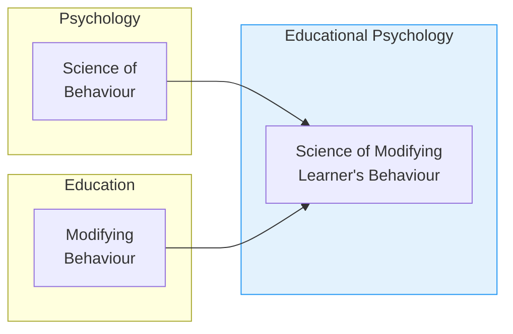

# 1:03 Definition of Educational Psychology

!!! abstract "Section Overview"
    This section defines **Educational Psychology** as a branch of psychology concerned with psychological research applied to educational processes and practices, with the classroom serving as the laboratory for educational psychologists.

---

## 📖 Definition

!!! quote "Definition"
    **Educational Psychology** is defined as that branch of psychology which is concerned with **psychological researches as applied to any or all aspects of educational processes and practices**. It is in relation to problems like **learning, teaching and training**.

---

## 🔬 The Classroom as Laboratory

| General Psychology | Educational Psychology |
|-------------------|------------------------|
| Laboratory experiments | **Classroom** is the laboratory |
| Studies behaviour generally | Studies learner's behaviour specifically |
| Broad scope | Focused on educational settings |

!!! note "Key Points 📌"
    The **classroom** is the laboratory for educational psychologists. This is where theories are tested and applied in real educational situations.

---

## 🎯 Purpose of Educational Psychology

According to **Kolesnik** (Russian Psychologist):

!!! quote "Kolesnik's View"
    By applying the **principles and laws of psychology** in educational situations, educational psychology tries to **solve the different problems faced in the educative process** so as to make it **more effective and efficient**.

---

## 🔄 Relationship with Psychology and Education

| Discipline | Definition | Focus |
|------------|------------|-------|
| **Psychology** | Science of behaviour | Understanding behaviour |
| **Education** | Deliberate process of modifying behaviour | Systematic change |
| **Educational Psychology** | Science of modifying learner's behaviour | Practical application |

---

## 📚 Redden's Definition of Education

!!! quote "Definition"
    **Education** is the deliberate process of modifying one's behaviour (**knowledge, skills and attitude**) through a sequence of **systematically planned experiences** to achieve the **predetermined goals and objectives**.

---

## 🎓 Ultimate Goal of Educational Psychology

!!! success "Core Objective"
    Educational Psychology aims to **modify the learner's behaviour** so as to:
    
    - **Refine his personality**
    - **Make him an efficient and responsible citizen**

---

## 📊 Key Elements

| Element | Role in Educational Psychology |
|---------|-------------------------------|
| **Principles of Psychology** | Provide theoretical foundation |
| **Educational Situations** | Provide context for application |
| **Problem-Solving** | Core activity of the discipline |
| **Effectiveness** | Goal of making education better |

---

## 📝 Quick Revision Table

| Aspect | Description |
|--------|-------------|
| **Definition** | Psychology applied to educational processes |
| **Laboratory** | Classroom |
| **Focus** | Learning, teaching, training |
| **Goal** | Effective and efficient education |
| **Ultimate Aim** | Refine personality, create responsible citizens |

---

> **Bridge →** Having defined Educational Psychology, the next section explores its **nature** - what makes it a unique and independent field of study.

---

!!! tip "Exam Tip 📝"
    Remember that Educational Psychology is the **application** of psychological principles to education. Questions often ask about the relationship between psychology and education, or the practical purpose of educational psychology.
