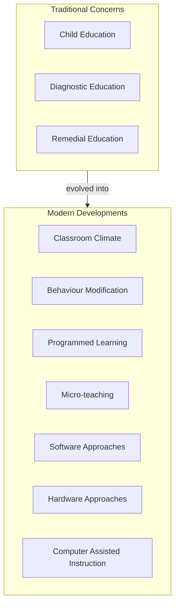
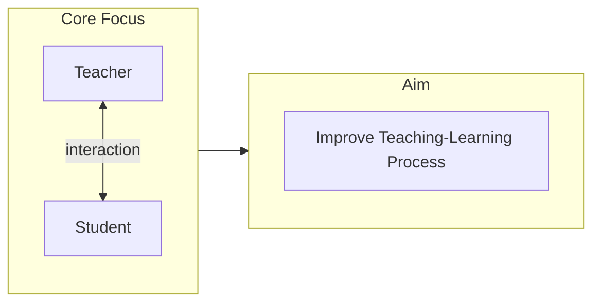

# 1:04 Nature of Educational Psychology

!!! abstract "Section Overview"
    This section explores the **nature of Educational Psychology** as an independent field of study, highlighting its tremendous advancement and the wide range of educational problems that come under its purview.

---

## 📚 Educational Psychology as an Independent Study

!!! note "Key Points 📌"
    Educational Psychology has made **tremendous advancement** and gradually established itself as an **independent study**. Most educational problems come under its purview.

---

## 🎯 Areas Under Educational Psychology

### Areas of Study and Application

| Area | Description |
|------|-------------|
| **Child Education** | Understanding how children learn and develop |
| **Diagnostic & Remedial Education** | Identifying learning problems and providing solutions |
| **Education for Gifted** | Specialized approaches for talented students |
| **Education for Handicapped** | Inclusive education strategies |
| **Factors Affecting Learning** | Understanding variables that impact learning |
| **Principles of Evaluation** | Assessment and measurement of learning |

---

## 🔬 Modern Developments in Educational Psychology

### Techniques and Approaches Developed

| Development | Purpose |
|-------------|---------|
| **Classroom Climate Study** | Understanding learning environment |
| **Behaviour Modification Techniques** | Changing learner behaviour systematically |
| **Programmed Learning** | Self-paced, structured learning |
| **Micro-teaching** | Training teachers in specific skills |
| **Software Approaches** | Content-based instructional materials |
| **Hardware Approaches** | Technology-based teaching aids |
| **Computer Assisted Instruction (CAI)** | Using computers for individualized learning |

---

## 🎓 Proof of Independent Status

!!! success "Evidence of Independence"
    The following areas bear proof to the claim that educational psychology is a **special field of study**:
    
    1. Child education
    2. Diagnostic and remedial education
    3. Education for the gifted and handicapped
    4. Factors affecting learning
    5. Principles of evaluation

---

## 💡 Key Insight

!!! info "Information"
    **Advanced techniques of instruction are through and through psychological by nature.**
    
    This means that all modern teaching innovations are fundamentally grounded in psychological principles about how people learn and behave.

---

## 🎯 Focus of Educational Psychology

---

## 📝 Quick Revision Table

| Aspect | Description |
|--------|-------------|
| **Status** | Independent field of study |
| **Traditional Areas** | Child education, diagnostic education, evaluation |
| **Modern Areas** | Behaviour modification, CAI, micro-teaching |
| **Core Focus** | Teacher-student interaction |
| **Nature** | Psychological foundations of education |

---

> **Bridge →** Understanding the nature of Educational Psychology leads us to explore its **scope** - the specific areas and problems it addresses in education.

---

!!! tip "Exam Tip 📝"
    Remember the modern developments like **micro-teaching**, **programmed learning**, and **CAI** as examples of how educational psychology contributes to improving instruction.
