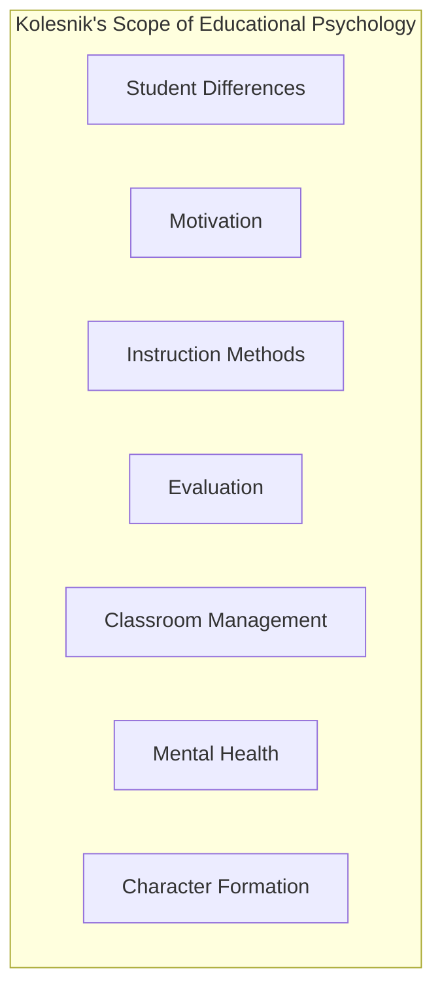
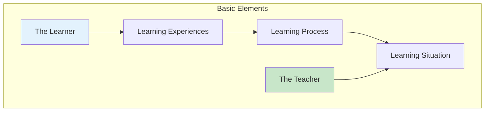
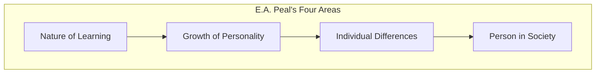

# 1:05 Scope of Educational Psychology

!!! abstract "Section Overview"
    This section explores the **scope of Educational Psychology** according to various scholars including **Blair, Jones and Simpson**, **Kolesnik**, **H.C. Lindgren**, **Garrison et al.**, and **E.A. Peal**, covering the major areas and focal points of the discipline.

---

## 🎯 Philosophy vs Psychology in Education

!!! quote "Blair, Jones and Simpson"
    **Educational Philosophy** is primarily concerned with the question of **"what should be done"** and **Educational Psychology** attempts to answer the question of **"how it can be done"**.

| Discipline | Question Addressed | Focus |
|------------|-------------------|-------|
| **Educational Philosophy** | What should be done? | Ends (Goals) |
| **Educational Psychology** | How can it be done? | Means (Methods) |

!!! note "Key Points 📌"
    Educational psychology for most part is interested in **means rather than ends**.

---

## 📚 Kolesnik's View on Scope

According to **Kolesnik**, the following problems dealt by educational psychologists form the scope of educational psychology:

| Area | Description |
|------|-------------|
| **i) Differences among students** | Understanding individual variations |
| **ii) Motivation** | What drives students to learn |
| **iii) Methods of instruction** | How to teach effectively |
| **iv) Evaluation** | Assessing learning outcomes |
| **v) Classroom management** | Organizing the learning environment |
| **vi) Mental health** | Psychological well-being of students |
| **vii) Character formation** | Moral and ethical development |

---

## 🔬 H.C. Lindgren's View

!!! quote "Lindgren's View"
    Educational Psychology revolves around the **behaviour of the learner in educational situations** and as such it should limit itself to the **teaching-learning process** and the **educational environment**.

### Five Basic Elements of Educational Psychology

---

### (i) The Learner

!!! info "The First Focal Area"
    The **learner** is around whom the whole subject-matter is knitted. This area acquaints us with the **need of knowing the learner** and deals with the **techniques of knowing him well**.

| Aspect of Learner | What is Studied |
|-------------------|-----------------|
| **Innate abilities** | Natural capacities of the individual |
| **Individual differences** | Variations and their measurement |
| **Overt behaviour** | Observable actions |
| **Covert behaviour** | Internal mental processes |
| **Conscious behaviour** | Aware actions |
| **Unconscious behaviour** | Unaware influences |
| **Growth & Development** | Characteristics from childhood to adulthood |

---

### (ii) The Learning Experiences

!!! info "Deciding What to Teach"
    Educational Psychology helps in deciding **what learning experiences are desirable**, at **what stage of growth and development** so that these experiences could be acquired with **great ease and satisfaction**.

| Focus | Purpose |
|-------|---------|
| **Selection of experiences** | Choosing appropriate content |
| **Timing of experiences** | Matching to developmental stage |
| **Ease of acquisition** | Making learning comfortable |
| **Satisfaction** | Ensuring positive learning outcomes |

---

### (iii) The Learning Process

!!! info "Understanding How Learning Occurs"
    This area deals with the **nature of learning** and **how it takes place**.

| Topic | Description |
|-------|-------------|
| **Laws of learning** | Principles governing learning |
| **Principles of learning** | Guidelines for effective learning |
| **Theories of learning** | Explanatory frameworks |
| **Motivation** | Driving forces behind learning |
| **Transfer of learning** | Applying learning to new situations |
| **Remembering & Forgetting** | Memory processes |
| **Perceiving** | How we take in information |
| **Concept formation** | Building mental representations |
| **Thinking & Reasoning** | Cognitive processes |
| **Problem-solving** | Applying knowledge to challenges |

---

### (iv) The Learning Situation

!!! info "The Learning Environment"
    This area deals with **environmental factors** and **learning situations** that come midway between the learner and the teacher.

| Factor | Role |
|--------|------|
| **Classroom climate** | Atmosphere for learning |
| **Group dynamics** | Interaction patterns |
| **Techniques and aids** | Tools that facilitate learning |
| **Evaluation techniques** | Assessment methods |
| **Guidance and counselling** | Support services |

---

### (v) The Teacher

!!! info "Psychology of the Teacher"
    The teacher is a very important element in the teaching-learning process. The **Psychology of being a teacher** is also included in the scope.

| Aspect | Description |
|--------|-------------|
| **Motivations** | What drives teachers |
| **Conflicts** | Professional challenges |
| **Effectiveness** | Teaching success factors |
| **Professional growth** | Continuous development |
| **Mental health** | Teacher well-being |

!!! success "Goal"
    To inspire teachers to become **successful** and play their role properly in the process of education.

---

## 📊 Garrison et al.'s Major Divisions

According to **Garrison et al.**, the major divisions of educational psychology are:

### 1) The Child and His Development

| Topic | Focus |
|-------|-------|
| Course of development | Patterns of growth |
| Nature of intelligence | Cognitive abilities |
| Language and thinking | Communication and cognition |
| Socialization and its role | Social integration |

### 2) Learning and Educative Process

| Topic | Focus |
|-------|-------|
| Learning and motivation | Drives behind learning |
| Learning of skills | Acquiring abilities |
| Knowledge, understanding | Cognitive acquisition |
| Problem-solving | Applied thinking |
| Character development | Moral growth |

### 3) Evaluating Pupil-Growth

| Topic | Focus |
|-------|-------|
| Methods of pupil-evaluation | Assessment techniques |
| Studying the individual child | Case study approach |
| Learning difficulties at school | Identifying problems |
| Evaluating instruction results | Measuring effectiveness |

### 4) Guiding the Child

| Topic | Focus |
|-------|-------|
| Personality integration | Wholeness of character |
| Adjustment problems | Coping difficulties |
| Pupil-teacher relations | Interaction dynamics |

---

## 🎓 E.A. Peal's Summary

!!! quote "E.A. Peal's View"
    Educational psychology broadly deals with:
    
    1. **The nature of learning**
    2. **The growth of human personality**
    3. **The differences between individuals**
    4. **The study of the person in relation to society**

---

## 📝 Quick Revision Table

| Scholar | Key Focus Areas |
|---------|-----------------|
| **Kolesnik** | Student differences, Motivation, Methods, Evaluation, Classroom management, Mental health, Character |
| **Lindgren** | Learner, Learning experiences, Learning process, Learning situation, Teacher |
| **Garrison et al.** | Child development, Learning process, Evaluation, Guidance |
| **E.A. Peal** | Nature of learning, Personality growth, Individual differences, Person-society relation |

---

> **Bridge →** Having explored the scope of Educational Psychology, the next section compares it with General Psychology to understand their distinct focuses.

---

!!! tip "Exam Tip 📝"
    **Lindgren's five elements** (Learner, Learning Experiences, Learning Process, Learning Situation, Teacher) are frequently asked in exams. Remember them as the **L-L-L-L-T** framework.
