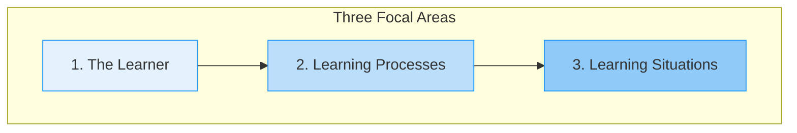
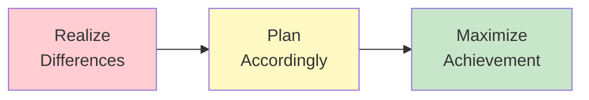

# 1:06 Differences Between General and Educational Psychology

!!! abstract "Section Overview"
    This section differentiates between **General Psychology** and **Educational Psychology**, highlighting that the basic difference lies in the **matter of focus** - General Psychology gives a comprehensive view of human behaviour while Educational Psychology focuses specifically on the behaviour of the learner.

---

## 🔄 Basic Difference: Focus

!!! note "Key Points 📌"
    The basic difference between General Psychology and Educational Psychology appears to be the **matter of focus**.

| Aspect | General Psychology | Educational Psychology |
|--------|-------------------|------------------------|
| **Scope** | Comprehensive view of human behaviour | Behaviour of the learner |
| **Population** | All humans | Learners specifically |
| **Context** | Various life situations | Educational settings |

---

## 🎯 Three Focal Areas of Educational Psychology

---

### 1. The Learner

!!! info "Most Important Factor"
    The **learner has the most important place in the classroom**. One important factor that the teacher should know about the learner is that there are **individual differences** among learners.

| Type of Learner | Description |
|-----------------|-------------|
| **Gifted** | Above average abilities |
| **Average** | Typical abilities |
| **Slow Learners** | Below average abilities |

!!! warning "Classroom Reality"
    The class is generally **NOT homogeneous but heterogeneous** - containing students of varying abilities and learning speeds.

---

### 2. Learning Process

!!! quote "Definition"
    An **effective learning process** is one where the **instruction is individualised**.

| Component | Description |
|-----------|-------------|
| **Perception** | How students take in information |
| **Thinking** | Mental processing |
| **Reasoning** | Logical analysis |
| **Intelligence** | Cognitive capacity |
| **Remembering** | Memory functions |

---

### 3. Learning Situation

!!! quote "Definition"
    The learning situation includes conditions that affect learning, also known as **classroom climate**.

| Factor | Description |
|--------|-------------|
| **Physical factors** | Room setup, lighting, seating |
| **Tone of the class** | Atmosphere and mood |
| **Attitude of teacher** | Teacher's disposition |
| **Behaviour of teacher** | Teacher's actions |

---

## 📊 Comparison Table

| Aspect | General Psychology | Educational Psychology |
|--------|-------------------|------------------------|
| **Focus** | Human behaviour generally | Learner's behaviour specifically |
| **Setting** | Various contexts | Classroom and school |
| **Diversity** | General population | Heterogeneous classroom |
| **Application** | Broad understanding | Teacher preparation |
| **Goal** | Understand behaviour | Maximize achievement |

---

## 🎓 Practical Implication

!!! success "Educational Psychology's Aim"
    Educational Psychology aims to **prepare the teacher** to:
    
    1. **Realize** the individual differences among pupils
    2. **Plan accordingly** to maximize achievement
    3. **Care for** each individual learner entrusted to them

---

## 📝 Quick Revision Table

| Feature | General Psychology | Educational Psychology |
|---------|-------------------|------------------------|
| **View** | Comprehensive | Focused |
| **Subject** | All humans | Learners |
| **Areas** | Multiple | 3 focal areas (Learner, Process, Situation) |
| **Classroom** | Not central | Central focus |
| **Individual Differences** | Acknowledged | Critical consideration |

---

> **Bridge →** Understanding these differences, we now explore the **significance** of Educational Psychology and how it helps teachers in their professional practice.

---

!!! tip "Exam Tip 📝"
    Questions often ask about the **three focal areas** of educational psychology (Learner, Learning Process, Learning Situation). Remember that the key difference from general psychology is the **educational context** and **focus on the learner**.
