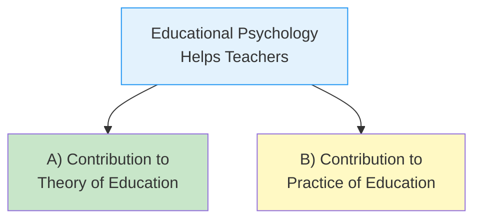
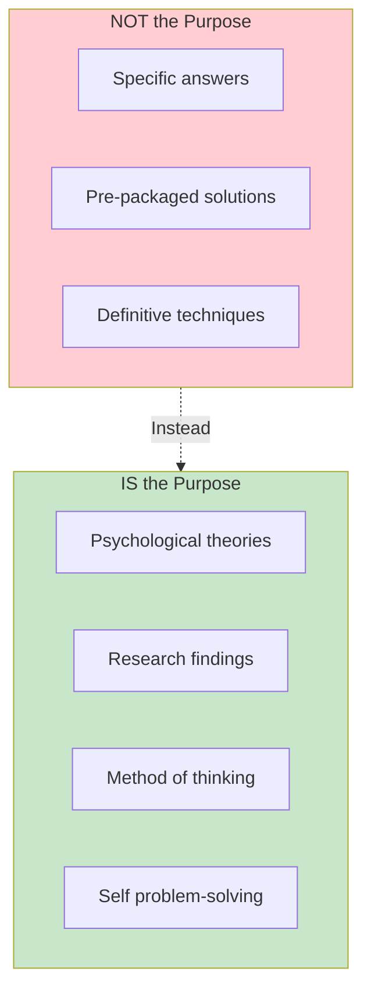

# 1:07 Significance of Educational Psychology

!!! abstract "Section Overview"
    This section explores the **significance of Educational Psychology** for teachers, covering both its contributions to **theory of education** and its applications in the **practice of education**, culminating with **Kolesnik's summary** of the purpose of educational psychology.

---

## 🎯 Overview

Educational psychology helps the teacher in two major ways:

---

## A) Contribution to Theory of Education

### 1) Understanding Development Characteristics of Children

!!! example "Analogy"
    To be a **successful doctor**, one must have:
    
    - Required professional knowledge and skills
    - Knowledge about the **nature of the patient** whom he wants to treat
    
    Similarly, to be a **successful teacher**, one must know about the **science of behaviour of learners**.

| Stage | Characteristics to Understand |
|-------|------------------------------|
| **Infancy** | Dependency, basic development |
| **Childhood** | Learning foundations, socialization |
| **Adolescence** | Identity formation, physical changes |

!!! note "Key Points 📌"
    If the prospective teacher knows these characteristics, he can utilize them in **imparting instruction** and **moulding behaviour** according to the specified goal of education.

---

### 2) Understanding the Nature of Classroom Learning

| Knowledge Area | Purpose |
|----------------|---------|
| **Principles of learning** | Guide effective instruction |
| **Approaches to learning process** | Multiple methods understanding |
| **Problems of learning** | Identification of difficulties |
| **Remedial measures** | Solutions for learning problems |
| **Factors affecting learning** | Understanding influences |
| **Guidance for effective learning** | Practical application |

---

### 3) Understanding Individual Differences

!!! info "Information"
    The teacher must understand individual differences and **adjust his teaching** to the needs and requirements of the class which has a **great range of individual differences**.

---

### 4) Understanding Effective Teaching Methods

| Aspect | Benefit |
|--------|---------|
| **Various theories** | Multiple approaches available |
| **Different age levels** | Age-appropriate methods |
| **Classroom teaching** | Uses several theories together |
| **Problem tackling** | Different approaches for different problems |

!!! note "Key Points 📌"
    Classroom teaching is **NOT dependent on any one theory**. It is related to and uses **several theories** of teaching-learning.

---

### 5) Understanding Causes of Problems

- Problems that occur at **different age levels**
- Successfully **solving** them with appropriate interventions

---

### 6) Knowledge of Mental Health

!!! warning "Critical Aspect"
    Mental health of **both the teacher and the taught** is very important for efficient learning.

| Factor | Impact |
|--------|--------|
| **Factors causing mental ill-health** | Teacher can identify |
| **Maladjustment causes** | Teacher can understand |
| **Prevention** | Teacher can prevent maladjustment |
| **Mental hygiene knowledge** | Essential for teachers |

---

### 7) Curriculum Construction

Psychological principles are used in formulating curriculum for different stages:

| Factor to Consider | Role in Curriculum |
|-------------------|-------------------|
| **Needs of pupils** | Content relevance |
| **Developmental characteristics** | Age-appropriateness |
| **Learning patterns** | Teaching methods |
| **Needs of society** | Social relevance |

---

### 8) Measurement of Learning Outcome

| Assessment Type | Purpose |
|-----------------|---------|
| **Psychological tools** | Assess student learning outcome |
| **Teaching evaluation** | Evaluate teaching methods |
| **Performance analysis** | Modify strategy of teaching |

---

### 9) Guidance for Education of Exceptional Children

- Special education approaches for gifted and challenged students

### 10) Helps to Develop Positive Attitude

- Fostering constructive mindset in learners

### 11) Understanding of Group Dynamics

- Managing classroom interactions effectively

---

## B) Contribution to Practice of Education

### 1) Problem of Discipline

| Traditional Approach | Modern Approach |
|---------------------|-----------------|
| "Spare the rod and spoil the child" | Corporal punishment is **inhumane** |
| Autocratic teacher | **Democratic** teacher |
| Punishment without understanding | Examining **causal factors** scientifically |

!!! warning "Historical Note"
    Traditional teachers believed in the dictum "spare the rod and spoil the child" - Modern teachers realize that corporal punishment is inhumane.

---

### 2) Use of A.V. Aids

!!! success "Modern Teaching"
    Teaching with the use of aids that affect **multiple senses** of the learner is **more effective and lasting**.

| Approach | Description |
|----------|-------------|
| **Hardware approaches** | Physical equipment and technology |
| **Software approaches** | Content and materials |
| **Multi-sensory learning** | Engaging multiple senses |

---

### 3) School and Classroom Administration

| Traditional | Modern |
|-------------|--------|
| Dictatorial | **Participative** |
| Top-down | Democratic |
| Rigid | Flexible |

---

### 4) Time Table Construction

!!! tip "Exam Tip 📝"
    **Key Principle**: No two difficult subjects are taught in successive periods.

| Consideration | Rationale |
|--------------|-----------|
| **Difficulty level** | Varying cognitive demands |
| **Fatigue index** | Managing student energy |
| **Subject sequencing** | Optimizing learning |

---

### 5) Co-curricular Activities

| Traditional View | Modern View |
|-----------------|-------------|
| Wastage of time | **Due importance** given |
| Focus only on theoretical subjects | **Harmonious development** of personality |

**Activities valued now:**

- Debate and Drama
- Scouting
- Games and Sports
- Cultural activities

---

### 6) Use of Innovative Methods

| Innovation | Description |
|------------|-------------|
| **Activity-centred teaching** | Learning by doing |
| **Discussion method** | Collaborative learning |
| **Micro-teaching** | Skill-based teacher training |
| **Programmed instruction** | Self-paced learning |
| **Non-graded school classes** | Flexible grouping at primary stage |

---

### 7) Production of Text Books

Text books are now written considering:

| Factor | Application |
|--------|-------------|
| **Intellectual development** | Age-appropriate content |
| **Needs of children** | Relevant material |
| **Interests at different age levels** | Engaging content |

---

## 📜 Kolesnik's Summary

!!! quote "W.B. Kolesnik's View"
    "The purpose of educational psychology is **NOT** to give specific, definitive answers to questions about methods of teaching or techniques of dealing with children, **NOT** to arm the teacher in advance with pre-packaged solutions to the many practical problems that he is likely to encounter in the classroom.
    
    Its purpose, rather, is to **introduce him to psychological theories and research findings** about learners and the learning process, and to a **method of thinking psychologically**, that may help him **answer his own questions**, **reach his own conclusions** and **solve his own problems**."

---

## 📝 Quick Revision Table

| Contribution Area | Key Points |
|-------------------|------------|
| **Theory** | Understanding development, learning, individual differences, mental health |
| **Practice** | Discipline, A.V. aids, time-table, co-curricular activities, innovations |
| **Kolesnik's View** | Psychological thinking, not pre-packaged solutions |

---

## 🧠 Memory Mnemonic

!!! tip "Remember Theory Contributions: DUCK-CMG"
    - **D**evelopment characteristics
    - **U**nderstanding classroom learning
    - **C**hildren's problems
    - **K**nowledge of mental health
    - **C**urriculum construction
    - **M**easurement of learning
    - **G**uidance for exceptional children

---

> **Bridge →** Having explored Educational Psychology thoroughly, we now transition to understanding the concepts of **Growth** and **Development** - fundamental to understanding learners.

---

!!! success "Section Summary"
    Educational Psychology contributes to both theory (understanding learners, learning, development) and practice (discipline, A.V. aids, innovative methods) of education. Its ultimate purpose is to equip teachers with psychological thinking skills to solve their own classroom problems.
