# 1:08 Meaning of the term 'Growth'

!!! abstract "Section Overview"
    This section defines **Growth** as a physical, quantitative change that can be objectively observed and measured, including increase in size, length, height, and weight. It also covers the **characteristics of growth** (1:08:1).

---

## 📖 Definition of Growth

!!! quote "Definition"
    In the strict sense of terminology, the term **'Growth'** is used purely in the **physical sense**. It generally refers to **increase in size, length, height and weight**. Changes in the **quantitative aspects**, which could be **objectively observed and measured**, come into the domain of growth.

---

## 🔄 Relationship with Development

!!! note "Key Points 📌"
    - **Growth** is one of the components of the developmental process
    - In a sense, development in its **quantitative aspect** is termed as growth

---

## 📏 What Growth Includes

| Aspect | Examples |
|--------|----------|
| **Size** | Body getting bigger |
| **Length** | Arms, legs getting longer |
| **Height** | Getting taller |
| **Weight** | Getting heavier |

---

# 1:08:1 Characteristics of 'Growth'

## 📋 Eight Characteristics of Growth

### 1) Increase in Size

!!! info "Characteristic 1"
    Growth refers to **increase** caused by becoming **larger and heavier**.

### 2) Quantitative Nature

!!! info "Characteristic 2"
    Growth is:
    
    - **Quantitative** - measurable in numbers
    - **Additive** - adds to what exists
    - **Augmental** - increases

### 3) Observable and Measurable

!!! info "Characteristic 3"
    Growth is **objectively observable and measurable** using tools like scales, measuring tapes, etc.

### 4) Stops at Maturity

!!! info "Characteristic 4"
    Growth **does not continue throughout life** - it **stops when maturity has been obtained**.

### 5) May or May Not Bring Development

!!! warning "Characteristic 5"
    Growth **may or may not bring development**.
    
    **Example**: A child may grow (in terms of weight) by becoming **fat**, but this growth may not bring any **functional improvement** (qualitative change) or development.

### 6) Non-uniform Rate

!!! info "Characteristic 6"
    **Rate of growth is NOT uniform**:
    
    | Period | Rate |
    |--------|------|
    | Early years of life | **Rapid** |
    | Later years of infancy | **Slows down** |
    | Puberty | **Sudden rise** again |

```mermaid
flowchart LR
    subgraph RATE["Growth Rate Pattern"]
        A["Early Years<br/>⬆️ Rapid"] --> B["Later Infancy<br/>⬇️ Slows"]
        B --> C["Puberty<br/>⬆️ Sudden Rise"]
    end
```

### 7) Individual Differences

!!! info "Characteristic 7"
    There exist **wide range of individual differences** among children with respect to growth.

### 8) Different Rates in Different Parts

!!! info "Characteristic 8"
    The **rate of growth of different parts of the body is different**.
    
    Example: Brain grows faster than limbs in early years.

---

## 📊 Summary Table of Growth Characteristics

| # | Characteristic | Description |
|---|----------------|-------------|
| 1 | **Increase** | Becoming larger and heavier |
| 2 | **Quantitative** | Additive and augmental |
| 3 | **Observable** | Objectively measurable |
| 4 | **Stops at Maturity** | Has an end point |
| 5 | **May/May Not = Development** | Not always functional improvement |
| 6 | **Non-uniform Rate** | Varies across life stages |
| 7 | **Individual Differences** | Children vary in growth |
| 8 | **Differential Body Parts** | Different parts grow differently |

---

## 🧠 Memory Mnemonic

!!! tip "Remember Growth Characteristics: IQOS-INID"
    - **I**ncrease in size
    - **Q**uantitative, additive
    - **O**bservable, measurable
    - **S**tops at maturity
    - **I**ndependent of development (may/may not lead to it)
    - **N**on-uniform rate
    - **I**ndividual differences
    - **D**ifferent rates in body parts

---

## 📝 Quick Revision Table

| Aspect | Key Point |
|--------|-----------|
| **Definition** | Physical increase in size, length, height, weight |
| **Nature** | Quantitative, observable, measurable |
| **Duration** | Stops at maturity |
| **Rate** | Non-uniform across life stages |
| **Relationship** | One component of development |

---

> **Bridge →** Having understood Growth, we now explore **Development** - a broader concept that includes both quantitative and qualitative changes.

---

!!! tip "Exam Tip 📝"
    Remember that growth is **physical and quantitative only**. The classic example to remember is: becoming **fat** (growth) without becoming **stronger** (no development) illustrates how growth may not lead to development.
