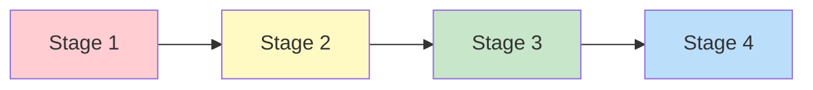

# 1:09 Meaning of the term 'Development'

!!! abstract "Section Overview"
    This section defines **Development** as overall changes in shape, form, or structure resulting in improved working or functioning, emphasizing its qualitative nature. It also covers the **characteristics of development** (1:09:1).

---

## 📖 Definition of Development

!!! quote "Definition"
    **Development** implies overall changes in **shape, form or structure** resulting in **improved working or functioning**. It indicates the changes in the **quality or character** rather than in quantitative aspects.

---

## 🔄 What Development Results From

!!! note "Key Points 📌"
    **Development is the result of:**
    
    1. **Growth** - Physical increase
    2. **Maturation** - Natural unfolding
    3. **Learning** - Experience-based change

---

## 📊 Growth vs Development Overview

| Aspect | Growth | Development |
|--------|--------|-------------|
| **Nature** | Quantitative | Qualitative |
| **Focus** | Size, weight, height | Shape, form, function |
| **Outcome** | Increase | Improved functioning |
| **Measurement** | Objective | Through observation |

---

# 1:09:1 Characteristics of 'Development'

## 📋 Eleven Characteristics of Development

### 1) Progressive, Directional, and Sequential

!!! info "Characteristic 1"
    Development is **progressive**: series of changes occur in an **orderly, predictable pattern** as a result of maturation and experience.
    
    Development is **'directional'** and **'sequential'**.

### 2) Continuous

!!! info "Characteristic 2"
    Development is **continuous in all areas of mental activity**. It **does not stop with puberty** as in the case of growth.

| Growth | Development |
|--------|-------------|
| Stops at puberty/maturity | Continues throughout life |

### 3) Goal-oriented (Adaptation)

!!! info "Characteristic 3"
    The **goal of development** is to enable the individual to **adapt to the environment** in which he lives.
    
    **Development results in improved functioning of the individual.**

### 4) Complex and Integrative

!!! info "Characteristic 4"
    Development is a **complex process** of integrating many **structures and functions**.

### 5) Multi-dimensional with Individual Differences

!!! info "Characteristic 5"
    Development is of **many aspects**:
    
    - Physical
    - Emotional
    - Intellectual
    - Social
    - Moral
    
    **Individual differences** are seen in the different aspects of development.

### 6) Spiral (Not Linear) - Non-uniform Rate

!!! info "Characteristic 6"
    Rate of development is **NOT uniform** throughout the life span.
    
    The child makes **advancement** during a particular period and takes **rest** in the next following period to **consolidate** his development. In advancing, he **turns back** and then **moves forward** again like a **spiral**.

!!! note "Key Points 📌"
    Development is **SPIRAL** and **NOT LINEAR**.

### 7) Influenced by Maturation and Learning

!!! info "Characteristic 7"
    Development is influenced by:
    
    | Factor | Role |
    |--------|------|
    | **Maturation** | Natural unfolding of abilities |
    | **Learning** | Experience-based changes |

### 8) Environment-related

!!! info "Characteristic 8"
    Development is very much **related to one's environment**.
    
    **Stimulating environment helps an individual to develop many skills.**

### 9) Based on Modelling

!!! info "Characteristic 9"
    Development is based on **modelling** the parents, teachers and other elder members.

### 10) Cannot be Measured Directly

!!! info "Characteristic 10"
    Since development is **qualitative in nature**, it **cannot be measured directly**.
    
    It could be **assessed through keen observation** in behavioural situations.

| Growth | Development |
|--------|-------------|
| Measured directly | Assessed through observation |
| Use scales, tapes | Watch behaviour |

### 11) Possible Without Growth

!!! info "Characteristic 11"
    **Development is possible even without growth.**
    
    **Example**: Even short-statured people may exhibit **strong physical functioning**.

---

## 📊 Summary Table of Development Characteristics

| # | Characteristic | Description |
|---|----------------|-------------|
| 1 | **Progressive** | Orderly, predictable, sequential pattern |
| 2 | **Continuous** | Doesn't stop at puberty |
| 3 | **Goal-oriented** | Enables environmental adaptation |
| 4 | **Complex** | Integrates structures and functions |
| 5 | **Multi-dimensional** | Physical, emotional, intellectual, social, moral |
| 6 | **Spiral** | Non-linear, advances and consolidates |
| 7 | **Influenced** | By maturation and learning |
| 8 | **Environment-related** | Stimulating environment helps |
| 9 | **Modelling-based** | Learning from parents, teachers |
| 10 | **Not directly measurable** | Assessed through observation |
| 11 | **Independent of growth** | Possible without physical growth |

---

## 🧠 Memory Mnemonic

!!! tip "Remember Development Characteristics: PCGC-MSEMMP"
    - **P**rogressive and sequential
    - **C**ontinuous throughout life
    - **G**oal is adaptation
    - **C**omplex integration
    - **M**ulti-dimensional (PEISM: Physical, Emotional, Intellectual, Social, Moral)
    - **S**piral (not linear)
    - **E**nvironment-related
    - **M**odelling-based
    - **M**easured indirectly
    - **P**ossible without growth

---

## 📝 Quick Revision Table

| Aspect | Key Point |
|--------|-----------|
| **Definition** | Overall change in shape, form, structure → improved functioning |
| **Nature** | Qualitative |
| **Result of** | Growth + Maturation + Learning |
| **Duration** | Continuous throughout life |
| **Pattern** | Spiral, not linear |
| **Measurement** | Through observation, not direct measurement |

---

> **Bridge →** Having understood both Growth and Development separately, the next section provides a detailed **comparison** between these two concepts.

---

!!! tip "Exam Tip 📝"
    The key distinction is: **Growth is quantitative** (measurable), **Development is qualitative** (observable). Remember that development follows a **spiral pattern**, not linear - this is a frequently tested concept.
