# 1:10 Comparison between 'Growth' and 'Development'

!!! abstract "Section Overview"
    This section provides a detailed **point-by-point comparison** between Growth and Development across ten different dimensions, highlighting their fundamental differences in nature, measurement, duration, and outcomes.

---

## 📊 Comprehensive Comparison Table

| # | Aspect | Growth | Development |
|---|--------|--------|-------------|
| **1** | **Nature** | Quantitative i.e. it indicates increase, enlargement and augmentation | Both quantitative and qualitative; results in improved functioning of the individual |
| **2** | **Observation & Measurement** | Could be objectively observed and measured | Cannot be measured; could be assessed through keen observation in behavioural situations |
| **3** | **Duration** | Does not continue throughout the life-span; stops after maturation is obtained | Continuous in all areas of mental activity; does not stop after puberty |
| **4** | **Relationship** | Growth is one aspect of development | Development is complex and many-sided |
| **5** | **Location** | Occurs in different parts of the organism | Describes the changes in the organism as a whole; does not list changes in parts |
| **6** | **Direction** | Not directional | Progressive and sequential |
| **7** | **Rate** | Rate of growth is not uniform in all parts of the organism | Rate of development is also not uniform |
| **8** | **Individual Differences** | Individual differences exist in growth among children | Children differ in their level of development in different aspects (physical, social, emotional, intellectual) |
| **9** | **Learning Influence** | Not affected very much by learning | Learning and experience affect development to a very great extent |
| **10** | **Outcome** | May or may not lead to development | Development in one aspect promotes development in other aspects (integrative) |

---

## 📈 Visual Comparison

### Nature Comparison

### Duration Comparison

```mermaid
flowchart LR
    subgraph GROWTH_TIMELINE["Growth Timeline"]
        A["Birth"] --> B["Childhood"]
        B --> C["Puberty"]
        C --> D["STOPS ⛔"]
    end
    
    subgraph DEV_TIMELINE["Development Timeline"]
        E["Birth"] --> F["Childhood"]
        F --> G["Puberty"]
        G --> H["Adulthood"]
        H --> I["Old Age"]
        I --> J["CONTINUES ♾️"]
    end
```

---

## 🔍 Detailed Point Analysis

### 1. Quantitative vs Qualitative

| Growth | Development |
|--------|-------------|
| Numbers (height in cm, weight in kg) | Quality of functioning |
| Can measure with instruments | Observed through behaviour |
| Example: 150 cm tall | Example: Can run faster |

### 2. Observable and Measurable

| Growth | Development |
|--------|-------------|
| Use tape measures, scales | Watch and observe |
| Get exact numbers | Make qualitative judgments |
| Objective data | Behavioural assessment |

### 3. Stops vs Continues

!!! warning "Critical Difference"
    **Growth**: Has an **end point** at maturity
    
    **Development**: Is **lifelong** - continues even in old age

### 4. Part vs Whole

| Growth | Development |
|--------|-------------|
| Height grows | Whole personality develops |
| Weight increases | Multiple aspects integrate |
| Individual organs grow | Organism as a whole changes |

### 5. Directional Nature

```mermaid
flowchart TB
    subgraph GROWTH_DIR["Growth Direction"]
        G["No specific direction"]
        G --> G1["Random across parts"]
    end
    
    subgraph DEV_DIR["Development Direction"]
        D["Progressive & Sequential"]
        D --> D1["Stage 1 → Stage 2 → Stage 3"]
    end
```

### 6. Learning Influence

| Factor | Growth | Development |
|--------|--------|-------------|
| **Learning** | Minimal effect | Major effect |
| **Experience** | Little influence | Great influence |
| **Environment** | Limited role | Critical role |

### 7. Integrative Nature of Development

!!! success "Development is Integrative"
    Development in one aspect **promotes development in other aspects**:
    
    - Physical → Enables intellectual
    - Social → Supports emotional
    - Intellectual → Enhances social

---

## 📝 Quick Comparison Summary

| Dimension | Growth | Development |
|-----------|--------|-------------|
| **What** | Increase | Improvement |
| **How measured** | Directly | By observation |
| **When stops** | At maturity | Never |
| **Where** | Body parts | Whole organism |
| **Direction** | No | Yes (sequential) |
| **Learning effect** | Little | Much |
| **Outcome** | May not improve function | Always improves function |

---

## 🧠 Memory Mnemonic

!!! tip "Remember the Key Differences: QDOM-LDIO"
    **Growth vs Development differences:**
    
    - **Q**uantitative vs Qualitative
    - **D**irect measurement vs Observation
    - **O**ne aspect vs Many-sided
    - **M**aturity stops it vs Mental activity continues
    - **L**earning little effect vs Large effect
    - **D**irection absent vs Directional
    - **I**ndividual parts vs Integrated whole
    - **O**utcome uncertain vs Outcome positive

---

## ❓ Common Exam Questions

| Question Type | Focus Area |
|--------------|------------|
| Define and differentiate | Nature and definitions |
| List differences | 10-point comparison |
| Explain with examples | Growth without development |
| Relationship | Growth as part of development |

---

> **Bridge →** Having compared Growth and Development, we now explore **Maturation** - a key concept that relates to both.

---

!!! tip "Exam Tip 📝"
    The classic example for "growth without development": A child becoming **fat** (growth in weight) but not becoming **functionally stronger** (no development). This illustrates that growth may or may not lead to development.
