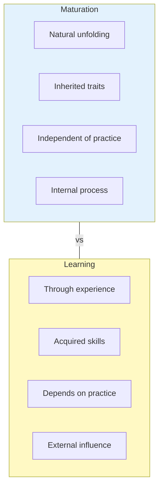

# 1:11 Meaning of Maturation

!!! abstract "Section Overview"
    This section defines **Maturation** as a natural process involving the growth that takes place within the individual, resulting from the unfolding and ripening of inherited traits, relatively independent of activity, practice, or experience.

---

## 📖 Definition of Maturation

!!! quote "Definition"
    **Maturation** is a **natural process**. It is the **growth which takes place within the individual**. The maturational changes are the result of **unfolding and ripening of inherited traits** and are **relatively independent of activity, practice or experience**.

---

## 🔬 Key Features of Maturation

| Feature | Description |
|---------|-------------|
| **Nature** | Natural process |
| **Location** | Takes place within the individual |
| **Source** | Unfolding of inherited traits |
| **Independence** | Relatively independent of practice/experience |
| **Association** | Associated with normal growth |

---

## 📊 Maturation vs Learning

| Aspect | Maturation | Learning |
|--------|------------|----------|
| **Source** | Heredity | Environment |
| **Process** | Unfolding | Acquisition |
| **Practice** | Not required | Essential |
| **Nature** | Internal | External influence |

---

## 🌱 What Maturation Involves

!!! note "Key Points 📌"
    Maturation involves changes that are associated with **normal growth**:
    
    - Physical maturation (bodily changes)
    - Neural maturation (brain development)
    - Sexual maturation (puberty)
    - Cognitive maturation (mental capabilities)

---

## 💡 Examples of Maturation

| Maturational Change | Description |
|---------------------|-------------|
| **Walking** | Child walks when muscles and nervous system are mature, not just from practice |
| **Puberty changes** | Hormonal changes occur naturally at a certain age |
| **Teeth eruption** | Baby teeth appear at developmental schedule |
| **Voice changes** | Voice deepens in adolescence naturally |

---

## 📝 Quick Revision Points

| Aspect | Key Point |
|--------|-----------|
| **Definition** | Natural growth within the individual |
| **Basis** | Unfolding of inherited traits |
| **Independence** | Relatively independent of practice/experience |
| **Association** | Linked to normal growth |
| **Nature** | Internal, hereditary |

---

> **Bridge →** Having understood Maturation, we now explore its **relationship with Growth and Development** to see how these three concepts interact.

---

!!! tip "Exam Tip 📝"
    Remember: Maturation is **nature-driven** (heredity), while Learning is **nurture-driven** (environment). A child cannot walk before the muscles are **mature**, no matter how much practice is given. This illustrates the principle of **readiness** in learning.
