# 1:12 Relationship between Growth, Development and Maturation

!!! abstract "Section Overview"
    This section explains the **interrelationship** between Growth, Development, and Maturation, clarifying how these three concepts work together while maintaining their distinct characteristics.

---

## 📖 Definitions Recap

| Term | Definition |
|------|------------|
| **Growth** | Increase in size, length, height and weight; quantitative in nature |
| **Development** | Overall changes in shape, form or structure resulting in improved working or functioning |
| **Maturation** | Maximum level of growth; the point where growth stops |

---

## 🔄 The Relationship Model

---

## 📊 Key Relationships

### 1. Growth → Maturation → Development

!!! note "Key Points 📌"
    - **Growth** in an organism continues until it reaches a **maximum limit**
    - This maximum level of growth is referred to as **'Maturation'**
    - **Development** is a continuous process lasting throughout the life of the organism

### 2. Timeline of Each Process

```mermaid
flowchart LR
    subgraph TIMELINE["Life Timeline"]
        B["Birth"] --> C["Childhood"]
        C --> P["Puberty"]
        P --> A["Adulthood"]
        A --> O["Old Age"]
    end
    
    subgraph GROWTH_LINE["Growth"]
        G1["Active"] --> G2["Active"]
        G2 --> G3["STOPS ⛔"]
    end
    
    subgraph DEV_LINE["Development"]
        D1["Active"] --> D2["Active"]
        D2 --> D3["Active"]
        D3 --> D4["Active"]
        D4 --> D5["CONTINUES ♾️"]
    end
```

| Process | When it Occurs | When it Stops |
|---------|----------------|---------------|
| **Growth** | Before maturation | At maturation |
| **Development** | Before and after maturation | Never (lifelong) |
| **Maturation** | Peak of growth | Point of reaching maximum |

---

## 🧬 Determining Factors

| Factor | Growth | Development | Maturation |
|--------|--------|-------------|------------|
| **Heredity** | ✅ Major role | ⚡ Some role | ✅ Major role |
| **Environment** | ⚡ Some role | ✅ Significant role | ⚡ Some role |

!!! info "Information"
    - **Growth and Maturation** are largely determined by **heredity**
    - **Environmental influences** play a significant role in determining **development**

---

## 🎯 Summary Statement

!!! success "Key Relationship"
    In short:
    
    1. **Growth and Development go hand in hand**
    2. **Growth stops after maturation**
    3. **Development continues as long as the organism is alive**

---

## 📋 Comparison Summary Table

| Aspect | Growth | Development | Maturation |
|--------|--------|-------------|------------|
| **Nature** | Quantitative | Qualitative | Maximum growth |
| **Measurement** | Objective | Observation-based | Point reached |
| **Duration** | Till maturation | Lifelong | End point |
| **Determinant** | Heredity | Environment | Heredity |
| **Observable** | Yes | Through behaviour | As growth peak |

---

## 🔄 Visual Summary

---

## 📝 Quick Revision Points

| Relationship | Explanation |
|--------------|-------------|
| **Growth → Maturation** | Growth stops when maturation is reached |
| **Growth → Development** | Growth contributes to development |
| **Maturation → Development** | Development continues after maturation |
| **Heredity role** | Primarily affects growth and maturation |
| **Environment role** | Primarily affects development |

---

> **Bridge →** Understanding these relationships, we now explore the various **dimensions of human development** to see how development manifests in different areas of human life.

---

!!! tip "Exam Tip 📝"
    **Memory Key**: 
    - **Growth + Maturation = Heredity dominant**
    - **Development = Environment plays significant role**
    - **Growth stops, Development continues**
