# 1:13 Dimensions of Human Development

!!! abstract "Section Overview"
    This section explores the **major aspects/dimensions of human growth and development**, including Physical, Intellectual, Emotional, Moral, Social, and Language Development, explaining how these cut across all developmental stages from infancy through adulthood.

---

## 📚 Overview of Development Dimensions

!!! note "Key Points 📌"
    We can distinguish certain aspects of human development that **cut across and continually proceed** through the various stages of development such as infancy, childhood, adolescence and adulthood.

---

## (i) Physical Development

!!! quote "Definition"
    **Physical Development** consists of two components: **Anatomical growth** and **Physiological growth**, along with **Motor Development**.

### Two Components of Physical Development

### Comparison: Anatomical vs Physiological Growth

| Anatomical Growth | Physiological Growth |
|-------------------|---------------------|
| Growth in skeleton | Changes in internal organs |
| Changes in quality and number of bones | Heart, lungs, liver |
| Changes in height, weight | Bladder, kidney, intestine |
| External structure | Stomach, brain, muscles |

### Motor Development

!!! info "Information"
    **Motor Development** refers to the growth and development of **bodily organs like the limbs** and the **related muscles** that activate them so that **functional efficiency (Manipulative skills)** is attained.

!!! note "Key Points 📌"
    Even though there are subtle differences between physical development and motor development, they are generally referred to as **Physical Development** as these two develop **jointly** and **cannot be viewed in isolation**.

---

## (ii) Intellectual or Mental Development

!!! quote "Definition"
    **Intellectual Development** (also known as **Cognitive Development**) includes the development of intellectual powers like thinking and reasoning, imagination, concentration, creativity, and various mental processes.

### Components of Intellectual Development

| Power | Description |
|-------|-------------|
| **Thinking** | Mental processing of information |
| **Reasoning** | Logical analysis and conclusions |
| **Imagination** | Creating mental images |
| **Concentration** | Focused attention |
| **Creativity** | Novel idea generation |
| **Sensation** | Receiving sensory input |
| **Perception** | Interpreting sensory input |
| **Memory** | Storing and retrieving information |
| **Association** | Connecting ideas |
| **Discrimination** | Distinguishing between stimuli |
| **Generalisation** | Drawing broad conclusions |

---

## (iii) Emotional Development

!!! quote "Definition"
    **Emotional Development** involves the evolution from a basic instinct of 'General Excitement' to differentiated primary emotions (joy, fear, anger) and complex secondary emotions, developing towards emotional maturity and balance.

### Evolution of Emotions

### Goal of Emotional Development

!!! success "Emotional Maturity"
    The emotional behaviour is developed to the point of **emotional maturity and balance of emotions** wherein the child learns to:
    
    1. **Control emotion**
    2. **Express the proper emotion at appropriate situations**
    3. **Use of language** is also resorted to

---

## (iv) Moral or Character Development

!!! quote "Definition"
    **Moral Development** includes the evolution of **moral sense** to discriminate the right and wrong and development of **character**. The individual develops his **ethical and moral codes**.

| Aspect | Description |
|--------|-------------|
| **Moral sense** | Ability to distinguish right from wrong |
| **Character** | Behavioral patterns reflecting values |
| **Ethical codes** | Personal standards of conduct |
| **Moral codes** | Rules of right behaviour |

!!! note "Key Points 📌"
    **Social development and moral development are intertwined.**

---

## (v) Social Development

!!! quote "Definition"
    **Social Development** is the process by which an initially self-centred and animalistic child develops into a **social being**, learning to behave according to the **rules and norms of society**.

### Progression of Social Development

### Outcomes of Social Development

| Outcome | Description |
|---------|-------------|
| **Following social rules** | Conformity to norms |
| **Getting along with others** | Interpersonal skills |
| **Participating in social activities** | Community involvement |
| **Striving for social maturity** | Full social adaptation |

---

## (vi) Language Development in Children

!!! quote "Definition"
    **Language Development** in children appears to be dramatic and depends upon **physical maturation** (like control of mouth and tongue). It passes through certain stages and exhibits individual differences.

### Stages of Language Development

```mermaid
flowchart TB
    subgraph PRELINGUAL["Pre-lingual Stage<br/>(Before 1 year)"]
        C["Cooing and Crying"]
        B["Babbling"]
        G["Gestures<br/>(smiling, head movements)"]
    end
    
    subgraph EARLY["Early Language"]
        W1["First word (~1 year)"]
        W2["10-12 words (~18 months)"]
        V1["Rapid vocabulary increase"]
        S1["Sentence formation (~2-3 years)"]
    end
    
    subgraph ADVANCED["Advanced Language"]
        S2["Improved sentences (4-5 years)"]
        G1["Grammar rules"]
        SC["School contribution (5½+)"]
    end
    
    PRELINGUAL --> EARLY --> ADVANCED
```

### Language Development Timeline

| Age | Language Milestone |
|-----|-------------------|
| **Before 1 year** | Pre-lingual: cooing, babbling, gestures |
| **~1 year** | First word |
| **~18 months** | 10-12 simple words |
| **~3 years** | Sizable vocabulary, mother tongue |
| **~12 years** | 10,000+ words |
| **2-3 years** | Sentence formation, pronouns, plural, past tense |
| **4-5 years** | Improved sentences, simple grammar |
| **After 5½** | School contributes to vocabulary, comprehension, pronunciation, writing |

### Piaget's Observation on Speech

!!! info "Piaget's Finding"
    According to Piaget, in children we can notice a shift from **ego-centric to socialized speech** as they grow.

| Speech Type | Characteristics |
|-------------|-----------------|
| **Ego-centric** | Self-focused, talking to self |
| **Socialized** | Communication with others, social purpose |

---

## 📊 Summary of All Dimensions

| Dimension | Key Focus | Goal |
|-----------|-----------|------|
| **Physical** | Body, organs, motor skills | Functional efficiency |
| **Intellectual** | Cognitive powers | Mental abilities |
| **Emotional** | Feelings, emotions | Emotional maturity |
| **Moral** | Right/wrong, character | Ethical conduct |
| **Social** | Society, relationships | Social maturity |
| **Language** | Communication | Effective expression |

---

## 🧠 Memory Mnemonic

!!! tip "Remember: PIEMSL"
    - **P**hysical (Anatomical + Physiological + Motor)
    - **I**ntellectual (Cognitive powers)
    - **E**motional (General excitement → Primary → Secondary)
    - **M**oral (Right/wrong, character)
    - **S**ocial (I-feeling → We-feeling)
    - **L**anguage (Pre-lingual → Lingual → Advanced)

---

> **Bridge →** Having explored the dimensions of development, we now look at the **developmental phases** through which human beings progress from birth to old age.

---

!!! tip "Exam Tip 📝"
    Be clear about the **two components of Physical Development** (Anatomical + Physiological) and **three types of emotional progression** (General Excitement → Primary → Secondary emotions).
