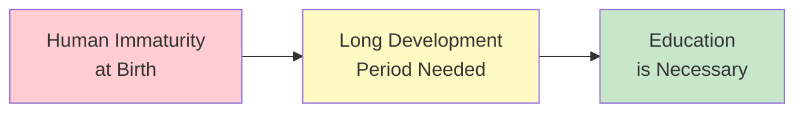
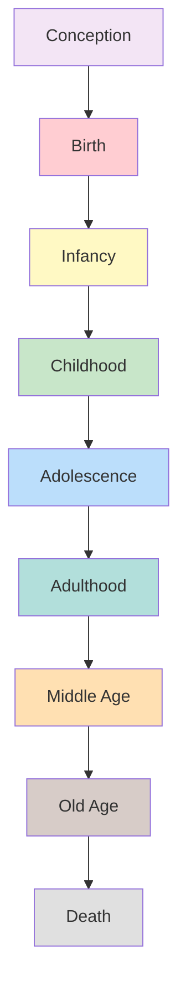

# 1:14 Development Phases

!!! abstract "Section Overview"
    This section introduces the concept of **developmental phases/stages**, explaining why humans have the longest period of immaturity at birth among mammals and how this necessitates education. It establishes the framework for understanding progressive, sequential developmental changes from conception till death.

---

## 🦁 Humans Among Mammals

!!! note "Key Points 📌"
    Of all the mammals, **man is the most immature at birth** and needs the **longest period of development** before he is capable of the activities and skills of his species.

| Comparison | Other Mammals | Humans |
|------------|---------------|--------|
| **At birth** | More mature | Most immature |
| **Development period** | Shorter | Longest |
| **Independence** | Achieved quickly | Takes many years |

---

## 📚 Implication for Education

!!! success "Educational Significance"
    This **prolonged period of immaturity** points to the **necessity of education**.

---

## 🔄 Nature of Developmental Changes

!!! quote "Key Principle"
    The human individual is a **developing organism** and **progressive sequential changes** take place in an **orderly pattern** from **conception till death**.

### Characteristics of Developmental Changes

| Feature | Description |
|---------|-------------|
| **Progressive** | Moving forward |
| **Sequential** | In a specific order |
| **Orderly pattern** | Predictable |
| **Timeline** | From conception to death |

---

## 📊 Why Study Developmental Phases?

!!! info "Information"
    These developmental changes could be **best understood** if we study them in **different phases of human life**, otherwise known as **'developmental stages'**.

### Benefits of Phase-wise Study

| Benefit | Explanation |
|---------|-------------|
| **Better understanding** | Complex changes simplified |
| **Predictability** | Know what to expect |
| **Planning** | Educational programs can be designed |
| **Intervention** | Problems can be addressed timely |

---

## 🎯 Framework for Understanding

---

## 📝 Quick Revision Points

| Concept | Key Point |
|---------|-----------|
| **Human uniqueness** | Most immature at birth among mammals |
| **Development period** | Longest among all mammals |
| **Implication** | Necessitates education |
| **Nature of changes** | Progressive, sequential, orderly |
| **Timeline** | Conception to death |
| **Study approach** | Phase-wise (developmental stages) |

---

> **Bridge →** Having understood why we study development in phases, the next section provides a detailed breakdown of the **important phases of development** with specific age ranges and characteristics.

---

!!! tip "Exam Tip 📝"
    Remember the key insight: **Human immaturity at birth → Longest development period → Necessity of education**. This connects biological development with the purpose of education.
