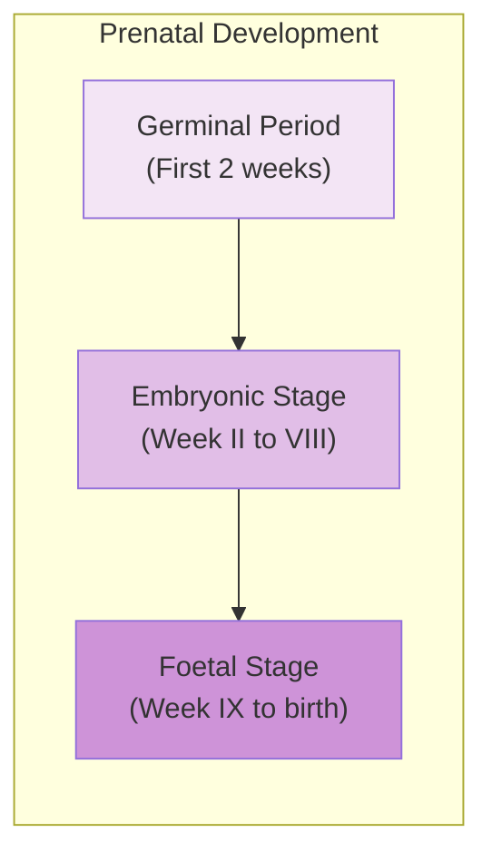
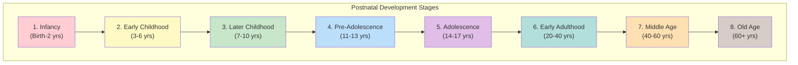
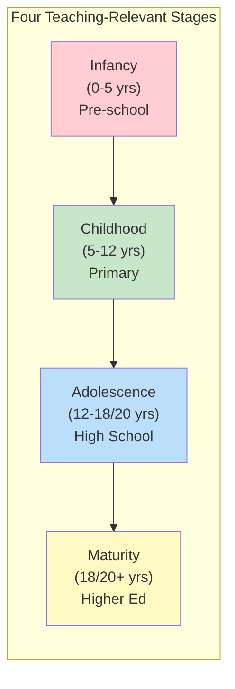

# 1:15 Important Phases of Development

!!! abstract "Section Overview"
    This section presents the **classification of human life-span** into developmental stages according to Hurlock, covering both **Prenatal** and **Postnatal** stages with specific age ranges, and telescopes them into four broader categories relevant for teachers.

---

## 📚 Classification of Developmental Stages

!!! note "Key Points 📌"
    Based on certain **common developmental characteristics**, psychologists have classified human life-span into developmental stages.

---

## I. Prenatal Stage (Conception to Birth)

### Prenatal Stages Detailed

| Stage | Period | Key Developments |
|-------|--------|------------------|
| **Germinal Period** | First 2 weeks | Zygote grows to ¼ inch |
| **Embryonic Stage** | Week II to VIII | Rudiments of bodily organs formed; Heart beat begins (~8 weeks) |
| **Foetal Stage** | Week IX to birth | Child attains full size and shape gradually |

!!! info "Key Feature"
    **Cell division and differentiation** characterize pre-natal development.

---

## II. Postnatal Stages

### Hurlock's Classification (10 Stages)

| # | Stage | Age Range |
|---|-------|-----------|
| 1 | **Infancy** | Birth to 2 years |
| 2 | **Early Childhood** | 3 to 6 years |
| 3 | **Later Childhood** | 7 to 10 years |
| 4 | **Pre-Adolescence** | 11 to 13 years |
| 5 | **Adolescence** | 14 to 17 years (strictly, upto onset of puberty) |
| 6 | **Early Adulthood** | 20 to 40 years |
| 7 | **Middle-age** | 40 to 60 years |
| 8 | **Old-age** | 60 years onwards |

### Key Feature of Postnatal Development

!!! info "Information"
    **Postnatal development** involves:
    
    - Increase in size
    - Diversity of functions
    - Complexity of functions

---

## 📊 Telescoped Categories for Teachers

!!! success "Practical Classification"
    The 10 stages may be **telescoped into 4 wider categories** as teachers generally deal only with these broad stages in their professional work.

| # | Broad Category | Age Range | Educational Level |
|---|----------------|-----------|-------------------|
| 1 | **Infancy** | Birth to 5 years | Pre-school |
| 2 | **Childhood** | 5 to 12 years | Primary/Middle School |
| 3 | **Adolescence** | 12 to 18/20 years | High School |
| 4 | **Maturity/Adulthood** | After 18/20 years | Higher Education |

---

## ⚠️ Important Note on Individual Differences

!!! warning "Caution"
    There are certainly **individual differences** and so we should **NOT think that every child will have each stage according to the age mentioned**.

| Factor | Impact |
|--------|--------|
| **Genetics** | Influences timing |
| **Environment** | Affects development rate |
| **Nutrition** | Can accelerate or delay |
| **Health** | Impacts all stages |

---

## 📝 Quick Revision Tables

### Prenatal Development

| Stage | Period | Key Feature |
|-------|--------|-------------|
| Germinal | 0-2 weeks | Zygote growth |
| Embryonic | 2-8 weeks | Organ formation, heartbeat |
| Foetal | 9 weeks-birth | Full size and shape |

### Postnatal for Teachers

| Stage | Age | School Level |
|-------|-----|--------------|
| Infancy | 0-5 | Pre-school |
| Childhood | 5-12 | Primary |
| Adolescence | 12-18/20 | High School |
| Adulthood | 18/20+ | Higher Education |

---

## 🧠 Memory Mnemonic

!!! tip "Remember Prenatal: GEF"
    - **G**erminal (0-2 weeks)
    - **E**mbryonic (2-8 weeks)
    - **F**oetal (9 weeks-birth)
    
    *"**G**ood **E**mbryos become **F**etuses"*

!!! tip "Remember Postnatal for Teachers: ICAM"
    - **I**nfancy (0-5)
    - **C**hildhood (5-12)
    - **A**dolescence (12-18/20)
    - **M**aturity (18/20+)
    
    *"**I** **C**an **A**chieve **M**aturity"*

---

> **Bridge →** Having understood the phases of development, we now explore **Physical Development from Infancy to Adolescence** in detail.

---

!!! tip "Exam Tip 📝"
    Questions often ask about **Hurlock's classification** or the **four broad stages for teachers**. Remember the connection between developmental stages and **educational levels** (Primary, Middle, High School).
