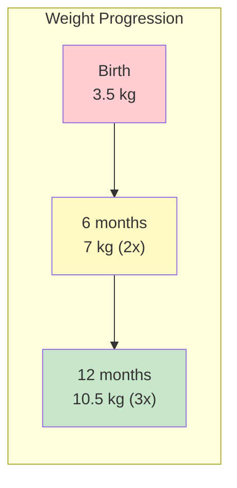
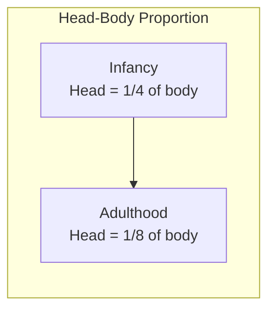
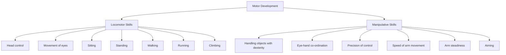

# 1:16 Physical Development from Infancy to Adolescence

!!! abstract "Section Overview"
    This section traces **physical and motor development** from birth through adolescence, covering bodily growth, brain development, internal organ growth, sensory development, and motor skills including locomotor and manipulative skills.

---

## 📖 Physical Development Overview

!!! quote "Definition"
    The **bodily growth** is physical development. Physical development along with **physiological development** appears to be the **basic aspect** of human development.

---

## 👶 Physical Development in Infancy

### Newborn Statistics

| Measurement | At Birth |
|-------------|----------|
| **Length** | About 50 cms |
| **Weight** | About 3.5 kg |

### First Year Growth

| Period | Growth |
|--------|--------|
| **By first year** | Another 25 cms in length |
| **First six months** | Weight doubles |
| **Next six months** | Weight triples |

### Body Proportion Changes

!!! info "Head to Body Ratio"
    Proportion of **head to body** changes from **¼ to ⅛**
    
    - Lengths of arms and legs increase as the infant begins using them more

---

## 🧠 Brain Growth

!!! note "Key Points 📌"
    **Brain growth is more rapid** than other body parts.

| Age | Brain Development |
|-----|-------------------|
| **Before birth** | Full complement of cells |
| **4 to 6 years** | 80% of adult weight |
| **By age 8** | Another 13% (total ~93%) |
| **End of adolescence** | Complete development |

---

## 🫀 Internal Organ Development

!!! info "Information"
    The **internal organs** such as digestive organs, lungs, etc. grow rapidly and reach a **balance of effective coordinated functioning**.

### Sensory Development

| Sense | Development |
|-------|-------------|
| **Hearing** | Well developed at infancy |
| **Coordinated binocular vision** | Takes more time |

---

## 👶 Caring for Infant's Bodily Development

| Factor | Importance |
|--------|------------|
| **Mother's milk** | Primary nutrition |
| **Affectionate atmosphere** | Emotional security |
| **Nutritious food** | Physical growth |
| **Cleanliness** | Health maintenance |
| **Adequate sleep** | Recovery and growth |
| **Optimum sensory stimulation** | Brain development |
| **Bodily activities** | Motor development |

---

## 🧒 Early Childhood Physical Development

!!! note "Key Points 📌"
    The physical development secured during the **first three years** is **strengthened and made more stable** during early childhood.

---

## 👦 Later Childhood Physical Development

| Characteristic | Description |
|----------------|-------------|
| **Rate** | Bodily development appears to **slow down** a bit |
| **Body proportion** | Approximates that of the adult |

---

## 👤 Adolescence Physical Development

!!! warning "Significant Changes"
    The stage of adolescence is marked by an **accelerated rate of physical growth** along with the **onset of sexual maturity**.

### Key Features of Adolescent Physical Growth

| Feature | Description |
|---------|-------------|
| **Growth rate** | Accelerated |
| **Sexual maturity** | Onset occurs |
| **Uneven growth** | Different rates |
| **Clumsiness** | Due to uneven growth |
| **Awkwardness** | In movements |
| **Self-consciousness** | About body changes |

### Gender Differences in Physical Growth

| Aspect | Girls | Boys |
|--------|-------|------|
| **Average level** | Lower height and weight | Greater height and weight |
| **At age 13** | Surpass boys in average weight | Temporarily lower |
| **Puberty timing** | About 1-2 years earlier | 1-2 years later |

!!! example "Example"
    At the age of **13**, **girls surpass boys** in average weight since girls attain **puberty about a year or two earlier** than boys do.

---

## 🏃 Motor Development

### Two Types of Motor Skills

### Locomotor Skills vs Manipulative Skills

| Locomotor Skills | Manipulative Skills |
|------------------|---------------------|
| Head control | Handling objects with dexterity |
| Movement of eyes | Eye-hand co-ordination |
| Sitting | Precision of control |
| Standing | Speed of arm movement |
| Walking | Arm steadiness |
| Running | Aiming |
| Climbing | |

---

## 🔗 Importance of Motor Development

!!! success "Significance"
    - Motor activities are important for **personal and educational growth**
    - The child makes contact with the **external world** only through motor development
    - Motor development is closely related to **intellectual, emotional and social development**

---

## 👨‍🏫 Educational Implications

### For Teachers

| Observation | Response |
|-------------|----------|
| **Individual differences** | Early discovery important |
| **Problems/deviations** | Provide proper guidance |
| **Physical adjustments** | Promote adjustments among children |

### Benefits of Proper Physical and Motor Development

!!! tip "Key Outcomes"
    Proper physical and motor development promote:
    
    1. **Self-help** - Independence in daily activities
    2. **Competence** - Ability to perform tasks effectively

---

## 📝 Quick Revision Table

| Stage | Physical Characteristics |
|-------|-------------------------|
| **Infancy** | Rapid growth; head ¼ body; brain 80% by 4-6 years |
| **Early Childhood** | Growth strengthened and stabilized |
| **Later Childhood** | Growth slows; body proportion like adult |
| **Adolescence** | Accelerated growth; sexual maturity; uneven; self-conscious |

---

## 🧠 Memory Mnemonic

!!! tip "Remember Motor Skills: LOCO-MANI"
    **LOCO**motor: Movement of body through space
    
    - **L**ying/lifting head
    - **O**pen eyes, move them
    - **C**rawl, climb
    - **O**n feet - stand, walk, run
    
    **MANI**pulative: Using hands skillfully
    
    - **M**anipulating objects
    - **A**iming
    - **N**imble fingers
    - **I**ntricate hand-eye coordination

---

> **Bridge →** Having explored physical development, we now examine **Intellectual Development from Infancy to Adolescence**.

---

!!! tip "Exam Tip 📝"
    Remember the **brain development percentages**: 80% by 4-6 years, 93% by 8 years, complete by end of adolescence. Also note that **girls reach puberty 1-2 years earlier** than boys.
