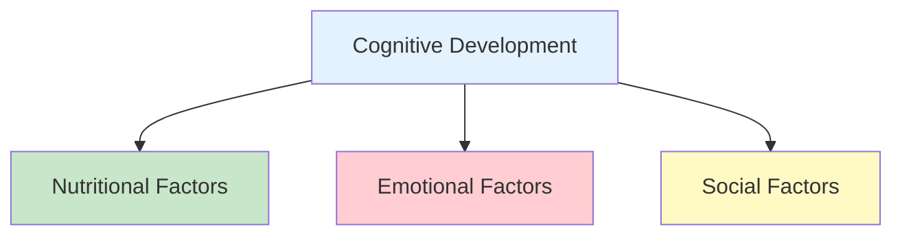
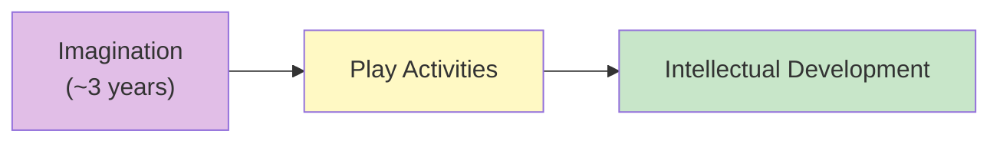
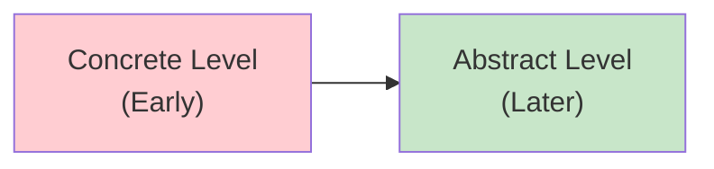
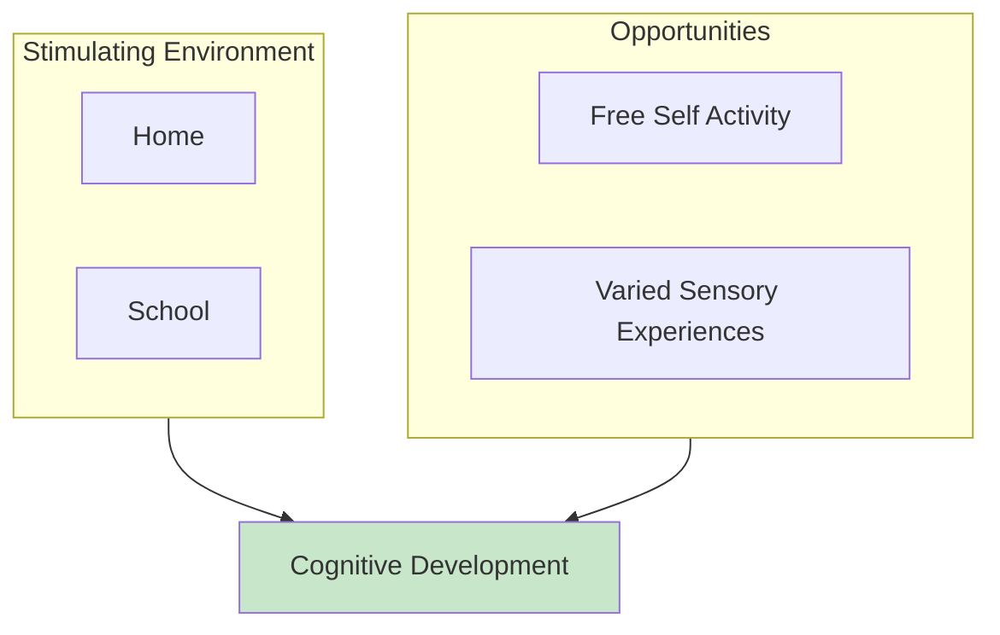

# 1:17 Intellectual Development from Infancy to Adolescence

!!! abstract "Section Overview"
    This section explores **Intellectual/Cognitive Development** from infancy through adolescence, covering the growth of cognitive abilities, the role of imagery, imagination, language, and the progression from concrete to abstract thinking, including Piaget's important observation about children's cognitive processes.

---

## 📖 Definition of Intellectual Development

!!! quote "Definition"
    **Intellectual development** is also referred to as **cognitive development**. It refers to the gradual growth in **cognitive abilities** and also to consequent growth in **knowledge** and **adjustment to environment**.

---

## 🧠 Cognitive Abilities

| Ability | Description |
|---------|-------------|
| **Attend** | Focus on stimuli |
| **Perceive** | Interpret sensory information |
| **Discover** | Find new information |
| **Recognise** | Identify familiar things |
| **Imagine** | Create mental images |
| **Judge** | Make decisions |
| **Conceptualise** | Form abstract ideas |
| **Remember** | Store and retrieve information |
| **Learn** | Acquire knowledge/skills |
| **Reason** | Think logically |
| **Take decisions** | Make choices |
| **Solve problems** | Find solutions |
| **Engage in meaningful speech** | Communicate effectively |

---

## 🔄 Factors Influencing Cognitive Development

---

## 👶 Infancy: The Beginning

### Initial State

!!! info "Newborn Characteristics"
    - Mental powers are **immature and undeveloped**
    - Brain centres are still **maturing**
    - Knowledge at birth is **practically nil**

### Early Observable Differences

!!! note "Key Points 📌"
    Even early, observers can notice **individual differences** in the mental powers of infants due to **hereditary differences**.

### First Intellectual Responses

| Stage | Characteristic |
|-------|----------------|
| **Initial** | Response to stimuli from outside world |
| **As imagery grows** | Intellectual activities broaden |
| **Memory develops** | Retention and recall of past experiences |

---

## 🎨 Role of Imagination

!!! info "Imagination Emergence"
    **Imagination comes to the foreground by about the age of three** and:
    
    - Expresses itself through **play activities**
    - Serves as a **means of intellectual development**

---

## 📚 Role of Language

!!! success "Language Functions"
    **Language (mother tongue)** helps in:
    
    1. **Preserving** intellectual growth
    2. **Fostering** intellectual growth

---

## 📈 Progression of Intellectual Growth

### Development of Higher Cognitive Functions

| Function | Development |
|----------|-------------|
| **Judging** | Develops with experience |
| **Reasoning** | Grows with maturity |
| **Problem-solving** | Emerges gradually |

### From Concrete to Abstract

!!! info "Information"
    Intellectual growth continues to accelerate as children develop the ability to **judge, reason and solve problems**, starting from the **concrete level** and going towards the **abstract**.

---

## 💡 Role of Creativity

!!! note "Key Points 📌"
    **Creativity** helps in:
    
    - **Divergent thinking** - Thinking in multiple directions
    - Leading to **novel intellectual products and practices**

---

## 🧪 Piaget's Important Observation

!!! quote "Piaget's Insight"
    Psychologists like **Jean Piaget** point out that **child's cognitive processes are NOT abridged or simplified versions of adult processes** but are **qualitatively different**, though certain common invariants are also there.

| Child's Cognition | Adult's Cognition |
|-------------------|-------------------|
| Qualitatively different | Different in quality |
| Not simplified version | Complete system |
| Has own logic | Has mature logic |
| Some common elements | Some common elements |

---

## 🏠 Fostering Cognitive Development

!!! success "Environmental Factors"
    Broadly speaking, cognitive development of children can be fostered by:
    
    - **Stimulating home environment**
    - **Stimulating school environment**
    - **A lot of scope for free self activity**
    - **Opportunities for varied sensory experiences**

### What Helps Cognitive Development

| Factor | How it Helps |
|--------|--------------|
| **Stimulating home** | Rich experiences early |
| **Stimulating school** | Structured learning |
| **Free self activity** | Exploration and discovery |
| **Varied sensory experiences** | Multiple inputs for brain |

---

## 📊 Summary: Intellectual Development Timeline

| Age/Stage | Cognitive Characteristic |
|-----------|-------------------------|
| **Newborn** | Immature, undeveloped, near-zero knowledge |
| **Early infancy** | Response to external stimuli |
| **~3 years** | Imagination emerges; play activities |
| **Childhood** | Language fosters growth; judgment begins |
| **Later childhood** | Reasoning and problem-solving at concrete level |
| **Adolescence** | Abstract thinking emerges; creativity develops |

---

## 🧠 Memory Mnemonic

!!! tip "Remember Cognitive Abilities: APDR-IJCR-LDPS"
    - **A**ttend, **P**erceive, **D**iscover, **R**ecognise
    - **I**magine, **J**udge, **C**onceptualise, **R**emember
    - **L**earn, **D**ecide, **P**roblem-solve, **S**peak meaningfully

---

## 📝 Quick Revision Points

| Concept | Key Point |
|---------|-----------|
| **Definition** | Growth in cognitive abilities, knowledge, adaptation |
| **Influencing factors** | Nutritional, emotional, social |
| **Imagination** | Emerges ~3 years; through play |
| **Language** | Preserves and fosters intellectual growth |
| **Progression** | Concrete → Abstract |
| **Piaget's view** | Child cognition qualitatively different, not simplified adult |
| **Fostering** | Stimulating environment + free activity + varied sensory experiences |

---

> **Bridge →** Having explored intellectual development, we now examine **Social Development from Infancy to Adolescence**.

---

!!! tip "Exam Tip 📝"
    Remember **Piaget's key insight**: Children's cognitive processes are **qualitatively different** from adults, not just simplified versions. This is a frequently tested concept.
