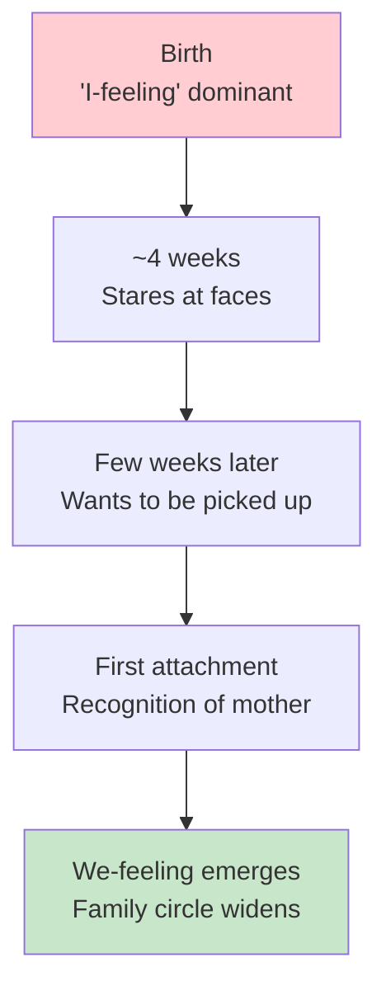
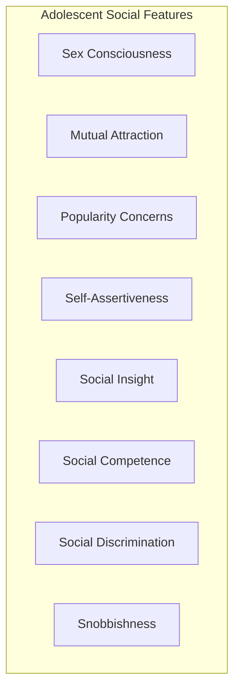
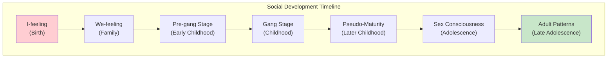

# 1:18 Social Development from Infancy to Adolescence

!!! abstract "Section Overview"
    This section traces **social development** from the non-gregarious newborn infant through various stages of socialization, including the development of attachment, play patterns, peer relationships, and the characteristics of social behaviour at different developmental stages.

---

## 📖 Fundamental Principle

!!! quote "Definition"
    Social development takes place **gradually**. **Being a social person is NOT innate; it must be learned.**

---

## 👶 Infancy: The Beginning

### Newborn Characteristics

| Characteristic | Description |
|----------------|-------------|
| **Social activity** | Little or no social activity |
| **Primary concern** | Satisfaction of bodily needs |
| **Nature** | Non-gregarious |
| **Dominant feeling** | **'I-feeling'** alone |

### Early Social Development Timeline

| Age | Social Milestone |
|-----|------------------|
| **~4 weeks** | Stares at faces closely |
| **Few weeks later** | Wants to be picked up |
| **First attachment** | Recognition of mother |
| **Gradually** | Social circle widens to include other family members |

---

## 🎮 Play Development

### Evolution of Play Types

| Play Type | Age | Description |
|-----------|-----|-------------|
| **Solitary Play** | Very young | Playing alone |
| **Parallel Play** | Toddlers | Each child in a group playing in its own way |
| **Cooperative Play** | ~2 years | Desire to cooperate with others in group plays |

---

## 🧒 Early Childhood: Pre-Gang Stage

!!! info "Information"
    **Early childhood** is the **pre-gang stage** of social development.

---

## 👦 Childhood: Gang Stage

!!! note "Key Points 📌"
    **Childhood** is the **gang stage**, when **playmates have an active role** in accelerating social development.

### Characteristics of Childhood Socialization

| Feature | Description |
|---------|-------------|
| **Sex differences** | Not felt at this stage |
| **Learning method** | Direct imitation of other children's patterns |
| **Social responses** | Spontaneous reaction to situations |

### Social Behaviours Developed During Childhood

| Behaviour | Description |
|-----------|-------------|
| **Rivalry** | Competitive tendencies |
| **Aggression** | Forceful behaviour |
| **Co-operation** | Working together |
| **Sympathy** | Understanding others' feelings |
| **Social approval** | Seeking acceptance |
| **Social prejudices** | Biases imbibed from adults |
| **Proper/improper behaviour notions** | Understanding social norms |

---

## 👧 Later Childhood (8-12 years)

!!! success "Pseudo-Maturity"
    Later childhood is marked by **maximum social adjustment** in the changeable and variable social world, marking a level of **pseudo maturity**.

| Characteristic | Description |
|----------------|-------------|
| **Social adjustment** | Maximum level |
| **Time away from home** | Considerable |
| **Paternal affection** | Importance continues undiminished |

---

## 👤 Adolescence: Sex Consciousness

### Key Features

| Feature | Description |
|---------|-------------|
| **Sex consciousness** | Aware of gender in relationships |
| **Mutual attraction** | Trying to attract opposite sex |
| **Relations not well-defined** | Causes embarrassment in early adolescence |
| **Popularity** | Vital part in adjustment |
| **Self-assertiveness** | Emerging in later adolescence |
| **Social insight** | Understanding social situations |
| **Social competence** | Ability to navigate social settings |
| **Social discrimination/snobbishness** | Selective associations |

### Adolescent Gangs

!!! warning "Important Note"
    **Adolescent gangs** are powerful factors in socialization and **peer group culture is dominant**. This may sometimes lead to **antisocial or delinquent behaviour** if not guided and properly sublimated.

---

## 📊 Developmental Psychologists' Observations

### Pre-school Children

| Characteristic | Description |
|----------------|-------------|
| **Friends** | One or two friends |
| **Flexibility** | Change friends easily; socially flexible |
| **Play groups** | Small and loosely organised |
| **Quarrels** | Frequent but short duration, quickly forgotten |
| **Dramatic play** | Frequent |
| **Sex roles** | Awareness begins |

### Primary Class Children

| Characteristic | Description |
|----------------|-------------|
| **Friend selection** | More selective |
| **Preferences** | Like organised games |
| **Quarrels** | Still frequent; words used more than physical aggression |
| **Competition** | Often seen |
| **Boasting** | Common |
| **Gender interests** | Boys and girls show different interests in work and play |

### Elementary Grades

| Characteristic | Description |
|----------------|-------------|
| **Gang influence** | Becomes powerful |
| **Gender divergence** | Interests more divergent |
| **Games** | Team games more popular |

### During Adolescence

| Characteristic | Description |
|----------------|-------------|
| **Peer group** | Dominance more pronounced |
| **Opposite sex** | Concern increases |
| **End of adolescence** | Adult social patterns emerge |

---

## 📈 Social Development Progression

---

## 📝 Quick Revision Table

| Stage | Social Characteristic | Key Feature |
|-------|----------------------|-------------|
| **Infancy** | Non-gregarious, I-feeling | First attachment to mother |
| **Early Childhood** | Pre-gang stage | Solitary → Parallel → Cooperative play |
| **Later Childhood** | Gang stage, pseudo-maturity | Playmates influential |
| **Adolescence** | Sex consciousness | Peer group dominant |
| **Late Adolescence** | Adult patterns emerge | Social competence develops |

---

## 🧠 Memory Mnemonic

!!! tip "Remember Social Development Stages: I-WPPGA"
    - **I**-feeling (Birth)
    - **W**e-feeling (Family inclusion)
    - **P**re-gang stage (Early childhood)
    - **P**seudo-maturity/gang stage (Childhood)
    - **G**ender consciousness (Adolescence)
    - **A**dult patterns (Late adolescence)

---

> **Bridge →** Having explored social development, we now examine **Emotional Development from Infancy to Adolescence**.

---

!!! tip "Exam Tip 📝"
    Remember the key transitions: **I-feeling → We-feeling**, **Solitary → Parallel → Cooperative play**, and **Pre-gang → Gang → Pseudo-maturity stages**. Also note that childhood is the **gang stage** (frequently asked).
