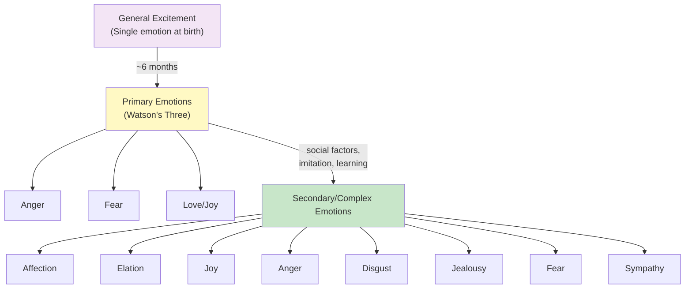
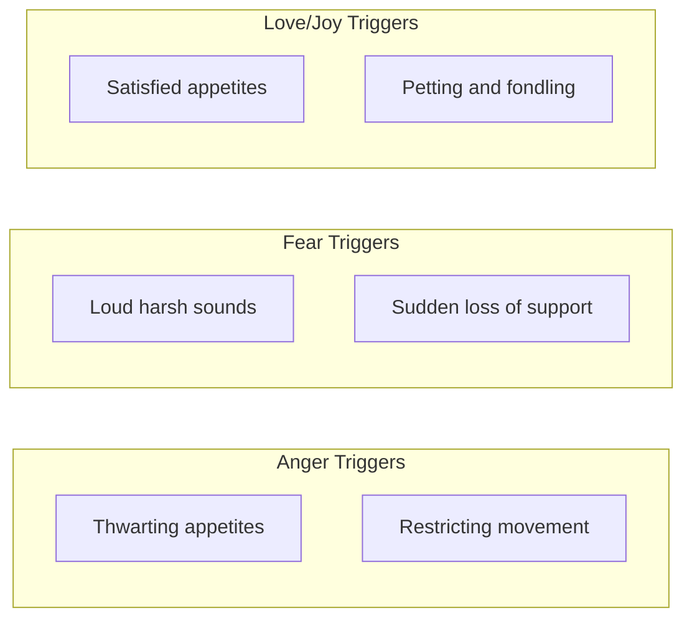
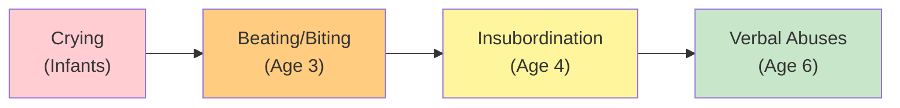
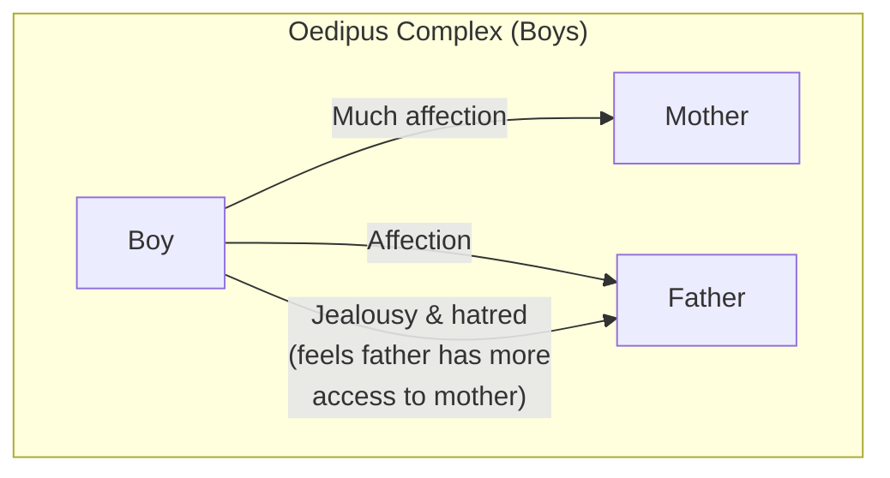
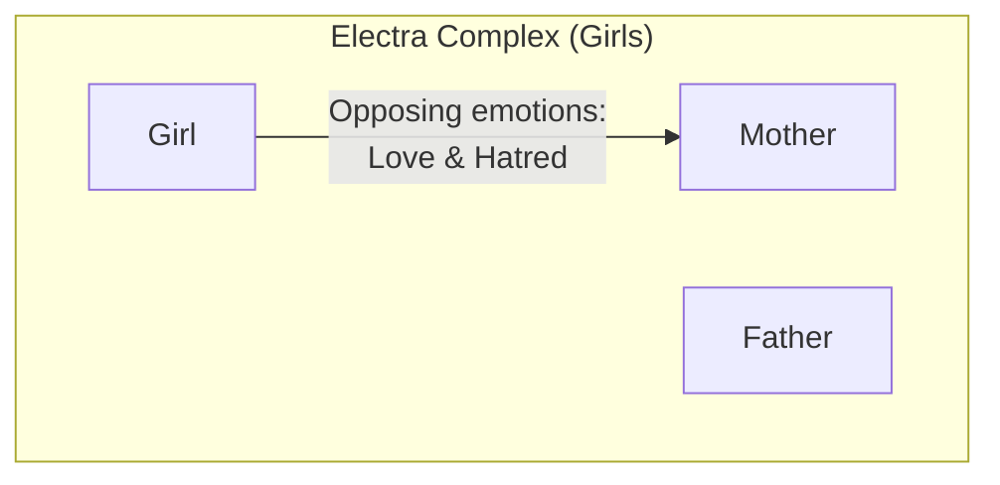

# 1:19 Emotional Development from Infancy to Adolescence

!!! abstract "Section Overview"
    This section traces **emotional development** from the newborn infant's generalized excitement through the differentiation of primary and secondary emotions, covering Watson's three primary emotions, changes in emotional expression patterns, and Freud's concepts of Oedipus and Electra complexes.

---

## 👶 Newborn: General Excitement

!!! quote "Starting Point"
    The new born infant has a **single generalised emotional response of excitement only** and out of this gradually evolves **increasing differentiated patterns** of emotional expression over the course of development.

---

## 🔬 Watson's Three Primary Emotions

!!! info "By About 6 Months"
    In about **6 months**, the child can express the **three primary emotions** as described by **Watson**:

| Emotion | Stimulus | Response |
|---------|----------|----------|
| **Anger** | Thwarting of appetites; restricting free bodily movements | Aggressive reaction |
| **Fear** | Loud, harsh sound; sudden loss of support | Withdrawal, crying |
| **Love/Joy** | Satisfaction of appetites; petting and fondling | Positive attachment |

---

## 📚 Development of Complex Emotions

!!! note "Key Points 📌"
    **Social factors, imitation and learning** lead to a variety of emotional reactions and expressions.

### By Early Childhood

Common emotions clearly discernible include:

| Emotion | Description |
|---------|-------------|
| **Affection** | Warm feelings towards others |
| **Elation** | High spirits, excitement |
| **Joy** | Happiness |
| **Anger** | Frustration response |
| **Disgust** | Strong dislike |
| **Jealousy** | Envy of others |
| **Fear** | Anxiety about threats |
| **Sympathy** | Understanding others' pain |

---

## 🧒 Pre-school Children's Emotions

!!! warning "Characteristics"
    Pre-school children, because of their **immaturity and lack of control**, tend to express their emotions **freely and openly**.

### Anger in Pre-schoolers

| Cause | Description |
|-------|-------------|
| **Fatigue** | Tired children are irritable |
| **Hunger** | Unmet physical needs |
| **Needless adult interference** | Over-control triggers outbursts |

### Fear in Pre-schoolers

| Type | Description |
|------|-------------|
| **Strange situations** | New environments cause fear |
| **Imagination-produced** | Irrational fears from imagination |

### Jealousy

!!! info "Information"
    Jealousy is **equally common** at this stage - often related to sibling rivalry or attention-seeking.

---

## 👦 Primary Grade Children (6-9 years)

| Characteristic | Description |
|----------------|-------------|
| **Alertness** | Often alert to feelings of others |
| **Social hurt** | Often hurt feelings of other children |
| **Sensitivity** | Very sensitive to criticism |
| **Need** | Praise and recognition essential |

---

## 👧 After Age 9

!!! warning "Emotional Difficulties"
    **Conflict between group codes** of peers and **adult rules** often cause emotional difficulties.

---

## 🔄 Changes in Emotional Expression

!!! note "Key Points 📌"
    At the end of infancy, **changes occur in the mode of expression** of emotional reaction.

### Example: Expression of Anger

| Age | Mode of Expression |
|-----|-------------------|
| **Small infants** | Crying |
| **Age 3** | Beating or biting others |
| **Age 4** | Insubordination |
| **Age 6** | Verbal abuses |

!!! info "Information"
    Such patterns of change in emotional reactions can be noticed in **other emotions also**.

---

## 🔬 Freud's Emotional Complexes

!!! quote "Freud's Theory"
    According to **Freud**, there seems to be a **twin faceted emotional behaviour** of individuals during infancy and early childhood.

### Oedipus Complex (Male Children)

| Element | Description |
|---------|-------------|
| **Target** | Male children |
| **Love object** | Mother (loved most) |
| **Ambivalence towards** | Father |
| **Reason** | Feels father has more concessions with mother |

### Electra Complex (Female Children)

| Element | Description |
|---------|-------------|
| **Target** | Female children |
| **Ambivalence towards** | Mother |
| **Nature** | Love and hatred simultaneously |

### Impact of Complexes

!!! warning "Potential Consequences"
    If such emotional complexes are **intense and persist for long**, they may **affect the personality characteristics** of the individuals later on.

---

## 📊 Summary: Emotional Development Timeline

| Stage | Emotional Characteristics |
|-------|-------------------------|
| **Newborn** | General excitement only |
| **~6 months** | Three primary emotions (Watson) |
| **Early childhood** | Complex emotions; freely expressed |
| **Pre-school** | Anger (fatigue/hunger), fear (imagination), jealousy |
| **6-9 years** | Alert to others' feelings; sensitive to criticism |
| **After 9 years** | Conflict between peer codes and adult rules |

---

## 🧠 Memory Mnemonic

!!! tip "Remember Watson's Primary Emotions: FAL"
    - **F**ear (loud sounds, loss of support)
    - **A**nger (thwarting, restriction)
    - **L**ove/Joy (satisfaction, petting)

!!! tip "Remember Freud's Complexes"
    - **O**edipus = **O**pposite parent love (Boys → Mother)
    - **E**lectra = **E**qual parent ambivalence (Girls → Mother)

---

## 📝 Quick Revision Points

| Concept | Key Point |
|---------|-----------|
| **Starting point** | General excitement at birth |
| **Primary emotions** | Fear, Anger, Love (Watson) - ~6 months |
| **Complex emotions** | Through social factors, imitation, learning |
| **Expression changes** | Mode changes with age (crying → verbal) |
| **Oedipus complex** | Boys - love mother, ambivalent to father |
| **Electra complex** | Girls - ambivalent to mother |

---

> **Bridge →** Having explored emotional development, we now examine the **Stages of Moral Development in Children**, including Piaget's and Kohlberg's theories.

---

!!! tip "Exam Tip 📝"
    **Watson's three primary emotions** (Fear, Anger, Love) and their triggers are frequently tested. Also remember Freud's **Oedipus** (boys) and **Electra** (girls) complexes and their potential impact on personality.
