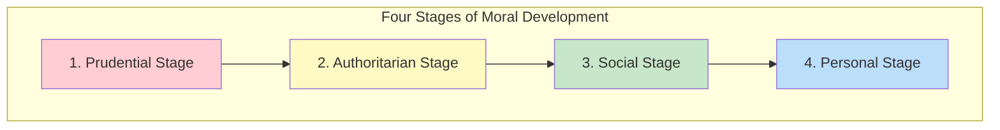
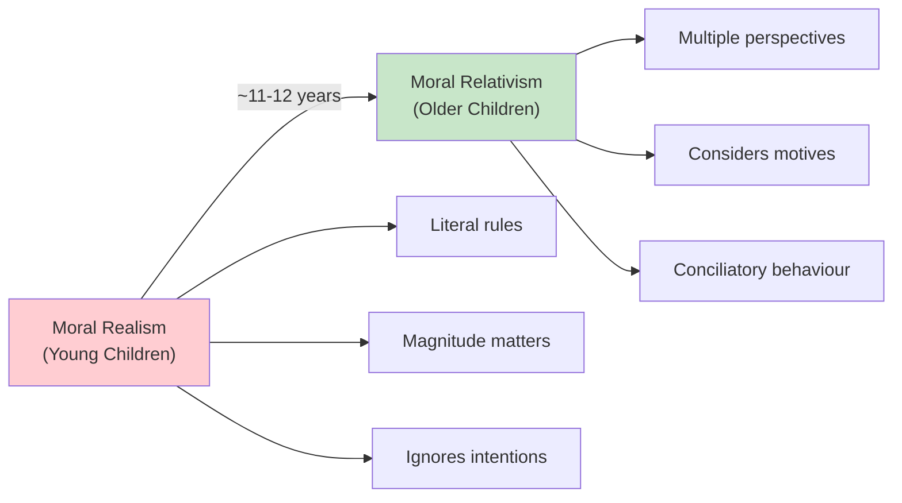
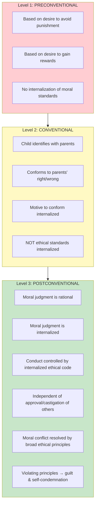

# 1:20 Stages of Moral Development in Children

!!! abstract "Section Overview"
    This section covers the **four stages of moral development** in children (Prudential, Authoritarian, Social, Personal), followed by detailed explanations of **Piaget's stages** (Moral Realism vs Moral Relativism) and **Kohlberg's three levels** (Preconventional, Conventional, Postconventional) of moral development.

---

## 📚 Four Stages of Moral Development

Psychologists mention **4 stages** in the moral development in children:

### Stage 1: Prudential Stage

!!! info "Prudential Stage"
    Children's behaviour is regulated by means of **pleasure and pain**.

| Mechanism | Description |
|-----------|-------------|
| **Rewards** | Children learn behaviours that are rewarded |
| **Punishment** | Children avoid behaviours that are punished |

### Stage 2: Authoritarian Stage

!!! info "Authoritarian Stage"
    Children follow the **directions of elders** like parents and teachers who have **dominating influence** over them.

### Stage 3: Social Stage

!!! info "Social Stage"
    Children's behaviour is governed by **social acceptance or rejection**.

| Feature | Description |
|---------|-------------|
| **Guidance** | Social expectations |
| **Goal** | Conformity with social norms |
| **Note** | Most of us get stagnated at this stage |

!!! warning "Important Note"
    The level of moral development in **most of us gets stagnated at this stage**.

### Stage 4: Personal Stage

!!! success "Personal Stage - Highest Level"
    An individual's behaviour is influenced by his **conviction of high morals and ethics**.

| Feature | Description |
|---------|-------------|
| **Basis** | Personal conviction |
| **Courage** | Steadfast even when society opposes |
| **Independence** | Courageous in convictions |

---

## 🔬 1:20:1 Jean Piaget's Stages

!!! quote "Piaget's Framework"
    **Jean Piaget** and **Laurence Kohlberg** have put forward a development theory of morality. Piaget distinguishes between **'moral realism'** and **'moral relativism'**.

### Moral Realism (Young Children)

!!! info "Characteristics of Moral Realism"
    Young children are **moral realists** who:
    
    - Interpret **moral rules literally**
    - Look at the **material side** of actions and their **magnitude**
    - **Ignore the intentions** of the acts

### Example of Moral Realism

!!! example "Example"
    A child is asked to judge two acts:
    
    | Case 1 | Case 2 |
    |--------|--------|
    | A child breaks **2 tea cups** while attempting to reach stealthily the sweets kept over the cupboard | A servant maid breaks **4 tea cups** due to carelessness while serving tea to visiting guests |
    
    **Child's Judgment (Moral Realism)**: The servant maid is **more guilty** because of the **magnitude** of the act (breaking more cups).
    
    **Actual Analysis**: The child's act involved **stealing** (worse intention), while the maid's was **accidental**.

### Moral Relativism (~11-12 years)

!!! success "Characteristics of Moral Relativism"
    Only by about **11-12 years** do children become capable of moral relativism.

| Capability | Description |
|------------|-------------|
| **Decentre** | Think of several qualities at once |
| **Overcome ego-centricism** | Aware others have different viewpoints |
| **Consider motives** | Take into account intentions |
| **Consider circumstances** | Factor in context |
| **After 12** | Behave conciliatorily and forgivingly |

---

## 📊 1:20:2 Kohlberg's Stages

!!! quote "Kohlberg's Framework"
    **Kohlberg's theory** of moral development is based on **Piaget's general theory of cognitive development**. He believes moral development, like cognitive growth, takes place through **'assimilation'** and **'accommodation'**.

### Key Emphasis

!!! note "Key Points 📌"
    Kohlberg lays emphasis on the significance of **looking at things from other's point of view** (role taking).

### Three Levels of Moral Development

### Detailed Level Comparison

| Level | Basis | Internalization | Key Feature |
|-------|-------|-----------------|-------------|
| **1. Preconventional** | Punishment & Rewards | None | External motivation |
| **2. Conventional** | Parental identification | Motive to conform | Conformity-based |
| **3. Postconventional** | Ethical principles | Complete | Principle-based; guilt when violated |

### Requirements for Higher Moral Development

!!! info "Kohlberg's View on Growth"
    Like Piaget, Kohlberg speaks of **maturation as the basis** of moral growth, but mere maturation may **NOT help** one to reach higher levels.

!!! quote "Life Experiences Needed"
    The individual must undergo **life experiences** that specifically "confront him with more complex moral dilemmas and with the realities of the social system in which he lives".

### Educational Relevance

| Point | Implication for Moral Education |
|-------|--------------------------------|
| **Life experiences** | Must be provided |
| **Moral dilemmas** | Should be confronted |
| **Social realities** | Must be understood |

### Universal Moral Values

!!! success "Kohlberg's Advocacy"
    Kohlberg advocates the existence of some **basic or universal moral values** because:
    
    - All normal children everywhere go through the **same stages** of cognitive development
    - They interact socially in **essentially the same ways**

---

## 📋 Comparison of All Frameworks

| Framework | Stages/Levels | Key Focus |
|-----------|---------------|-----------|
| **Four Stages** | Prudential → Authoritarian → Social → Personal | Behavioral regulation source |
| **Piaget** | Moral Realism → Moral Relativism | Rule interpretation |
| **Kohlberg** | Preconventional → Conventional → Postconventional | Internalization of standards |

---

## 🧠 Memory Mnemonic

!!! tip "Remember Four Stages: PASP"
    - **P**rudential (pleasure/pain)
    - **A**uthoritarian (elders' direction)
    - **S**ocial (acceptance/rejection)
    - **P**ersonal (conviction)

!!! tip "Remember Kohlberg's Levels: PCP"
    - **P**reconventional (punishment/reward)
    - **C**onventional (conformity)
    - **P**ostconventional (principles)

!!! tip "Remember Piaget's Transition"
    **MR → ML at 11-12**
    
    - **M**oral **R**ealism (magnitude) → **M**oral re**L**ativism (motives)

---

## 📝 Quick Revision Table

| Theory | Low Level | High Level | Transition |
|--------|-----------|------------|------------|
| **Four Stages** | Prudential | Personal | Gradual maturity |
| **Piaget** | Moral Realism | Moral Relativism | ~11-12 years |
| **Kohlberg** | Preconventional | Postconventional | Life experiences |

---

> **Bridge →** Having explored moral development, we now focus on the **Period of Adolescence** - a critical transition phase with unique characteristics.

---

!!! tip "Exam Tip 📝"
    The **tea cup example** illustrating moral realism is a classic exam question. Remember: young children judge by **magnitude** (4 cups > 2 cups), not **intention** (stealing vs. accident).
