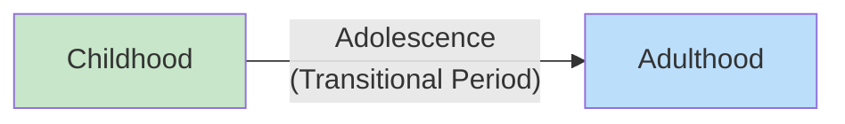
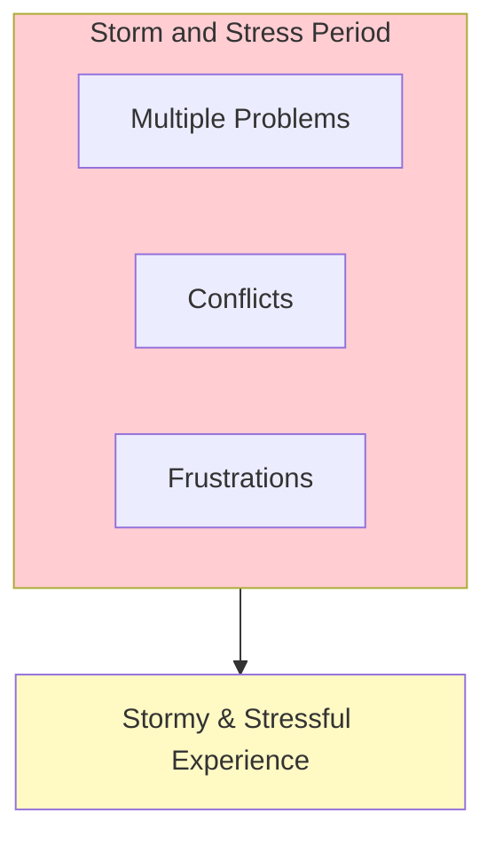

# 1:21 Period of Adolescence

!!! abstract "Section Overview"
    This section explores the **period of adolescence**, its etymology, significance as a transitional phase, and the psychological understanding of this "storm and stress" period identified by **Stanley Hall**.

---

## 📚 Definition of Adolescence

!!! quote "Etymology"
    The word **'adolescence'** is derived from the Latin word **'adolescere'** which means **'to grow'** or **'to grow into adulthood'**.

---

## 🔄 Adolescence as a Transitional Period

!!! info "Nature of Transition"
    Adolescence is a **transitional period** in an individual's life from childhood to adulthood.

---

## ⚡ Stanley Hall's Characterization

!!! note "Storm and Stress Period"
    Adolescence is a period of **'storm and stress'** — a characteristic given by psychologist **Stanley Hall**.

### What "Storm and Stress" Means

!!! warning "Key Characteristics"
    During this period, the adolescent:
    
    - **Faces so many problems** in life
    - **Becomes victim of conflicts and frustrations**
    - Makes the period stormy and stressful

---

## 📊 Summary of Key Points

| Aspect | Details |
|--------|---------|
| **Etymology** | Latin 'adolescere' = to grow |
| **Nature** | Transitional period |
| **Transition** | Childhood → Adulthood |
| **Characterized by** | Stanley Hall |
| **Description** | Storm and stress |
| **Causes** | Problems, conflicts, frustrations |

---

## 🧠 Memory Mnemonic

!!! tip "Remember ADOLESCERE"
    **A**dolescere = **A**dulthood (growing into it)

!!! tip "Remember Stanley Hall's View"
    **S**tanley **H**all = **S**torm and **H**ardship (stress)

---

## 📝 Quick Revision Table

| Term | Meaning/Association |
|------|---------------------|
| **Adolescere** | To grow (Latin) |
| **Transitional** | From childhood to adulthood |
| **Stanley Hall** | Storm and stress characterization |
| **Storm** | Multiple problems faced |
| **Stress** | Conflicts and frustrations |

---

> **Bridge →** Understanding the nature of adolescence leads us to examine the **Special Characteristics of Adolescents** - what makes this phase unique.

---

!!! tip "Exam Tip 📝"
    **Stanley Hall** and **'storm and stress'** are frequently asked together. Remember: Hall characterized adolescence as stormy due to the many problems, conflicts, and frustrations adolescents face during this transitional period.
