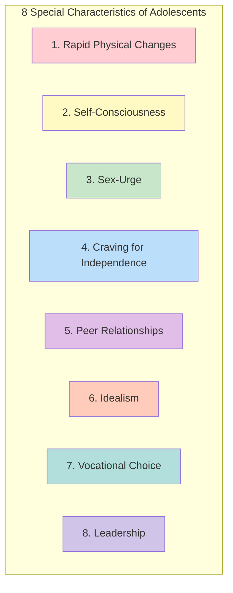
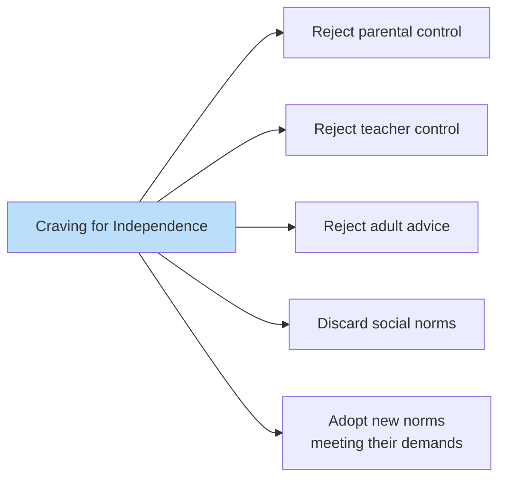

# 1:22 Special Characteristics of Adolescents

!!! abstract "Section Overview"
    This section details the **eight special characteristics** that distinguish adolescents from children, covering physical changes, psychological developments, social relationships, and identity formation.

---

## 📚 Eight Special Characteristics

---

## 1️⃣ Rapid Physical Changes

!!! info "Physical Growth Spurt"
    Adolescence is characterised by **rapid physical growth** particularly during puberty.

### Manifestations

| Aspect | Changes |
|--------|---------|
| **Primary sex characteristics** | Develop rapidly |
| **Secondary sex characteristics** | Develop rapidly |
| **Endocrine glands** | Undergo changes |
| **Internal organs** | Undergo changes |

---

## 2️⃣ Self-Consciousness

!!! info "Heightened Self-Awareness"
    Adolescents tend to become **self-conscious and conscious of the physical changes** taking place in them.

### Response to Self-Consciousness

| Tendency | Description |
|----------|-------------|
| **Shyness** | May develop shy behavior |
| **Emotional Breakdowns** | May experience emotional difficulties |
| **Preoccupation** | Occupied with physical appearance |

---

## 3️⃣ Sex-Urge

!!! info "Emergence of Sexual Feelings"
    Because of the sexual changes taking place, the adolescents become **victim of sex-urge**.

### Manifestations

!!! note "Key Behaviors"
    - Start taking interest in **members of the opposite sex**
    - May become victims of **infatuations or short-term loves**

---

## 4️⃣ Craving for Independence

!!! info "Freedom Seeking"
    Adolescents crave for **freedom or independence**.

### Expression of Independence Craving

!!! warning "Behavioral Signs"
    - Do not like to be told what to do
    - Do not like to be controlled by parents/teachers
    - Do not like advice given by adults
    - Tend to **discard parental and social norms**
    - Regard new norms that meet **their demands**

---

## 5️⃣ Peer Relationships

!!! info "Peer Influence"
    Adolescents like to be in the **company of their companions (peers)** who can share their views.

### Key Features

| Aspect | Description |
|--------|-------------|
| **Preference** | Company of peers over adults |
| **Sharing** | Like to share views with peers |
| **Acceptance** | Social acceptance by peer group is vital |
| **Importance** | Social acceptance becomes **very significant** |

!!! success "Importance of Peer Acceptance"
    For the adolescents, **social acceptance by their own peer-group** becomes very significant.

---

## 6️⃣ Idealism

!!! info "Idealistic Thinking"
    Adolescents tend to be **idealistic**.

### Manifestations of Idealism

| Behavior | Description |
|----------|-------------|
| **Hero worship** | Worship heros and great personalities |
| **Perfect world** | Dream of a perfect world |
| **Rebellion** | May rebel against elders if ideals not met |

!!! warning "Potential Conflict"
    Adolescents may tend to **rebel against their elders** if the elders don't come up to their expectations.

---

## 7️⃣ Vocational Choice

!!! info "Career Decision Making"
    This is a period of **vocational choice**.

### Key Aspects

| Feature | Description |
|---------|-------------|
| **Planning** | Plan to take up a vocation |
| **Preparation** | Prepare for college courses |
| **Career focus** | Career choice becomes primary concern |

---

## 8️⃣ Leadership

!!! info "Leadership Emergence"
    This is a period when the **leadership abilities of the individual begin to emerge**.

### Leadership Development

| Aspect | Description |
|--------|-------------|
| **Activities** | Take up many activities in school and society |
| **Initiative** | Initiate and organize activities |
| **Visibility** | Leadership qualities become visible |

---

## 📊 Summary Table

| # | Characteristic | Key Feature |
|---|----------------|-------------|
| 1 | Rapid Physical Changes | Sexual & endocrine development |
| 2 | Self-Consciousness | Aware of physical changes |
| 3 | Sex-Urge | Interest in opposite sex |
| 4 | Craving for Independence | Reject adult control |
| 5 | Peer Relationships | Peer acceptance vital |
| 6 | Idealism | Hero worship, perfect world |
| 7 | Vocational Choice | Career planning |
| 8 | Leadership | Abilities emerge |

---

## 🧠 Memory Mnemonic

!!! tip "Remember: RSSCPIVL"
    **R**apid physical changes
    **S**elf-consciousness
    **S**ex-urge
    **C**raving for independence
    **P**eer relationships
    **I**dealism
    **V**ocational choice
    **L**eadership

!!! tip "Alternative Mnemonic: SLIPS VCR"
    - **S**elf-consciousness
    - **L**eadership
    - **I**dealism
    - **P**eer relationships
    - **S**ex-urge
    - **V**ocational choice
    - **C**raving for independence
    - **R**apid physical changes

---

## 📝 Quick Revision Table

| Characteristic | What Happens | Why It Matters |
|----------------|--------------|----------------|
| **Physical changes** | Rapid growth, puberty | Triggers other changes |
| **Self-consciousness** | Body awareness | May cause shyness |
| **Sex-urge** | Opposite sex interest | Infatuations common |
| **Independence** | Reject adult control | Conflict with elders |
| **Peer relationships** | Peers > adults | Social acceptance crucial |
| **Idealism** | Hero worship | May rebel if disappointed |
| **Vocational choice** | Career planning | Future orientation |
| **Leadership** | Skills emerge | Activity participation |

---

> **Bridge →** These characteristics naturally lead to various **Problems of Adolescents** that need to be understood and addressed.

---

!!! tip "Exam Tip 📝"
    The **8 characteristics** are frequently asked. Remember them using the mnemonic and be able to explain each with examples. Key pairs: Self-consciousness + Physical changes, Independence + Rebellion, Peer relationships + Social acceptance.
