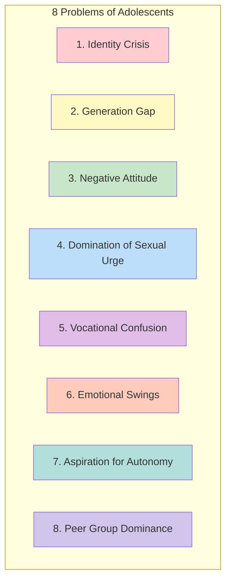
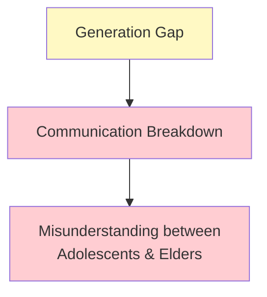
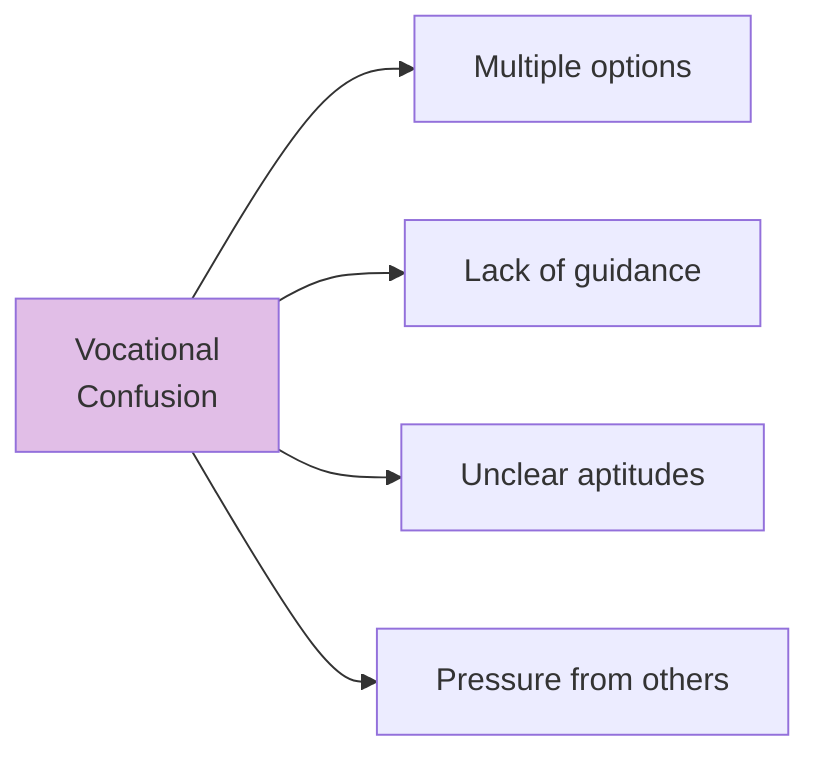
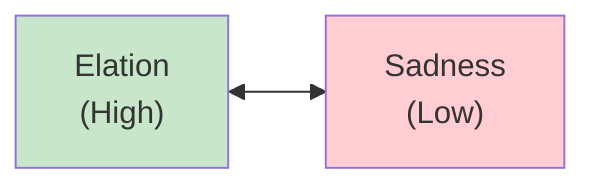

# 1:23 Problems of Adolescents

!!! abstract "Section Overview"
    This section examines the **eight major problems** faced by adolescents that contribute to the "storm and stress" characterization of this developmental period, including identity crisis, generation gap, and emotional challenges.

---

## 📚 Eight Major Problems

---

## 1️⃣ Identity Crisis

!!! warning "The Quest for Self"
    Adolescents want to know **who they really are** in the society in which they live.

### Manifestations

| Aspect | Description |
|--------|-------------|
| **Self-questioning** | Who am I? |
| **Role confusion** | Uncertain about social position |
| **Identity search** | Seeking self-definition |

---

## 2️⃣ Generation Gap

!!! warning "Communication Breakdown"
    Adolescents feel that there is a **generation gap** between them and the elders and parents due to which there is a **break in proper communication** among these groups.

### Key Issues

| Problem | Result |
|---------|--------|
| **Different worldviews** | Conflict in perspectives |
| **Communication break** | Misunderstanding |
| **Value differences** | Clash with parental values |

---

## 3️⃣ Negative Attitude

!!! warning "Oppositional Behavior"
    Adolescents tend to develop **negative attitude** against elders and norms of society.

### Expression of Negativity

!!! note "Manifestations"
    - Oppose elder's views
    - Reject social norms
    - Challenge established rules
    - Question authority

---

## 4️⃣ Domination of Sexual Urge

!!! warning "Sexual Preoccupation"
    As referred above, in an adolescent, the **sexual urge dominates**.

### Consequences

| Issue | Description |
|-------|-------------|
| **Preoccupation** | Sexual thoughts dominate |
| **Infatuations** | Short-term attractions |
| **May lose focus** | Can lead to distraction from other pursuits |

!!! info "Note"
    If sex-urge is **not properly understood and channelised** it may lead to abnormal behaviours.

---

## 5️⃣ Vocational Confusion

!!! warning "Career Uncertainty"
    Adolescents face **confusion in their vocational choice**.

### Causes of Confusion

---

## 6️⃣ Emotional Swings

!!! warning "Emotional Instability"
    There are **emotional swings** among adolescents characterised by **elation and sadness** from time to time.

### Pattern of Emotional Swings

| State | Description |
|-------|-------------|
| **Elation** | Periods of high excitement |
| **Sadness** | Periods of depression |
| **Mood swings** | Rapid changes between states |
| **Unpredictability** | Emotional states hard to predict |

---

## 7️⃣ Aspiration for Autonomy

!!! warning "Independence Struggle"
    Adolescents **aspire for autonomy in life**, but their parents/elders do not support them in getting autonomy.

### Conflict Pattern

| Adolescent's Desire | Parent's Response | Result |
|---------------------|-------------------|--------|
| Independence | Restriction | Conflict |
| Self-decision making | Control | Frustration |
| Freedom | Protection | Rebellion |

---

## 8️⃣ Peer Group Dominance

!!! warning "Peer Pressure"
    Adolescents, particularly **boys** are influenced by their **peer groups**, and there is **peer-group pressure** on the adolescents.

### Effects of Peer Dominance

| Aspect | Impact |
|--------|--------|
| **Conformity** | Must conform to peer norms |
| **Pressure** | Forced to follow peer behaviors |
| **Identity** | Peer group shapes identity |
| **Gender note** | Boys particularly affected |

---

## 📊 Summary of All Problems

| # | Problem | Core Issue |
|---|---------|------------|
| 1 | Identity Crisis | "Who am I?" |
| 2 | Generation Gap | Communication breakdown |
| 3 | Negative Attitude | Opposition to elders/norms |
| 4 | Sexual Urge Domination | Sexual preoccupation |
| 5 | Vocational Confusion | Career uncertainty |
| 6 | Emotional Swings | Elation-sadness cycles |
| 7 | Autonomy Aspiration | Independence blocked |
| 8 | Peer Group Dominance | Peer pressure |

---

## 🧠 Memory Mnemonic

!!! tip "Remember: IG DAVES P"
    - **I**dentity crisis
    - **G**eneration gap
    - **D**omination of sexual urge
    - **A**spiration for autonomy
    - **V**ocational confusion
    - **E**motional swings
    - **S**omething negative (negative attitude)
    - **P**eer group dominance

!!! tip "Alternative: VINES GPD"
    - **V**ocational confusion
    - **I**dentity crisis
    - **N**egative attitude
    - **E**motional swings
    - **S**exual urge domination
    - **G**eneration gap
    - **P**eer group dominance
    - **D**esire for autonomy (aspiration)

---

## 📝 Quick Revision Table

| Problem | Cause | Effect |
|---------|-------|--------|
| **Identity Crisis** | Physical/social changes | Self-questioning |
| **Generation Gap** | Value differences | Communication break |
| **Negative Attitude** | Independence seeking | Opposition behavior |
| **Sexual Urge** | Puberty changes | Preoccupation |
| **Vocational Confusion** | Multiple choices | Career uncertainty |
| **Emotional Swings** | Hormonal changes | Mood fluctuations |
| **Autonomy Aspiration** | Need for freedom | Parent-child conflict |
| **Peer Dominance** | Social belonging | Conformity pressure |

---

> **Bridge →** Understanding these problems leads us to explore **Ways to Help Adolescents Overcome Their Problems** - practical strategies for parents and teachers.

---

!!! tip "Exam Tip 📝"
    The **8 problems** correspond closely to the **8 characteristics** from the previous section. Identity crisis relates to self-consciousness; autonomy aspiration relates to craving for independence; peer dominance relates to peer relationships. Understanding these connections helps in answering comparative questions.
