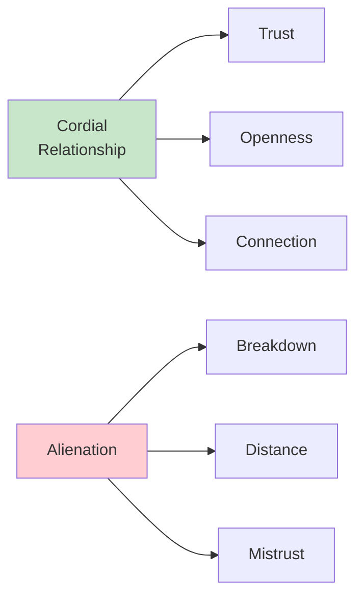
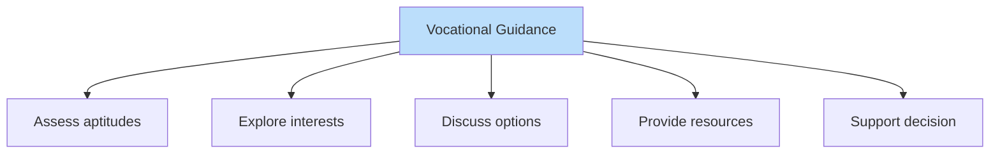
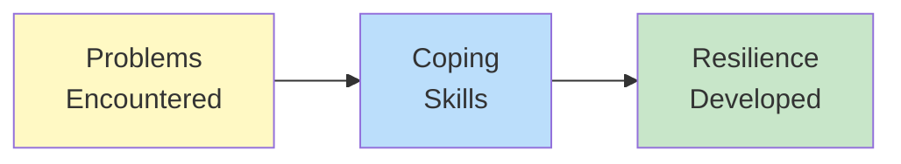

# 1:24 Helping Adolescents Overcome Their Problems

!!! abstract "Section Overview"
    This section provides **practical suggestions** for parents and teachers to help adolescents navigate through the challenges of this developmental period, emphasizing understanding, communication, guidance, and support.

---

## 📚 Suggestions for Parents and Teachers

!!! success "Key Approaches"
    The following suggestions may be useful for parents and teachers to help the adolescents overcome their problems.

---

## 1️⃣ Understand the Problems

!!! info "Understanding is Foundation"
    **Understand the problems** that they are going through and empathise with them.

| Action | Purpose |
|--------|---------|
| **Recognize problems** | Know what adolescents face |
| **Empathise** | Feel their struggles |
| **Acknowledge** | Validate their experiences |

---

## 2️⃣ Maintain Cordial Relationships

!!! info "Build Strong Bonds"
    **Maintain cordial relationship** with them and **do not alienate them**.

!!! warning "Avoid Alienation"
    Do **NOT** create distance or push adolescents away.

---

## 3️⃣ Lend a Patient Ear

!!! info "Active Listening"
    **Lend a patient ear** to their feelings and problems.

| Practice | Benefit |
|----------|---------|
| **Listen patiently** | Adolescents feel heard |
| **Don't interrupt** | Shows respect |
| **Give time** | Builds trust |
| **Be available** | Creates safe space |

---

## 4️⃣ Fulfill Identity Needs

!!! info "Support Self-Discovery"
    Try to **fulfill the adolescent's** need for knowing **his/her identity**.

### Ways to Support Identity Formation

| Approach | Description |
|----------|-------------|
| **Help self-exploration** | Encourage discovering strengths |
| **Provide feedback** | Positive reinforcement |
| **Allow experimentation** | Safe exploration of roles |
| **Recognize individuality** | Value uniqueness |

---

## 5️⃣ Trust Them

!!! info "Build Trust"
    **Trust them** in their tasks and appreciate them.

| Action | Impact |
|--------|--------|
| **Show trust** | Builds confidence |
| **Appreciate efforts** | Motivates |
| **Recognize achievements** | Validates |
| **Give responsibility** | Develops maturity |

---

## 6️⃣ Rational Guidance for Vocational Choice

!!! info "Career Counseling"
    Guide them in making a **rational choice of their vocation**.

### Guidance Elements

| Element | Description |
|---------|-------------|
| **Aptitude assessment** | Identify natural abilities |
| **Interest exploration** | Discover genuine interests |
| **Career information** | Provide accurate data |
| **Decision support** | Help rational decision-making |

---

## 7️⃣ Sex Education

!!! info "Appropriate Knowledge"
    Give **proper sex education** to them to enable them to understand their problems with sex-urge.

!!! note "Benefits of Sex Education"
    - Helps understand bodily changes
    - Normalizes developmental processes
    - Prevents misconceptions
    - Guides healthy attitudes
    - Addresses sex-urge problems appropriately

---

## 8️⃣ Develop Emotional Resilience

!!! info "Emotional Strength"
    Help them to develop **emotional resilience** by making them face problems of their life.

### Building Resilience

| Method | Outcome |
|--------|---------|
| **Face problems** | Develop coping skills |
| **Learn from failures** | Build strength |
| **Problem-solving** | Increase competence |
| **Support through difficulties** | Provide safety net |

---

## 9️⃣ Channel Energies into Activities

!!! info "Constructive Engagement"
    Provide opportunities for them to get involved in **creative and sporting activities** to channelize their excess energy.

### Types of Activities

| Category | Examples |
|----------|----------|
| **Creative** | Arts, music, drama, writing |
| **Sports** | Team sports, athletics, games |
| **Social** | Community service, clubs |
| **Academic** | Projects, competitions |

!!! success "Benefits"
    - Channels excess energy positively
    - Develops skills and talents
    - Provides healthy outlets
    - Builds social connections

---

## 📊 Summary of All Suggestions

| # | Suggestion | Key Action |
|---|------------|------------|
| 1 | Understand problems | Empathise |
| 2 | Cordial relationships | Don't alienate |
| 3 | Patient ear | Listen actively |
| 4 | Identity needs | Support self-discovery |
| 5 | Trust them | Appreciate |
| 6 | Vocational guidance | Rational career choice |
| 7 | Sex education | Address sex-urge |
| 8 | Emotional resilience | Face problems |
| 9 | Channel energies | Creative/sporting activities |

---

## 🧠 Memory Mnemonic

!!! tip "Remember: CLUE TV SCP"
    - **C**ordial relationships
    - **L**end patient ear
    - **U**nderstand problems
    - **E**motional resilience
    - **T**rust them
    - **V**ocational guidance
    - **S**ex education
    - **C**hannel energies (creative activities)
    - (**P** - implicit: recognize their **P**ersonality/identity)

!!! tip "Alternative: VEST CUPS"
    - **V**ocational guidance
    - **E**motional resilience
    - **S**ex education
    - **T**rust them
    - **C**ordial relationship
    - **U**nderstand problems
    - **P**atient listening
    - **S**porting/creative activities

---

## 📝 Quick Revision Table

| Problem | Corresponding Suggestion |
|---------|-------------------------|
| Identity Crisis | Fulfill identity needs |
| Generation Gap | Cordial relationships, patient listening |
| Negative Attitude | Trust, don't alienate |
| Sexual Urge | Sex education |
| Vocational Confusion | Rational vocational guidance |
| Emotional Swings | Build emotional resilience |
| Autonomy Aspiration | Trust, give responsibility |
| Peer Group Pressure | Channel into positive activities |

---

> **Bridge →** Having addressed adolescent problems, we now explore **Developmental Tasks** - the specific achievements expected at each life stage.

---

!!! tip "Exam Tip 📝"
    The **9 suggestions** can be matched with the **8 problems** from the previous section. This is a common exam question format: "What suggestions would you give to help adolescents with identity crisis/vocational confusion?" Be ready to connect problems with solutions.
