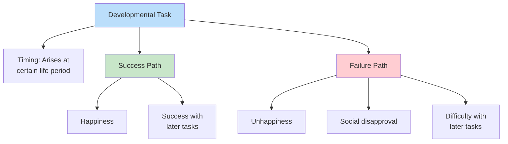
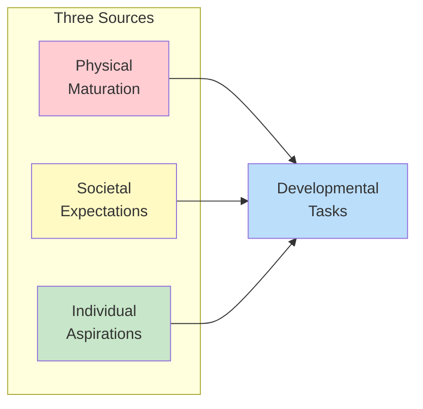
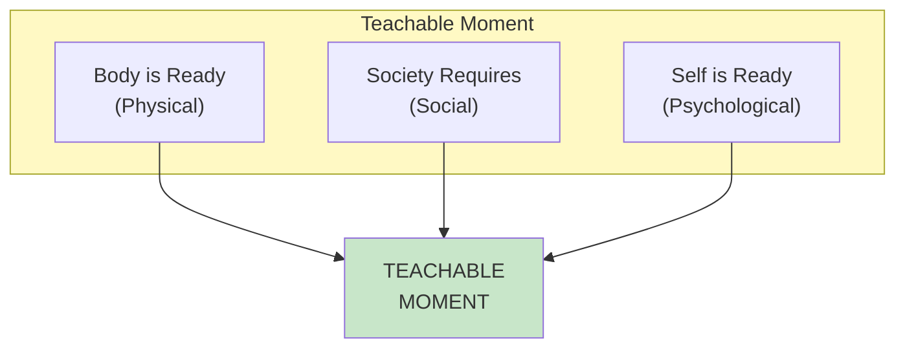

# 1:25 Developmental Tasks

!!! abstract "Section Overview"
    This section introduces the concept of **developmental tasks** as defined by **Robert J. Havighurst**, explaining what they are, their origin, and their significance in human development.

---

## 📚 Definition of Developmental Task

!!! quote "Havighurst's Definition"
    A **'developmental task'** is a task which arises at or about a certain period in the life of an individual, successful achievement of which leads to happiness and to success with later tasks, while failure leads to unhappiness in the individual, disapproval by the society, and difficulty with later tasks.
    
    — **Robert J. Havighurst**

---

## 🔑 Key Components of the Definition

### Outcomes of Task Achievement

| Achievement | Outcome |
|-------------|---------|
| **Success** | Happiness |
| **Success** | Success with later tasks |
| **Failure** | Unhappiness |
| **Failure** | Social disapproval |
| **Failure** | Difficulty with later tasks |

---

## 🎯 Sources of Developmental Tasks

!!! info "Origin of Tasks"
    According to Havighurst, developmental tasks arise from:

| Source | Description |
|--------|-------------|
| **Physical maturation** | Biological growth demands |
| **Societal expectations** | Cultural pressure of society |
| **Individual aspirations** | Personal values and goals |

---

## 📊 Uses of Developmental Tasks

!!! success "Practical Applications"
    Havighurst explains that developmental tasks have two important uses:

### 1. Discovering Educational Purposes

!!! info "For Schools"
    In **discovering and stating the purposes of education** in the schools.

| Application | Description |
|-------------|-------------|
| **Curriculum design** | Align with developmental needs |
| **Age-appropriate goals** | Set realistic expectations |
| **Educational planning** | Structure learning activities |

### 2. Timing of Educational Efforts

!!! info "Teachable Moment"
    In **timing our educational efforts** — achieving a "teachable moment".

!!! quote "Teachable Moment"
    When the body is ready, when society requires, and when the self is ready to achieve a certain task — the **teachable moment** has come.

---

## 🔄 Sequential Nature of Tasks

!!! warning "Importance of Timing"
    - Tasks arise at **specific periods**
    - Success at one stage enables success at **later stages**
    - Failure creates **cumulative difficulties**

| Stage | If Successful | If Failed |
|-------|---------------|-----------|
| **Current task** | Achievement | Struggle |
| **Later tasks** | Easier | More difficult |
| **Overall development** | Harmonious | Problematic |

---

## 📊 Summary of Key Points

| Aspect | Details |
|--------|---------|
| **Theorist** | Robert J. Havighurst |
| **Definition** | Tasks arising at specific life periods |
| **Success leads to** | Happiness, later success |
| **Failure leads to** | Unhappiness, social disapproval, later difficulty |
| **Sources (3)** | Physical maturation, societal expectations, individual aspirations |
| **Uses (2)** | Educational purposes, timing (teachable moment) |

---

## 🧠 Memory Mnemonic

!!! tip "Remember Sources: PSI"
    - **P**hysical maturation
    - **S**ocietal expectations
    - **I**ndividual aspirations

!!! tip "Remember Success Outcomes: HS"
    - **H**appiness
    - **S**uccess with later tasks

!!! tip "Remember Failure Outcomes: USD"
    - **U**nhappiness
    - **S**ocial disapproval
    - **D**ifficulty with later tasks

!!! tip "Remember Teachable Moment: BSS"
    - **B**ody ready
    - **S**ociety requires
    - **S**elf ready

---

## 📝 Quick Revision Table

| Question | Answer |
|----------|--------|
| Who defined developmental tasks? | Robert J. Havighurst |
| What is a developmental task? | Task arising at specific life period |
| What happens if achieved? | Happiness + later success |
| What happens if not achieved? | Unhappiness + disapproval + later difficulty |
| What are the 3 sources? | Physical, Social, Individual |
| What are the 2 uses? | Educational purposes + Teachable moment |

---

> **Bridge →** The concept of developmental tasks leads us to examine the **Specific Developmental Tasks for Various Stages of Life** — from infancy through old age.

---

!!! tip "Exam Tip 📝"
    **Havighurst's definition** is a classic exam question. Memorize the exact phrase: "successful achievement leads to happiness and success with later tasks, while failure leads to unhappiness, disapproval by society, and difficulty with later tasks." Also remember the **teachable moment** concept: body ready + society requires + self ready.
