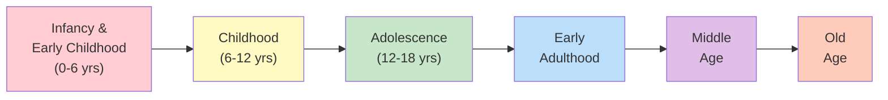
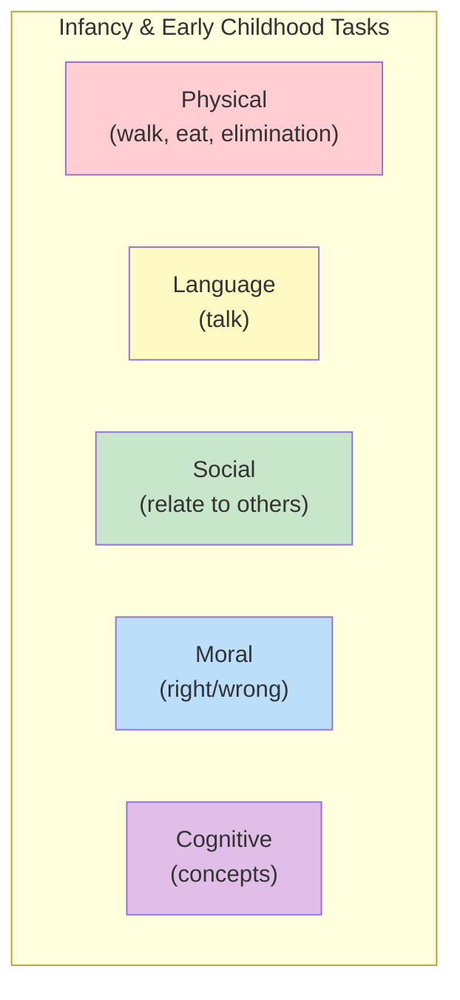
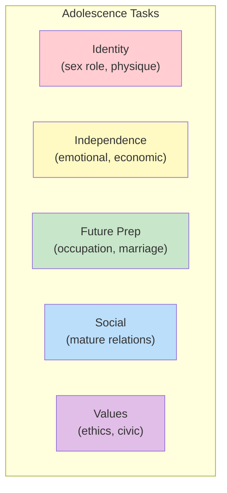
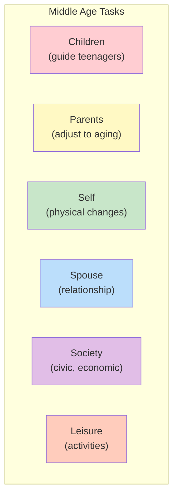

# 1:26 Developmental Tasks for Various Stages of Life

!!! abstract "Section Overview"
    This section presents **Havighurst's developmental tasks** organized by life stages — from infancy and early childhood through middle age and old age, providing a comprehensive framework of expected achievements at each life period.

---

## 📚 Overview of Life Stages

---

## 👶 Stage 1: Infancy and Early Childhood (0-6 years)

!!! info "Foundational Tasks"
    The developmental tasks during this period include:

| # | Developmental Task |
|---|-------------------|
| 1 | Learning to walk |
| 2 | Learning to take solid food |
| 3 | Learning to talk |
| 4 | Learning to control the elimination of body wastes |
| 5 | Learning sex differences and sexual modesty |
| 6 | Achieving physiological stability |
| 7 | Forming simple concepts of social and physical reality |
| 8 | Learning to relate emotionally to parents, siblings, and other people |
| 9 | Learning to distinguish right and wrong, and developing conscience |

### Key Areas

---

## 🧒 Stage 2: Childhood (6-12 years)

!!! info "School-Age Tasks"
    The developmental tasks during this period include:

| # | Developmental Task |
|---|-------------------|
| 1 | Learning physical skills necessary for ordinary games |
| 2 | Building wholesome attitude towards oneself as a growing organism |
| 3 | Learning to get along with age-mates |
| 4 | Learning an appropriate masculine or feminine social role |
| 5 | Developing fundamental skills in reading, writing, and calculating |
| 6 | Developing concepts necessary for everyday living |
| 7 | Developing conscience, morality, and a scale of values |
| 8 | Achieving personal independence |
| 9 | Developing attitudes towards social groups and institutions |

### Key Areas

| Domain | Tasks |
|--------|-------|
| **Physical** | Game skills, body acceptance |
| **Academic** | Reading, writing, calculating |
| **Social** | Peer relations, sex-role learning |
| **Moral** | Conscience, values |
| **Personal** | Independence |

---

## 🧑 Stage 3: Adolescence (12-18 years)

!!! info "Transitional Tasks"
    The developmental tasks during this period include:

| # | Developmental Task |
|---|-------------------|
| 1 | Achieving new and more mature relations with age-mates of both sexes |
| 2 | Achieving a masculine or feminine social role |
| 3 | Accepting one's physique and using the body effectively |
| 4 | Achieving emotional independence from parents and other adults |
| 5 | Achieving assurance of economic independence |
| 6 | Selecting and preparing for an occupation |
| 7 | Preparing for marriage and family life |
| 8 | Developing intellectual skills and concepts necessary for civic competence |
| 9 | Desiring and achieving socially responsible behaviour |
| 10 | Acquiring a set of values and an ethical system as a guide to behaviour |

### Key Themes

---

## 👨 Stage 4: Early Adulthood

!!! info "Establishment Tasks"
    The developmental tasks during this period include:

| # | Developmental Task |
|---|-------------------|
| 1 | Selecting a mate |
| 2 | Learning to live with a marriage partner |
| 3 | Starting a family |
| 4 | Rearing children |
| 5 | Managing a home |
| 6 | Getting started in an occupation |
| 7 | Taking on civic responsibility |
| 8 | Finding a congenial social group |

### Focus Areas

| Domain | Tasks |
|--------|-------|
| **Family** | Mate selection, marriage, children, home |
| **Career** | Occupation establishment |
| **Social** | Civic responsibility, social group |

---

## 👴 Stage 5: Middle Age

!!! info "Maintenance and Adjustment Tasks"
    The developmental tasks during this period include:

| # | Developmental Task |
|---|-------------------|
| 1 | Achieving adult civic and social responsibility |
| 2 | Establishing and maintaining an economic standard of living |
| 3 | Assisting teenage children to become responsible and happy adults |
| 4 | Developing adult leisure-time activities |
| 5 | Relating oneself to one's spouse as a person |
| 6 | Accepting and adjusting to the physiological changes of middle age |
| 7 | Adjusting to aging parents |

### Key Adjustments

---

## 👵 Stage 6: Old Age

!!! info "Later Life Tasks"
    The developmental tasks during this period include:

| # | Developmental Task |
|---|-------------------|
| 1 | Adjusting to decreasing physical strength and health |
| 2 | Adjusting to retirement and reduced income |
| 3 | Adjusting to death of spouse |
| 4 | Establishing an explicit affiliation with one's age group |
| 5 | Meeting social and civic obligations |
| 6 | Establishing satisfactory physical living arrangements |

### Adjustment Focus

| Area | Task |
|------|------|
| **Physical** | Decreasing strength, health |
| **Economic** | Retirement, reduced income |
| **Social** | Age group affiliation, civic obligations |
| **Personal** | Spouse's death, living arrangements |

---

## 📊 Comparative Summary Table

| Stage | Age | Key Focus | Number of Tasks |
|-------|-----|-----------|-----------------|
| **Infancy & Early Childhood** | 0-6 | Foundation building | 9 |
| **Childhood** | 6-12 | School skills, peer relations | 9 |
| **Adolescence** | 12-18 | Identity, independence | 10 |
| **Early Adulthood** | — | Family, career establishment | 8 |
| **Middle Age** | — | Maintenance, adjustment | 7 |
| **Old Age** | — | Adaptation, acceptance | 6 |

---

## 🧠 Memory Mnemonic

!!! tip "Remember Stages: ICE AMO"
    - **I**nfancy & Early Childhood
    - **C**hildhood
    - **E** (Adolescence - teens)
    - **A**dult (Early)
    - **M**iddle age
    - **O**ld age

!!! tip "Key Tasks per Stage"
    - **Infancy**: Walk, Talk, Eat, Eliminate
    - **Childhood**: Read, Write, Play, Peer
    - **Adolescence**: Independence, Occupation, Values
    - **Early Adult**: Mate, Family, Career
    - **Middle Age**: Children, Parents, Adjust
    - **Old Age**: Retire, Health, Accept

---

## 📝 Quick Revision Table

| Stage | Remember These Key Tasks |
|-------|-------------------------|
| **0-6 years** | Walk, talk, eat, toilet, emotions |
| **6-12 years** | 3R's (reading, writing, arithmetic), games, peers |
| **12-18 years** | Independence, career prep, values, mature relations |
| **Early Adult** | Marriage, family, career start |
| **Middle Age** | Help teens, aging parents, maintain |
| **Old Age** | Adjust to losses (health, income, spouse) |

---

> **Bridge →** Understanding developmental tasks leads us to examine how **Education and Developmental Tasks** are interconnected - the role of education in facilitating task achievement.

---

!!! tip "Exam Tip 📝"
    Questions often ask about tasks for **specific stages** (especially childhood and adolescence). Remember the **number of tasks**: Infancy (9), Childhood (9), Adolescence (10), Early Adult (8), Middle Age (7), Old Age (6). Also note how tasks **progress** — from basic physical skills to abstract values, and from dependence to independence to adjustment.
