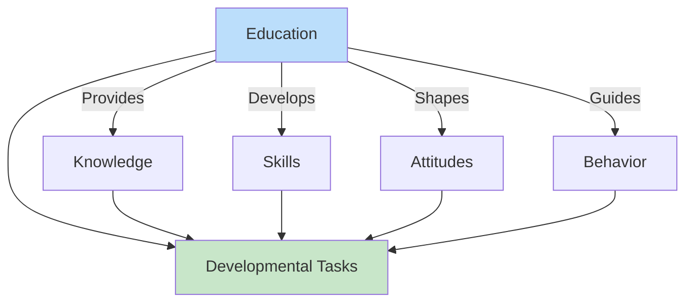
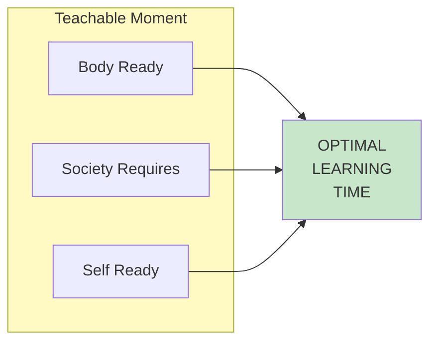
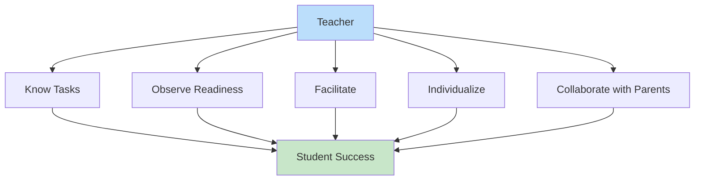
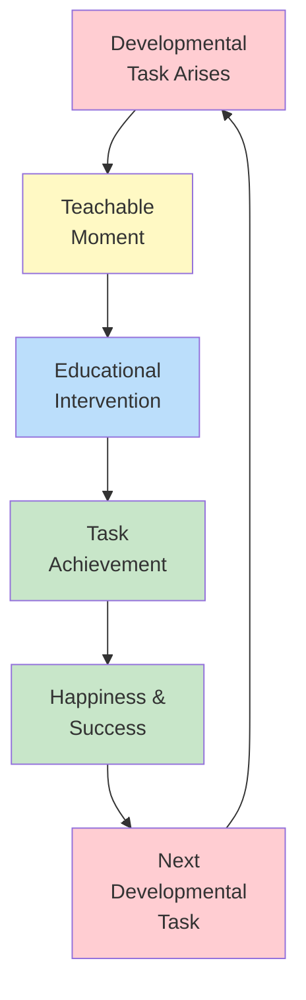

# 1:27 Education and Developmental Tasks

!!! abstract "Section Overview"
    This section explores the **relationship between education and developmental tasks**, examining how schools and educators can facilitate the achievement of developmental tasks and the importance of timing in educational efforts.

---

## 📚 The Educational Connection

!!! info "Role of Education"
    Education plays a **crucial role** in helping individuals achieve their developmental tasks at each stage of life.

---

## 🎯 Two Uses of Developmental Tasks in Education

!!! success "Havighurst's Applications"
    As Havighurst explained, developmental tasks have **two important uses** in education:

### 1. Discovering Educational Purposes

!!! info "Curriculum Planning"
    Developmental tasks help in **discovering and stating the purposes of education** in schools.

| Application | Description |
|-------------|-------------|
| **Goal setting** | Define age-appropriate educational objectives |
| **Curriculum design** | Align content with developmental needs |
| **Program development** | Create relevant educational experiences |

### 2. Timing Educational Efforts

!!! info "The Teachable Moment"
    Developmental tasks help in **timing our educational efforts** to achieve the **"teachable moment"**.

---

## 📊 Matching Education with Developmental Tasks

### Infancy & Early Childhood (0-6 years)

| Developmental Task | Educational Support |
|-------------------|---------------------|
| Learning to walk, talk | Early childhood programs |
| Social concepts | Play-based learning |
| Right and wrong | Value education starts |

### Childhood (6-12 years)

| Developmental Task | Educational Support |
|-------------------|---------------------|
| Reading, writing, calculating | Primary school curriculum |
| Physical skills for games | Physical education |
| Getting along with peers | Social learning activities |
| Moral development | Character education |

### Adolescence (12-18 years)

| Developmental Task | Educational Support |
|-------------------|---------------------|
| Intellectual skills | Secondary education |
| Vocational preparation | Career guidance |
| Values and ethics | Moral education |
| Civic competence | Social studies, citizenship |

---

## 🏫 Implications for Schools

!!! note "Key Implications"
    Schools must:

| Responsibility | Action |
|---------------|--------|
| **Understand tasks** | Know what students need at each stage |
| **Time instruction** | Teach when students are ready |
| **Support development** | Create conducive environment |
| **Address all domains** | Physical, intellectual, social, emotional, moral |

---

## 👨‍🏫 Role of Teachers

!!! success "Teacher Responsibilities"
    Teachers should:

| Responsibility | Description |
|---------------|-------------|
| **Know developmental tasks** | Be aware of age-appropriate expectations |
| **Observe readiness** | Identify teachable moments |
| **Facilitate achievement** | Support task completion |
| **Individualize** | Recognize individual differences |
| **Collaborate** | Work with parents |

---

## ⚠️ Consequences of Educational Mismatch

!!! warning "If Education Doesn't Align with Developmental Tasks"

| Mismatch | Consequence |
|----------|-------------|
| **Too early** | Frustration, failure |
| **Too late** | Missed opportunities |
| **Irrelevant content** | Disengagement |
| **Wrong method** | Ineffective learning |

---

## 🔄 The Cycle of Development and Education

---

## 📝 Summary

!!! success "Key Takeaways"
    
    1. **Education serves developmental tasks** — it's not an end in itself
    2. **Timing matters** — the teachable moment concept is crucial
    3. **Schools must align** curriculum with developmental needs
    4. **Teachers are facilitators** of developmental task achievement
    5. **Success builds on success** — early task achievement enables later success

---

## 🧠 Memory Mnemonic

!!! tip "Remember Education's Role: TAF"
    - **T**ime instruction (teachable moment)
    - **A**lign curriculum (with tasks)
    - **F**acilitate achievement

!!! tip "Remember Teachable Moment: BSS"
    - **B**ody ready
    - **S**ociety requires
    - **S**elf ready

---

## 📝 Quick Revision Table

| Question | Answer |
|----------|--------|
| What are the 2 uses of developmental tasks in education? | 1. Discovering educational purposes 2. Timing educational efforts |
| What is a teachable moment? | When body, society, and self are all ready |
| How should schools use developmental tasks? | Align curriculum and time instruction |
| What happens with educational mismatch? | Frustration, missed opportunities, disengagement |

---

!!! tip "Exam Tip 📝"
    This section ties together **Havighurst's theory** with **educational practice**. Key exam points: (1) Two uses of developmental tasks in education, (2) The teachable moment concept, and (3) The importance of timing in education. Remember that education should **serve** developmental needs, not impose arbitrary content.

---

## 🏁 Unit 1 Conclusion

!!! success "Unit Summary"
    Unit 1 has covered the foundational concepts of Educational Psychology:
    
    - **Definition and scope** of psychology and educational psychology
    - **Growth, development, and maturation** — meanings and relationships
    - **Dimensions and phases** of human development
    - **Physical, intellectual, social, emotional, and moral development** from infancy to adolescence
    - **Adolescence** — characteristics, problems, and solutions
    - **Developmental tasks** — Havighurst's framework and educational applications

> **Next Unit →** Unit 2 will explore **Attention, Perception, and Memory** — cognitive processes fundamental to learning.
