# Unit II: Attention, Perception and Memory

---

## 📋 Abstract

!!! abstract "Unit Overview"
    This unit explores three fundamental cognitive processes essential to learning and human behavior: **Attention**, **Perception**, and **Memory**. It examines how we selectively focus on stimuli (attention), how we interpret sensory information meaningfully (perception), and how we encode, store, and retrieve information (memory). Understanding these processes is crucial for educators to create effective learning environments and for students to develop efficient study strategies. The unit covers definitions, types, determinants, laws governing these processes, and practical classroom applications.

---

## 🎯 Introduction

Understanding **Attention, Perception, and Memory** is fundamental for anyone involved in education because:

- These three processes form the **foundation of all learning** and knowledge acquisition
- Teachers can **optimize instruction** by understanding how students attend, perceive, and remember
- Students can **improve their learning efficiency** by applying these psychological principles
- These concepts explain **individual differences** in learning and academic performance

**Key Learnings in this Unit:**

- Definition and nature of attention as a selective mental process
- Types of attention: Voluntary vs Involuntary
- External and internal factors that determine attention
- The relationship between sensation and perception
- Laws of perceptual organization (Gestalt principles)
- Short-term vs Long-term memory systems
- Factors affecting memory and techniques for improvement
- Practical classroom applications for teachers

---

## 🔗 Connection to Other Units


| Connected Unit | Connection Point | Relationship |
|----------------|------------------|--------------|
| **Unit I** | Human Development | Attention span develops with age; memory capacity increases during development |
| **Unit III** | Motivation & Learning | Motivation influences attention; memory is essential for learning |
| **Unit IV** | Intelligence | Attention and memory are components of intelligent behavior |
| **Unit V** | Personality | Individual differences in attention and memory relate to personality traits |

---

## 📚 Unit Overview

### Topics at a Glance

| Section | Topic | Focus |
|---------|-------|-------|
| 2:00 | **Introduction** | Overview of unit content |
| 2:01 | **Meaning of Attention** | Definition and concept of attending |
| 2:02 | **Types of Attention** | Voluntary vs Involuntary attention |
| 2:03 | **Nature/Characteristics of Attention** | Key features of the attention process |
| 2:04 | **Determinants of Attention** | External and internal factors |
| 2:05 | **Securing Better Attention** | Classroom strategies for teachers |
| 2:06 | **Sensory Organs and Sensations** | Gateway to knowledge |
| 2:07 | **Perception** | Meaningful interpretation of sensation |
| 2:08 | **Determinants of Perception** | Objective and subjective factors |
| 2:09 | **Laws of Perceptual Organisation** | Gestalt principles |
| 2:10 | **Errors in Perception** | Illusions and hallucinations |
| 2:11 | **Meaning of Memory** | Remembering as an active process |
| 2:12 | **Kinds of Memory** | Types and classification of memory |

### Key Framework: Cognitive Processing Flow


### Learning Outcomes

By the end of this unit, you will be able to:

1. **Define** attention, perception, and memory with their psychological significance
2. **Differentiate** between voluntary and involuntary attention
3. **Identify** external and internal determinants of attention
4. **Explain** the laws of perceptual organization (Gestalt principles)
5. **Distinguish** between illusion and hallucination
6. **Compare** short-term memory (STM) and long-term memory (LTM)
7. **Apply** strategies for securing better attention in the classroom
8. **Analyze** factors affecting memory and techniques for improvement

---

## 🗺️ Topic Connection Map

```mermaid
flowchart TB
    subgraph ATTENTION["📌 ATTENTION"]
        A1[2:01 Meaning & Definition]
        A2[2:02 Types]
        A3[2:03 Characteristics]
        A4[2:04 Determinants]
        A5[2:05 Classroom Strategies]
        A1 --> A2 --> A3 --> A4 --> A5
    end
    
    subgraph PERCEPTION["👁️ PERCEPTION"]
        P1[2:06 Sensation]
        P2[2:07 Perception Defined]
        P3[2:08 Determinants]
        P4[2:09 Laws of Organization]
        P5[2:10 Errors - Illusion & Hallucination]
        P1 --> P2 --> P3 --> P4 --> P5
    end
    
    subgraph MEMORY["🧠 MEMORY"]
        M1[2:11 Meaning]
        M2[2:12 Types - STM & LTM]
        M1 --> M2
    end
    
    ATTENTION --> PERCEPTION
    PERCEPTION --> MEMORY
```



---

## 📖 CONTENT

---

### 2:00 Introduction

!!! info "Information"
    This unit covers the mental processes of **attending**, **perceiving**, and **remembering** - three interconnected cognitive functions essential for learning and knowledge acquisition.

**Topics to be discussed:**

| Area | Topics Covered |
|------|---------------|
| **Attention** | Meaning, Definition, Nature, Types, Determinants, Classroom strategies |
| **Perception** | Sensation, Perception, Factors, Laws of perception |
| **Memory** | Meaning, Kinds, Factors affecting memory, Signs of good memory, Improvement techniques |

> **Bridge →** Let us begin by understanding what attention means and how it functions as a mental process.

---

### 2:01 Meaning of Attention

!!! quote "Definition"
    **Attending** can be defined as the mental activity of **focusing on certain aspects** of one's current experiences and **ignoring others**. It is a kind of mental set which predisposes the individual to concentrate upon one stimulus and screen out others.

!!! note "Key Points 📌"
    - Modern psychologists view attention as a **process or activity** of the mind, not an independent faculty
    - Better to speak of **'attending'** rather than 'attention' to emphasize the ongoing process
    - **William James**: Field of attention and consciousness are NOT identical
    - Only a few contents in our consciousness are selected and attended to

### Focus and Margin Concept

```mermaid
flowchart TB
    subgraph CONSCIOUSNESS["Field of Consciousness"]
        subgraph FOCUS["🎯 Focus (Figure)"]
            F[Attended Stimuli - Clear & Distinct]
        end
        subgraph MARGIN["〰️ Margin (Ground)"]
            M[Unattended Stimuli - Vague]
        end
    end
    FOCUS <--> |"Alternates"| MARGIN
    
    style FOCUS fill:#e8f5e9,stroke:#2e7d32,stroke-width:2px
    style MARGIN fill:#fafafa,stroke:#9e9e9e
```



| Term | Gestalt Equivalent | Description |
|------|-------------------|-------------|
| **Focus** | Figure | Central area of clearness; stimuli being attended to |
| **Margin** | Ground | Fringe area; stimuli not in clear awareness |

#### 2:01:1 Definition of Attention

!!! quote "Definition by McDougall"
    **McDougall** defines 'attending' as **"striving to cognize"** - emphasizing the active, effortful nature of attention.

**Components of Attentive Sets:**

| Component | Description |
|-----------|-------------|
| **Mental selectivity** | Choosing what to focus on |
| **Receptor adjustment** | Focusing eyes, turning head |
| **Postural adjustment** | Leaning forward |
| **Muscle tensions** | Physical readiness |

!!! tip "Exam Tip 📝"
    Remember that attention has THREE aspects: **Cognitive** (mental selectivity), **Affective** (emotional involvement), and **Conative** (motor/action related). Mnemonic: **CAC**

**Importance of Attention:**
- Increases one's **efficiency**
- Vital for **acquisition of skills**
- Aid to **remembering and recall**

> **Bridge →** Now let's explore the different types of attention and how they differ.

---

### 2:02 Types of Attention


### Comparison Table: Types of Attention

| Feature | Involuntary Attention | Voluntary Attention |
|---------|----------------------|---------------------|
| **Nature** | Spontaneous, natural, passive | Intentional, deliberate |
| **Effort** | Not much effort needed | Requires effort/will |
| **Common in** | Young children | Adults, mature individuals |
| **Interest** | Direct and immediate | Indirect interest |
| **Example** | Noticing a loud noise | Studying for exams |

### Subtypes of Voluntary Attention

| Subtype | Effort Required | Description | Example |
|---------|-----------------|-------------|---------|
| **Implicit Volitional** | Only to start | Once started, continues effortlessly | Starting to read a well-written book |
| **Explicit Volitional** | Throughout | Continuous effort to start AND sustain | Studying uninteresting subject |

!!! example "Example"
    **Habitual Attention**: A bus driver attending to traffic signals becomes automatic over time - similar to involuntary attention after practice.

!!! tip "Exam Tip 📝"
    Even in voluntary attention, **interest is present** but it's **indirect** rather than direct and immediate.

> **Bridge →** Understanding the nature and characteristics of attention helps us grasp how it functions.

---

### 2:03 Nature / Characteristics of Attention

!!! note "Key Points 📌"
    The following are the **9 key characteristics** of attention:

| # | Characteristic | Description |
|---|----------------|-------------|
| 1 | **Selective Process** | Selection among stimuli - some enter consciousness, others excluded |
| 2 | **First Step in Cognition** | Attending is the first step in knowing; perception is its function |
| 3 | **Three Dimensional** | Involves Cognitive + Affective + Conative aspects |
| 4 | **Requires Motor Adjustment** | Turning head, focusing eyes, leaning forward |
| 5 | **Not Divisible** | Cannot attentively do two things simultaneously |
| 6 | **Fluctuating** | Cannot attend to one object for more than **10 seconds** |
| 7 | **Limited Span** | Adult span: **6 to 8** ungrouped items at a glance |
| 8 | **Determined by Factors** | Internal (mental set, need, interest, mood, physiology) + External factors |
| 9 | **Interest & Effort** | Play significant role; attraction leads to attention |

### Three Dimensions of Attention


!!! warning "Limitation"
    **Attention is not divisible** - If we try to do two things attentively at the same time, **both activities will suffer**.

!!! tip "Exam Tip 📝"
    **Key Numbers to Remember:**
    - Attention fluctuates: Cannot focus on ONE object > **10 seconds**
    - Span of attention: **6-8** items (adults, ungrouped dots)

> **Bridge →** What determines whether we attend to something? Let's explore the determinants.

---

### 2:04 Determinants of Attention


### Summary Table: All Determinants

| External Factors (Objective) | Internal Factors (Subjective) |
|-----------------------------|------------------------------|
| 1. Size | 1. Interest |
| 2. Intensity | 2. Need |
| 3. Change | 3. Mental Set |
| 4. Contrast | 4. Mood |
| 5. Novelty | 5. Physiological Condition |
| 6. Movement | |
| 7. Repetition | |
| 8. Systematic Form | |

#### 2:04:1 External Factors of Attention

!!! info "Information"
    Even if a person is NOT interested, certain **characteristics of the object** may compel attention. These are **object-related** external factors.

| Factor | Description | Example | Classroom Application |
|--------|-------------|---------|----------------------|
| **Size** | Large objects arrest attention | Full-page ads vs quarter-page | Use large diagrams, charts |
| **Intensity** | High intensity stimuli attract | Loud sound, deep colors, pungent smell | Raise voice to overcome noise |
| **Change** | Sudden changes attract attention | Fan stopping, silence in class | Modulate voice while teaching |
| **Contrast** | Contrasting stimuli stand out | Black dot on white shirt, yellow median line on road | Use contrasting activities: lecture → questioning → charts |
| **Novelty** | Unusual presentation attracts | "Admission with permission only" vs "No admission" | Use novel examples, personal experiences |
| **Movement** | Moving objects attract more | Crow, car, airplane for crying child | Stimulus variation: move to blackboard, gestures |
| **Repetition** | Repeated stimuli get noticed | Same ad on TV, radio, newspapers | Explain important concepts 2-3 times with different illustrations |
| **Systematic Form** | Complete, organized forms are better retained | Faint tune heard in noisy surroundings | Give lesson overview before starting |

!!! example "Example"
    **Novelty**: Instead of "Please keep sufficient distance", a lorry displaying **"Don't kiss me please"** immediately arrests attention and is retained longer.

#### 2:04:2 Internal Factors of Attention

| Factor | Description | Example | Teaching Implication |
|--------|-------------|---------|---------------------|
| **Interest** | Most important for adults | Violinist notices music shop in bazaar | Kindle students' interests |
| **Need/Value** | Relevant to current needs | Hungry person spots restaurant, not bookshop | Point out utility of concepts |
| **Mental Set** | Readiness to react to specific stimulus | Person at station spots only their friend | Prepare students for lesson (Herbart's approach) |
| **Mood** | Emotional state affects attention | Happy vs sad mood | Create positive classroom environment |
| **Physiological Condition** | Body state determines attention level | Headache, fever impair attention | Allow rest for unwell students |

!!! tip "Exam Tip 📝"
    **Herbart** stressed the importance of **preparing students** for the lesson at the start of class - this creates the right **mental set** for attention.

> **Bridge →** How can teachers apply these principles to secure better attention in class?

---

### 2:05 Ways and Means of Securing Better Attention in Class

!!! success "Summary"
    **Five strategies** for teachers to secure better classroom attention:

### Strategy 1: Remove Obstacles to Attention

| Obstacles to Remove |
|--------------------|
| Poor physical conditions of pupil |
| Fatigue |
| Sensory defects |
| Unhygienic seating |
| Uncomfortable furniture |
| Inadequate lighting |

### Strategy 2: Use Objective Factors

| Technique | Application |
|-----------|-------------|
| **Loud voice** | Overcome distractions |
| **Striking diagrams** | Visual appeal |
| **Clear blackboard work** | Organized presentation |
| **Coloured chalks** | Contrast effect |
| **Varied activities** | Change and movement |
| **Novel illustrations** | Novelty factor |
| **Repetition** | Repeat basic ideas |

### Strategy 3: Match Attention Type to Age Level

| Stage | Type of Attention | Techniques |
|-------|-------------------|------------|
| **Elementary** | Involuntary | Concrete aids, direct experiences, play activities, curiosity |
| **Middle School** | Voluntary (emerging) | Stimulate acquired interests, hobbies, foster sentiments |
| **Adolescent** | Voluntary | Long-term interests, appeal to self-regard |

### Strategy 4: Effective Introduction

- Tell pupils **what to attend to** at the introduction stage
- Provide **overview of the lesson**
- **Relate new concepts** to previous knowledge
- Give **familiar examples** from day-to-day life

### Strategy 5: Harness Natural Interests

!!! note "Key Points 📌"
    **All children are interested in:**
    - Creative activities
    - Productive activities
    - Free activities
    - Life-like activities
    
    **Therefore, use:**
    - Play way methods
    - Projects
    - Discovery approach
    - Activity-based curriculum

> **Bridge →** Attention works on sensory inputs. Let's understand sensation before moving to perception.

---

### 2:06 Sensory Organs and Sensations

!!! quote "Definition"
    **Sense organs are the gateways of human knowledge** - we get information about the external world only through our sense organs.

### Sensory Pathway Table

| Stimulus Type | Sense Organ | Sensation Type | Action |
|---------------|-------------|----------------|--------|
| Visual stimuli | Eyes | Aural/Visual sensation | **Seeing** |
| Auditory stimuli | Ears | Auditory sensation | **Hearing** |
| Fragrance/odour | Nose | Olfactory sensation | **Smelling** |
| Taste stimuli | Tongue | Gustatory sensation | **Tasting** |
| Tactile stimuli | Skin | Tactile sensation | **Feeling of touch** |

#### 2:06:1 Sensation

!!! quote "Definition"
    **Sensation** is the immediate result of a sense organ being acted upon by appropriate stimuli. They are the various qualities of experience derived from stimulation of sense organs or receptors.


!!! tip "Exam Tip 📝"
    **Key Point**: Sensations are **qualitative differences** experienced with reference to **quantitative stimuli**.

> **Bridge →** Sensation alone is not enough. We need to interpret it meaningfully - that's perception.

---

### 2:07 Perception

!!! quote "Definition"
    **Perception** is a psychological process in which sensory inputs received from sense organs are **processed, organised and interpreted** based on past experiences so that the nature of stimuli are **meaningfully understood**.

### The Perception Formula

```
┌─────────────────────────────────────────────────────────┐
│  PERCEPTION = SENSATION + MEANINGFUL INTERPRETATION     │
└─────────────────────────────────────────────────────────┘
```

!!! example "Example"
    - **Sensation**: Experiencing a smell due to burning object
    - **Perception**: Understanding that the burning object is **rubber** (requires past experience with rubber smell)

### Sensation vs Perception

| Aspect | Sensation | Perception |
|--------|-----------|------------|
| **Nature** | Raw sensory data | Interpreted sensory data |
| **Requires** | Sense organ stimulation | Past experience + memory |
| **Outcome** | Basic awareness | Meaningful understanding |
| **Process** | Reception | Interpretation |

> **Bridge →** What factors determine how we perceive things? Let's explore.

---

### 2:08 Determinants of Perception

```mermaid
flowchart TB
    A[Perception] --> B[Objective Elements]
    A --> C[Subjective Elements]
    B --> D[Stimuli in Environment → Sensations]
    C --> E[Interpretation of Sensations]
    
    subgraph SUBJECTIVE["Subjective Factors"]
        S1[Mental Set]
        S2[Previous Concepts]
        S3[Attitudes]
        S4[Ongoing Needs]
        S5[Interest]
        S6[Suggestion]
        S7[Expectation]
    end
    
    E --> SUBJECTIVE
    
    style SUBJECTIVE fill:#fce4ec,stroke:#c2185b
```



### Perception Equation

| Component | Type | Source |
|-----------|------|--------|
| External objects stimulating sense organs | **Objective factors** | Environment |
| Subjective interpretation using past experiences | **Subjective factors** | Within the person |
| **RESULT** | **PERCEPTION** | |

!!! info "Information"
    **Gardner Murphy's Four Factors of Perception:**
    1. Sensations
    2. Nervous structure sensitive to differences
    3. Previous experiences
    4. Mental set at the time

!!! tip "Exam Tip 📝"
    The same stimulus is perceived **differently by different persons** because of varying subjective factors (mental set, needs, attitudes, past experiences).

> **Bridge →** Perception is organized in predictable ways. Let's learn the laws.

---

### 2:09 Laws of Perceptual Organisation

!!! note "Key Points 📌"
    The **Gestalt psychologists** discovered these laws of perceptual organization:


### Summary Table: Laws of Perception

| Law | Key Principle | Meaning | Example |
|-----|---------------|---------|---------|
| **Pragnanz** | Whole configuration | We perceive things as simple, meaningful wholes | Man on cycle = one unit, not separate parts |
| **Proximity** | Nearness | Closely situated things grouped together | 12 lines seen as 4 groups of 3 |
| **Similarity** | Like with like | Similar stimuli grouped as single unit | Triangles, circles, squares in rows |
| **Closure** | Completion | Mind fills gaps to see complete figures | Incomplete triangle seen as triangle |
| **Good Continuity** | Direction | Organization appears to continue infinitely | Dots in line appear as straight line |

#### 2:09:1 Law of Pragnanz

!!! quote "Definition"
    **'Pragnanz'** means **"compact but significant"**. We perceive everything as a **whole configuration** that is simple, meaningful, and stable - not as separate parts added together.

!!! example "Example"
    On seeing a simple face drawing (circle, triangles, squares, arc), we don't list the shapes - we say **"a human face"**.

#### 2:09:2 Law of Proximity

!!! quote "Definition"
    Perceptual groups are favoured according to the **nearness of the parts**. We perceive closely situated things as a **group**.

!!! example "Example"
    `|||  |||  |||  |||` - 12 parallel lines are perceived as **four groups** of 3 lines each.

#### 2:09:3 Law of Similarity

!!! quote "Definition"
    **Wertheimer**: "Other things being equal, stimuli that are **similar** will have greater tendency to be grouped as a **single unit**."

!!! example "Example"
    - Rows of triangles, circles, and squares → perceived as **horizontal groups** by shape
    - Columns of mixed shapes → perceived as **vertical groups** if colors match

#### 2:09:4 Law of Closure

!!! quote "Definition"
    **Closed or completed figures** are more stable than incomplete figures. Our mind **fills up gaps** and perceives objects as whole and complete.

!!! example "Example"
    - Incomplete triangle with gaps → still seen as a **triangle**
    - **Proof reading**: Missing letters escape attention because mind fills gaps
    - We overlook mistakes in our own letters but others notice them

#### 2:09:5 Law of Good Continuation

!!! quote "Definition"
    Organization in perception appears to **go infinitely in the same direction**. There is a tendency for factors to give direction, movement, and continuation.

!!! example "Example"
    - Series of dots: `• • • • • • • • •` → appears as a **straight line**
    - **Cinema**: Individual shots run at **15 frames per second** appear as one continuous scene

!!! tip "Exam Tip 📝"
    **Mnemonic for Gestalt Laws**: **"Please Pass Some Chocolates Continuously"**
    - **P**ragnanz
    - **P**roximity
    - **S**imilarity
    - **C**losure
    - **C**ontinuity

> **Bridge →** Perception isn't always accurate. Let's explore errors in perception.

---

### 2:10 Errors in Perception

!!! warning "Limitation"
    Our perception is **not always true and accurate**. Errors occur when our mind **wrongly interprets** sensory input.


#### 2:10:1 Illusion

!!! quote "Definition"
    **Illusions** are wrong or mistaken perceptions which **fail to correspond** with the situation as objectively assessed. They arise due to ambiguous qualities of what is perceived OR the state of the perceiving person OR both.

### Types of Illusions

| Type | Description | Example |
|------|-------------|---------|
| **Illusion of Movement** | Stationary objects appear moving | Spot of light in dark appears to move |
| **Illusion of Perspective** | Distance distortion | Parallel lines appear to meet at distance |
| **Reversible Perspective** | Image can be seen two ways | Famous optical illusions |
| **Muller-Lyer Illusion** | Line length distortion | Lines with arrows appear different lengths |
| **Vertical-Horizontal** | Vertical appears longer | Equal lines appear unequal |
| **Optical Illusions** | Various visual tricks | Multiple examples |

!!! example "Example"
    - Rope in backyard mistaken for **snake** at night
    - Trees appear **moving** to train passenger
    - Stationary train appears **moving** when nearby train starts

#### 2:10:2 Hallucination

!!! quote "Definition"
    **Hallucination** is **false perception** with **no sensory basis** - a dream-like image mistaken for perception.

### Illusion vs Hallucination

| Feature | Illusion | Hallucination |
|---------|----------|---------------|
| **Stimulus** | Has apparent external stimulus | NO external stimulus |
| **Who experiences** | All people | Few (mentally ill, drug users) |
| **Situation** | Same situation → same illusion for all | Different circumstances → different individuals |
| **Examples** | Rope → snake, moving trees | Mirage, ghosts, hearing sounds |

!!! example "Example"
    **Hallucinations**: Mirage, seeing ghost on tamarind tree, hearing door tapping sound, hearing anklet sound of an angel.

> **Bridge →** Now let's move to the third major process - Memory.

---

### 2:11 Meaning of 'Memory'

!!! quote "Definition"
    **Remembering** is an active process of mental search. It refers to **retention** of what is learnt and **retrieving** it when required for subsequent use.

!!! note "Key Points 📌"
    - Layman: Memory = capacity to reproduce what is learnt
    - Psychologically: Much more complex
    - Psychologists prefer **'remembering'** to 'memory'

### Three Stages of Remembering


### Factors Affecting Learning/Memorizing


> **Bridge →** Memory can be classified in different ways. Let's explore the types.

---

### 2:12 Kinds of Memory

### Classification of Memory

| Classification Basis | Types | Description |
|---------------------|-------|-------------|
| **Intention** | Incidental vs Intentional | Casual vs deliberate memorization |
| **Vividness** | Vivid vs Indistinct | Clear vs unclear memories |
| **Content** | Observational vs Rote | Concrete events vs words/symbols |
| **Duration** | Short-term (STM) vs Long-term (LTM) | Seconds vs permanent |

#### 2:12:1 Short-term and Long-term Memory

```mermaid
flowchart LR
    subgraph STM["📱 SHORT-TERM MEMORY"]
        S1[Duration: 15-30 seconds]
        S2[Capacity: 7±2 items]
        S3[Also: Primary/Working Memory]
    end
    
    subgraph LTM["💾 LONG-TERM MEMORY"]
        L1[Duration: Minutes to Years]
        L2[Capacity: Unlimited]
        L3[Organized Categories]
    end
    
    STM -->|"Transfer via Rehearsal + Coding"| LTM
    LTM -->|"Retrieval"| STM
```



### STM vs LTM Comparison

| Feature | Short-Term Memory (STM) | Long-Term Memory (LTM) |
|---------|------------------------|------------------------|
| **Also called** | Primary/Working memory | Secondary memory |
| **Duration** | 15-30 seconds | Minutes to many years |
| **Capacity** | Limited: **7±2 items** | **Unlimited** |
| **Storage** | Temporary | Permanent, organized |
| **Transfer time** | Immediate | ~30 minutes for consolidation |
| **Example** | Phone number till dialing | Multiplication tables, birthday |

!!! tip "Exam Tip 📝"
    **Key Numbers:**
    - STM duration: **15-30 seconds**
    - STM capacity: **7±2 items** (Memory span)
    - Transfer to LTM: ~**30 minutes** needed

### Memory Model: Information Processing System


!!! info "Information"
    **Transfer Process:**
    - Information filtered by significance
    - Significant info enters STM for immediate use
    - If valuable for permanent retention → processed, categorized, **coded**
    - Stored permanently in LTM in organized categories
    - **Coding**: Analyzing and compressing information into abbreviated form

!!! example "Example"
    A person who receives a **brain jolt** often doesn't remember events **just before** the accident but WILL remember events from **30 minutes earlier** - showing the time needed for STM to LTM transfer.

!!! note "Key Points 📌"
    **The Memory Process:**
    1. Incoming information → filtered by brain
    2. Significant items → fed to STM
    3. STM items → used immediately OR processed for LTM
    4. LTM storage → organized, categorized, coded
    5. Retrieval → LTM back to STM → response

---

### 2:13 Factors Affecting Memory

Apart from neurological factors (engram formation, synaptic resistance reduction), **psychological factors** play a vital role in retentive capacity.

| Factor Category | Specific Factors |
|----------------|------------------|
| **Learning Conditions** | Scope of material, learning time, number of repetitions, distribution of learning |
| **Age & Interruption** | Age of memory content, Zeigarnik effect (interrupted tasks recalled better) |
| **Motivational Factors** | Fatigue, attitude, concentration, interest, anxiety level, achievement motivation |

!!! quote "Zeigarnik Effect"
    **Interrupted tasks are retained and recalled better than completed tasks.** This is because unfinished tasks create psychological tension that aids memory.

!!! note "Key Points 📌"
    Retentivity (the core of memory) continues to be **puzzling and not fully understood** - both neurological and psychological factors contribute to it.

---

### 2:14 Signs of Good Memory

Psychologists identify **five characteristics** as hallmarks of good memory:

| Sign | Description |
|------|-------------|
| **1. Rapidity** | Ability to recollect past experiences **very quickly** |
| **2. Accuracy** | Bringing back learned materials **without any distortion** |
| **3. Length of Time** | How **long** one can retain learned materials before retrieving them |
| **4. Promptness of Retrieval** | Bringing back learned materials **instantly with ease** without requiring help |
| **5. Serviceableness** | Recall of the **right thing at the right place** and right time |

!!! example "Example of Serviceableness"
    If a candidate cannot give the correct answer during an interview, what is the use of recollecting it after coming out? Serviceableness means **timely recall**.

---

### 2:15 Techniques of Promoting Better 'Memory'

!!! info "Information"
    The capacity to retain cannot be improved intrinsically. What can be improved are the **methods of memorizing**. A good memory depends on a good brain - diet should contain **calcium and phosphorus-rich products**.

**Tips to Improve Memory:**

| # | Technique | Description |
|---|-----------|-------------|
| i | **Desire/Motivation** | Have the desire or motivation to learn whatever is learnt |
| ii | **Meaningful Material** | Meaningful material is learnt quickly and retained longer |
| iii | **SQ3R Method** | Survey, Question, Read, Recite, Review |
| iv | **Spacing** | Space learning periods appropriately for effective learning |
| v | **Recitation** | Self-evaluation during learning; useful especially for children |
| vi | **Over-learning** | Learning beyond the point of forgetting aids retention |
| vii | **Rhymes & Associations** | Logical associations between different parts help remembering |
| viii | **Mnemonic Devices** | Artificial associations like abbreviations (e.g., VIBGYOR for rainbow colors) |
| ix | **Multisensory Learning** | TV ads remembered better than radio ads |
| x | **Rest & Sleep** | Rest immediately after learning helps consolidation of memory traces |
| xi | **Avoid Interference** | Don't learn interfering subjects in succession; avoid Pro-active and Retro-active inhibition |
| xii | **Organization** | Present information in organized manner (Mandler, Herbart); use concept maps, advanced organizers (Ausubel) |

!!! tip "Exam Tip 📝"
    **Study Sequence to Avoid Interference:**
    Mathematics → Language (Tamil/English) → Science → Social Studies/Light subject
    
    This sequence avoids Pro-active and Retro-active inhibition!

---

## 📝 Quick Revision Table

| Topic | Key Points |
|-------|------------|
| **Attention Definition** | Mental activity of focusing on certain aspects while ignoring others; "striving to cognize" (McDougall) |
| **Types of Attention** | Involuntary (spontaneous) vs Voluntary (intentional); Implicit vs Explicit Volitional |
| **Attention Characteristics** | Selective, first step in cognition, 3-dimensional, not divisible, fluctuating (~10 sec), limited span (6-8 items) |
| **External Factors** | Size, Intensity, Change, Contrast, Novelty, Movement, Repetition, Systematic Form (8 factors) |
| **Internal Factors** | Interest, Need, Mental Set, Mood, Physiological Condition (5 factors) |
| **Sensation** | Immediate result of sense organ stimulation; raw sensory data |
| **Perception** | Sensation + Meaningful interpretation using past experience |
| **Gestalt Laws** | Pragnanz, Proximity, Similarity, Closure, Good Continuity (5 laws) |
| **Illusion** | Wrong perception WITH external stimulus; experienced by all |
| **Hallucination** | False perception WITHOUT external stimulus; experienced by few |
| **STM** | 15-30 seconds duration; 7±2 capacity; temporary |
| **LTM** | Minutes to years; unlimited capacity; permanent, organized |
| **Factors Affecting Memory** | Learning conditions, Zeigarnik effect, motivational factors (fatigue, interest, anxiety) |
| **Signs of Good Memory** | Rapidity, Accuracy, Length of time, Promptness of retrieval, Serviceableness (5 signs) |
| **Memory Techniques** | SQ3R, Over-learning, Mnemonics, Spacing, Multisensory learning, Organization (12 tips) |

---

## 🧠 Memory Mnemonics

### For External Factors of Attention (8)
**"SICKNESS MR"** - Size, Intensity, Change, Contrast, Novelty, Movement, Repetition, Systematic form

### For Internal Factors of Attention (5)
**"I NEED My MOOD PILL"** - Interest, Need, Mental set, Mood, Physiological condition

### For Gestalt Laws (5)
**"Please Pass Some Chocolates Continuously"**
- **P**ragnanz
- **P**roximity
- **S**imilarity
- **C**losure
- **C**ontinuity

### For Three Stages of Memory
**"LAR"** - Learning → Storage (Retention) → Retrieval

### For STM Characteristics
**"7 for 30"** - 7±2 items for 15-30 seconds

### Attention Dimensions
**"CAC"** - Cognitive, Affective, Conative

### For Signs of Good Memory (5)
**"RAMPS"** - Rapidity, Accuracy, Memory length, Promptness, Serviceableness

### For Memory Improvement Techniques
**"MOMS RSS"** - Motivation, Over-learning, Mnemonics, Spacing, Recitation, Sleep, SQ3R

---

## ❓ Review Questions

### Short Answer Questions (C)

1. Define the term 'attention'. [2:01:1]
2. What is the difference between focus and margin in the field of consciousness? [2:01]
3. List the types of attention. [2:02]
4. What is implicit volitional attention? Give an example. [2:02]
5. Write short note on the Nature of Attention. [2:03]
6. What is the span of attention? [2:03]
7. List the external factors of attention. [2:04]
8. List the internal factors of attention. [2:04]
9. Explain with a suitable illustration the meaning of the term 'Perception'. [2:07]
10. Differentiate perception from sensation. [2:06:1 + 2:07]
11. Mention the factors that determine our perception. [2:08]
12. Differentiate illusion from hallucination, with suitable examples. [2:10:1 + 2:10:2]
13. What is memory? [2:11]
14. State and illustrate the different kinds of memory. [2:12]
15. Mention the factors that affect memory. [2:13]
16. What are the signs of good memory? [2:14]

### Medium Answer Questions (B)

1. Explain the different kinds of attention and their importance in education. [2:02]
2. Write short note on the Nature of Attention. [2:03]
3. Explain the ways and means of securing better attention in the class. [2:05]
4. Explain the laws of perception with suitable illustrations. [2:09 + 2:09:1 to 2:09:5]
5. Explain the different phases of remembering. [2:11]

### Long Answer Questions (A)

1. Discuss the objective and subjective factors of attention with suitable illustrations and state how the knowledge of this would be of use to a classroom teacher. [2:04 + 2:04:1 + 2:04:2 + 2:05]
2. Discuss the techniques of promoting better memory in pupils through classroom instruction. [2:15]

---

## ✅ Unit Complete

!!! success "Summary"
    **Congratulations!** You have completed **Unit II: Attention, Perception and Memory**.
    
    **What you learned:**
    
    ✅ **Attention** (2:01-2:05) - The selective mental process of focusing; types (voluntary/involuntary); 9 characteristics; 8 external and 5 internal determinants; classroom strategies
    
    ✅ **Perception** (2:06-2:10) - Meaningful interpretation of sensation; Gestalt laws (Pragnanz, Proximity, Similarity, Closure, Continuity); errors (illusion vs hallucination)
    
    ✅ **Memory** (2:11-2:15) - Three stages (learning, retention, retrieval); STM (7±2 items, 15-30 sec) vs LTM (unlimited, permanent); factors affecting memory; 5 signs of good memory; 12 techniques for better memory
    
    **Key Takeaways for Teachers:**
    - Use external factors (size, contrast, novelty, movement) to capture attention
    - Create proper mental set through lesson introduction
    - Apply Gestalt principles in presenting visual information
    - Understand STM limitations when presenting new information
    - Use repetition, organization, and meaningful connections for LTM storage
    - Apply SQ3R method and proper spacing for effective learning
    - Arrange subjects to avoid pro-active and retro-active inhibition

---

*📖 Next Unit: Unit III - Motivation and Learning*
