# 📋 Unit II: Attention, Perception and Memory - Introduction

!!! abstract "Unit Overview"
    This unit explores three fundamental cognitive processes: **Attention**, **Perception**, and **Memory**. It covers the meaning and definition of attention, its nature and types, determinants of attention, ways to secure better attention in the classroom, the relationship between sensation and perception, laws of perceptual organization, the meaning and kinds of memory, factors affecting memory, signs of good memory, and techniques for promoting better memory in educational settings.

---

## 🎯 Introduction

Understanding the mental processes of **attention**, **perception**, and **memory** is crucial for effective teaching and learning. These cognitive processes form the foundation of how students acquire, process, and retain knowledge.

### Why This Unit Matters

- **Attention** determines what information enters our conscious awareness
- **Perception** shapes how we interpret and make sense of sensory information
- **Memory** enables the storage and retrieval of learned material

### Key Learnings in This Unit

| Topic Area | Key Concepts |
|------------|--------------|
| **Attention** | Meaning, definition, types (voluntary/involuntary), nature, determinants |
| **Perception** | Sensation vs perception, factors affecting perception, laws of perceptual organization |
| **Memory** | Meaning, kinds (STM/LTM), factors affecting memory, signs of good memory |
| **Educational Application** | Ways to secure attention in class, techniques for better memory |

---

## 🔗 Connection to Other Units

| Unit | Connection to Unit II |
|------|----------------------|
| **Unit I** | Psychological foundations; understanding growth & development supports cognitive processes |
| **Unit III** | Motivation influences attention; learning depends on memory |
| **Unit IV** | Intelligence relates to memory capacity and perceptual processing |
| **Unit V** | Personality affects attention patterns and learning preferences |

---

## 📚 Unit Overview

### Topics at a Glance

| Section | Topic | Focus |
|---------|-------|-------|
| 2:00 | **Introduction** | Overview of the unit |
| 2:01 | **Meaning of Attention** | Definition and concept of attending |
| 2:02 | **Types of Attention** | Voluntary and involuntary attention |
| 2:03 | **Nature of Attention** | Characteristics of attention |
| 2:04 | **Determinants of Attention** | External and internal factors |
| 2:05 | **Securing Better Attention** | Classroom strategies |
| 2:06 | **Sensory Organs & Sensations** | Gateway to perception |
| 2:07 | **Perception** | Meaning and process |
| 2:08 | **Determinants of Perception** | Factors affecting perception |
| 2:09 | **Laws of Perceptual Organisation** | Gestalt principles |
| 2:10 | **Errors in Perception** | Illusion and hallucination |
| 2:11 | **Meaning of Memory** | Definition and phases |
| 2:12 | **Kinds of Memory** | STM and LTM |
| 2:13 | **Factors Affecting Memory** | Conditions for retention |
| 2:14 | **Signs of Good Memory** | Characteristics of good memory |
| 2:15 | **Techniques for Better Memory** | Memorizing strategies |

---

### Key Framework: Three Pillars of Cognition

```mermaid
flowchart TB
    subgraph COGNITION["🧠 Cognitive Processes"]
        direction TB
        A["📍 ATTENTION"]
        B["👁️ PERCEPTION"]
        C["💾 MEMORY"]
    end
    
    A -->|"Selects stimuli"| B
    B -->|"Interprets sensations"| C
    C -->|"Stores & retrieves"| OUTPUT["Learning & Behavior"]
    
    style A fill:#ffebee,stroke:#c62828
    style B fill:#e3f2fd,stroke:#1565c0
    style C fill:#e8f5e9,stroke:#2e7d32
```

---

### Learning Outcomes

By the end of this unit, you will be able to:

1. **Define** attention, perception, and memory with clarity
2. **Explain** the types and nature of attention
3. **Identify** external and internal determinants of attention
4. **Apply** strategies to secure better attention in the classroom
5. **Differentiate** between sensation and perception
6. **Describe** the laws of perceptual organization
7. **Distinguish** between illusion and hallucination
8. **Compare** short-term and long-term memory
9. **Analyze** factors affecting memory
10. **Implement** techniques for promoting better memory

---

## 🗺️ Topic Connection Map

```mermaid
flowchart TB
    subgraph ATTENTION["📍 ATTENTION"]
        A1[2:01 Meaning] --> A2[2:02 Types]
        A2 --> A3[2:03 Nature]
        A3 --> A4[2:04 Determinants]
        A4 --> A5[2:05 Classroom Strategies]
    end
    
    subgraph PERCEPTION["👁️ PERCEPTION"]
        P1[2:06 Sensation] --> P2[2:07 Perception]
        P2 --> P3[2:08 Determinants]
        P3 --> P4[2:09 Laws]
        P4 --> P5[2:10 Errors]
    end
    
    subgraph MEMORY["💾 MEMORY"]
        M1[2:11 Meaning] --> M2[2:12 Kinds]
        M2 --> M3[2:13 Factors]
        M3 --> M4[2:14 Signs]
        M4 --> M5[2:15 Techniques]
    end
    
    ATTENTION --> PERCEPTION --> MEMORY
    
    style ATTENTION fill:#ffebee,stroke:#c62828
    style PERCEPTION fill:#e3f2fd,stroke:#1565c0
    style MEMORY fill:#e8f5e9,stroke:#2e7d32
```

---

!!! tip "Exam Tip 📝"
    The unit is divided into three major themes: **Attention**, **Perception**, and **Memory**. Questions often ask you to compare types (voluntary vs involuntary attention, STM vs LTM), explain determinants/factors, or describe laws and techniques. Master the definitions first!

---

> **Bridge →** Now that we have an overview of the unit, let's begin with the first cognitive process: **Attention**. In the next section, we'll explore what attention means and how psychologists define it.
