# 2:01 Meaning of Attention

!!! abstract "Section Overview"
    This section explores the concept of **attention** as a mental process, distinguishing it from a mere faculty of mind. It introduces the relationship between attention and consciousness, and provides a formal definition of 'attending'.

---

## 🧠 Understanding Attention as a Process

Modern psychologists, who believe in the **integrated functioning of the mind**, do not consider 'attention' as an independent faculty or unique power of mind.

!!! note "Key Points 📌"
    - Attention is a **process** or an **activity** of the mind
    - It is better to speak of **'attending'** rather than 'attention'
    - Both terms can be used synonymously once we understand it as an ongoing process

---

## 📍 Attention and Consciousness

| Concept | Description |
|---------|-------------|
| **Field of Consciousness** | The entire range of what we are aware of at any moment |
| **Field of Attention** | Only a few selected items from consciousness |
| **William James's Insight** | Field of attention and consciousness are **not identical** |

### Focus and Margin Model

!!! info "Information"
    **Gestalt Psychologists** use the terms:
    
    - **Figure** → corresponds to **Focus** (attended stimuli)
    - **Ground** → corresponds to **Margin** (unattended stimuli)

### Dynamic Nature

The **focus and margin alternate**:

- Stimulus now in focus may **drift to the margin**
- Stimulus earlier in the margin may **move to focus**
- This creates a constant **shifting of attention**

---

## 2:01:1 Definition of Attention

!!! quote "Definition"
    **Attending** can be defined as the **mental activity of focusing on certain aspects of one's current experiences and ignoring others**.

### Components of Attention

| Component | Description |
|-----------|-------------|
| **Mental Selectivity** | Choosing what to attend to |
| **Receptor Adjustment** | Focusing our eyes, turning our head |
| **General Postural Adjustment** | Leaning forward towards stimulus |
| **Muscle Tensions** | Physical readiness to engage |

!!! quote "McDougall's Definition"
    **McDougall** defines 'attending' as **"striving to cognize"**.

---

## 🎭 Three Dimensions of Attention

Attention involves **cognitive**, **affective**, and **conative** aspects:

```mermaid
flowchart LR
    subgraph DIMENSIONS["Three Dimensions of Attending"]
        direction TB
        COG["🧠 COGNITIVE\n(Mental selectivity)"]
        AFF["❤️ AFFECTIVE\n(Emotion related)"]
        CON["🏃 CONATIVE\n(Motor activity related)"]
    end
    
    COG --- AFF --- CON
    
    style COG fill:#e3f2fd,stroke:#1565c0
    style AFF fill:#ffebee,stroke:#c62828
    style CON fill:#e8f5e9,stroke:#2e7d32
```

| Dimension | Aspect | Example |
|-----------|--------|---------|
| **Cognitive** | Mental selectivity | Choosing to focus on teacher's voice |
| **Affective** | Emotional involvement | Interest or curiosity in the topic |
| **Conative** | Motor/action related | Leaning forward, taking notes |

---

## 📈 Importance of Attention

!!! success "Benefits of Attention"
    | Benefit | Description |
    |---------|-------------|
    | **Increases Efficiency** | Better focus leads to improved performance |
    | **Vital for Skill Acquisition** | Attention is essential for learning new skills |
    | **Aid to Remembering** | What we attend to is more likely to be remembered |
    | **Aid to Recall** | Attended information is easier to retrieve |

---

## 🔑 Key Terms Summary

| Term | Meaning |
|------|---------|
| **Attending** | Mental activity of focusing on certain aspects while ignoring others |
| **Focus** | Central area of clearness in consciousness |
| **Margin (Fringe)** | Peripheral area of consciousness, not clearly felt |
| **Figure** | Gestalt term for attended stimuli |
| **Ground** | Gestalt term for unattended background |
| **Striving to Cognize** | McDougall's definition of attending |

---

!!! tip "Exam Tip 📝"
    Remember the **focus-margin** or **figure-ground** relationship. A common question asks you to define attention with reference to consciousness. Always mention that attention is a **selective process** and not the entire field of consciousness.

---

!!! example "Example"
    When sitting in a classroom:
    
    - **Focus**: Teacher's explanation of a concept
    - **Margin**: Sound of fan, classmates whispering, light from window
    
    The focus can shift if the fan suddenly stops (change attracts attention), moving the fan sound from margin to focus temporarily.

---

> **Bridge →** Now that we understand what attention means, let's explore the **two major types of attention**: voluntary and involuntary attention in the next section.
