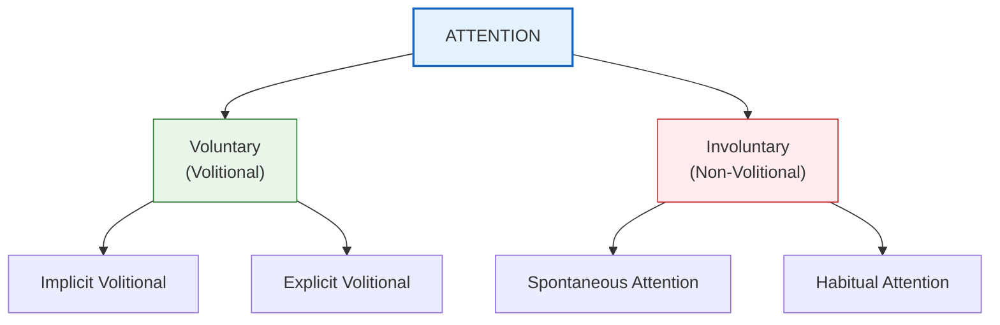
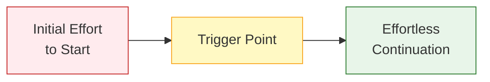
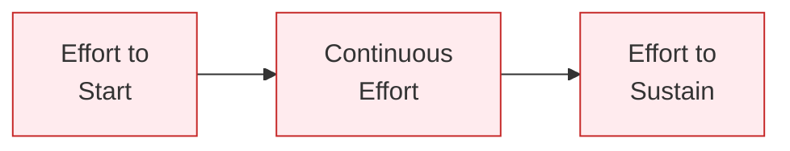
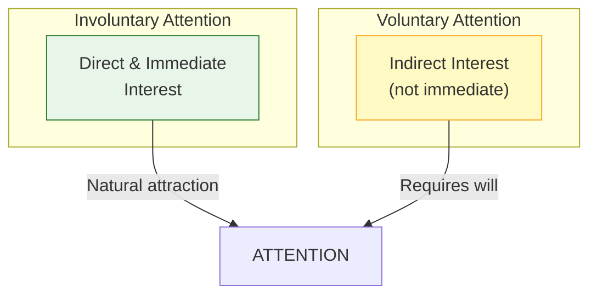

# 2:02 Types of Attention

!!! abstract "Section Overview"
    This section examines the **two main types of attention**: Voluntary (Volitional) and Involuntary (Non-Volitional) attention, along with their subtypes including Implicit Volitional, Explicit Volitional, and Habitual attention.

---

## 📊 Classification of Attention

---

## 1️⃣ Involuntary or Non-Volitional Attention

!!! quote "Definition"
    **Involuntary Attention** is the type of attention that is **spontaneous, free, natural, and passive**. It requires **little to no effort** from the individual.

### Characteristics

| Feature | Description |
|---------|-------------|
| **Spontaneous** | Occurs naturally without intention |
| **Free** | No deliberate choice required |
| **Natural** | Follows the natural tendencies of mind |
| **Passive** | Does not require mental effort |
| **Effortless** | Minimal exertion needed |

!!! example "Example"
    - A child's attention captured by colorful toys
    - Suddenly looking up when hearing a loud sound
    - Noticing a bright flash of light

!!! note "Key Points 📌"
    **Attention of young children is primarily involuntary in nature.** They are easily distracted by novel, bright, or moving stimuli without any conscious effort.

---

## 2️⃣ Voluntary or Volitional Attention

!!! quote "Definition"
    **Voluntary Attention** is the type of attention that involves **some effort or will**. It is **intentional** and requires the individual to consciously direct their focus.

### Characteristics

| Feature | Description |
|---------|-------------|
| **Effortful** | Requires conscious effort |
| **Intentional** | Deliberately directed |
| **Will-based** | Involves volition or will power |
| **Interest may be indirect** | Not always immediate interest |

!!! example "Example"
    - Studying a subject you find boring but is important for exams
    - Forcing yourself to listen to a lengthy lecture
    - Reading a difficult textbook

---

## 📋 Subtypes of Voluntary Attention

### A. Implicit Volitional Attention

!!! quote "Definition"
    **Implicit Volitional Attention** is when **effort is required only to initiate or start attending**, but once started, the attention continues **effortlessly**.

!!! example "Example"
    - Starting to read a new book requires effort
    - Once absorbed in a well-written book, reading continues effortlessly
    - Beginning a hobby that becomes enjoyable

---

### B. Explicit Volitional Attention

!!! quote "Definition"
    **Explicit Volitional Attention** requires **continuous effort** to both **start and sustain** attention throughout the activity.

!!! example "Example"
    - Studying a subject with absolutely no interest
    - Listening to a monotonous lecture throughout
    - Completing tasks that feel tedious

!!! note "Key Points 📌"
    **Most activities carried out without much interest belong to this category** of explicit volitional attention.

---

## 3️⃣ Habitual Attention

!!! quote "Definition"
    **Habitual Attention** is a type of attention that becomes **automatic after some time** due to repeated practice. It is **akin to involuntary attention**.

!!! example "Example"
    - Bus drivers attending to traffic signals automatically
    - Experienced typists attending to the keyboard
    - Musicians automatically reading musical notes

---

## 📊 Comparison Table: Types of Attention

| Aspect | Involuntary | Voluntary (Implicit) | Voluntary (Explicit) | Habitual |
|--------|-------------|---------------------|---------------------|----------|
| **Effort Level** | No effort | Initial effort only | Continuous effort | No effort (automatic) |
| **Nature** | Spontaneous | Triggered then flows | Forced throughout | Automatic |
| **Interest** | Direct & immediate | Develops after start | Indirect | Not required |
| **Typical Age** | Young children | All ages | All ages | Adults with practice |
| **Will Required** | No | Yes (initially) | Yes (continuously) | No |

---

## 🎯 Role of Interest in Attention

!!! info "Information"
    Even in **voluntary attention**, some interest is present. However, the interest is of an **indirect nature** rather than direct and immediate. Without any interest whatsoever, we would not attend at all.

---

## 🏫 Educational Implications

| Type of Attention | Teaching Strategy |
|-------------------|-------------------|
| **Involuntary** | Use colorful aids, novelty, movement for young children |
| **Implicit Volitional** | Make beginnings engaging; once hooked, learning flows |
| **Explicit Volitional** | Use motivation, incentives for difficult subjects |
| **Habitual** | Build routines and practice for skill development |

---

!!! tip "Exam Tip 📝"
    A common exam question asks you to **explain the different kinds of attention and their importance in education**. Make sure you:
    
    1. Define each type clearly
    2. Give examples
    3. Explain educational implications
    4. Note the progression: Involuntary → Voluntary → Habitual

---

## 🔑 Key Terms Summary

| Term | Meaning |
|------|---------|
| **Involuntary Attention** | Spontaneous, effortless attention |
| **Voluntary Attention** | Intentional, effortful attention |
| **Implicit Volitional** | Effort to start, then effortless |
| **Explicit Volitional** | Continuous effort required |
| **Habitual Attention** | Automatic attention from practice |

---

> **Bridge →** Now that we know the types of attention, let's examine the **nature and characteristics of attention** in detail in the next section.
