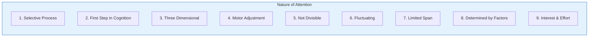
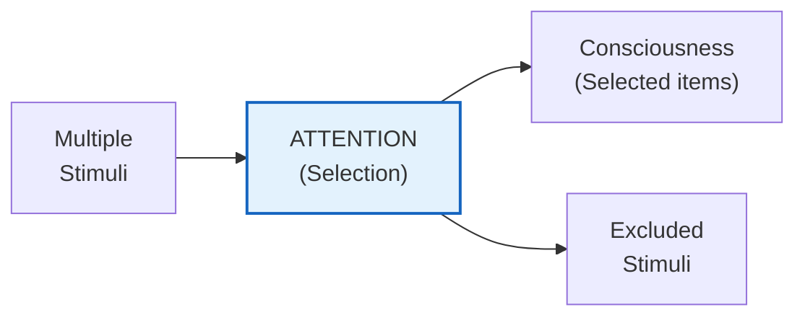
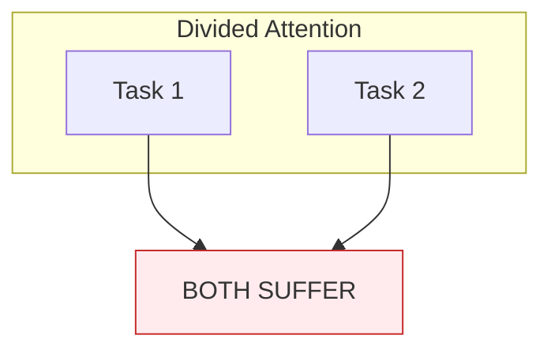
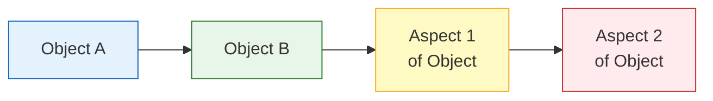
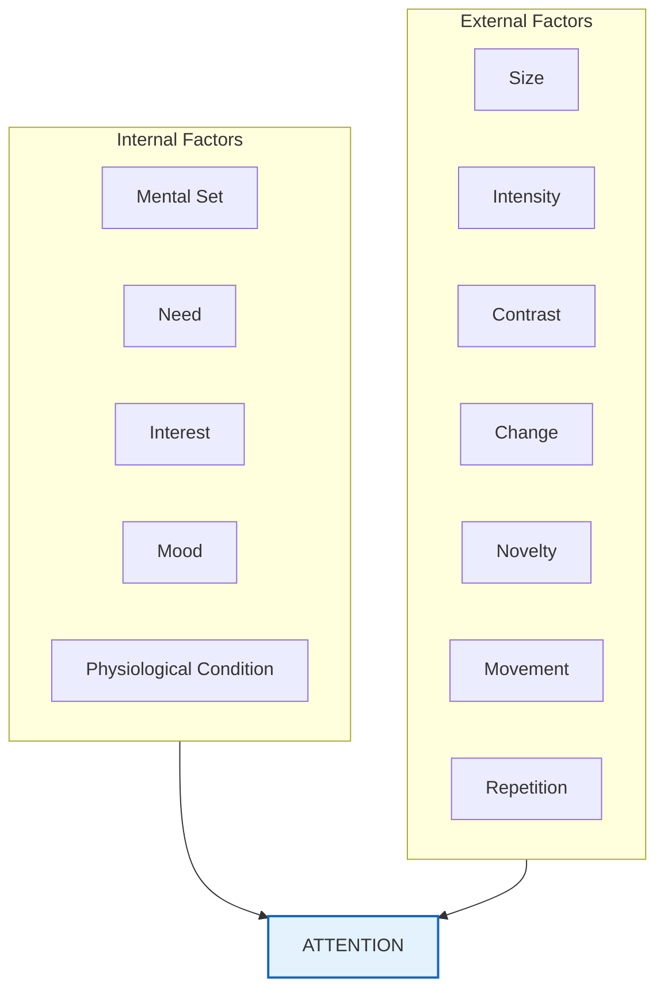

# 2:03 Nature / Characteristics of Attention

!!! abstract "Section Overview"
    This section explores the **nine key characteristics** that define the nature of attention, including its selective nature, three-dimensional aspect, fluctuating quality, and limited span.

---

## 📋 The Nine Characteristics of Attention

---

## 1️⃣ Attention is a Selective Process

!!! quote "Characteristic"
    Attention is a process of **selection among items not yet entered in the field of consciousness**—selecting some stimuli to enter consciousness while **others remain excluded**.

---

## 2️⃣ Attending is the First Step in Cognition

!!! quote "Characteristic"
    Attending is the **first step in the mental process of knowing** called **'Cognition'**. Perception is the function of attention.

!!! note "Key Points 📌"
    Without attention, perception cannot occur, and without perception, knowledge (cognition) cannot be acquired.

---

## 3️⃣ Attention is Three Dimensional

!!! quote "Characteristic"
    Attention involves not only **mental selectivity** but also **affective** (emotion related) and **conative** (motor activity related) aspects in the cognitive activity of attending.

| Dimension | Aspect | Description |
|-----------|--------|-------------|
| **Cognitive** | Mental Selectivity | Choosing what to focus on |
| **Affective** | Emotional | Feelings and emotions involved |
| **Conative** | Motor Activity | Physical actions and adjustments |

!!! quote "McDougall's Definition"
    McDougall defines 'attending' as **"Striving to Cognize a stimulus clearly"**.

---

## 4️⃣ Attention Needs Motor Adjustment

!!! quote "Characteristic"
    Attention requires **physical adjustments** to facilitate focusing on stimuli.

| Motor Adjustment | Description |
|------------------|-------------|
| **Turning the head** | Orienting towards the stimulus |
| **Focusing the eyes** | Visual accommodation |
| **Leaning forward** | Postural adjustment |
| **Muscle tension** | Physical readiness |

---

## 5️⃣ Attention is Not Divisible

!!! quote "Characteristic"
    We **cannot attentively do two things at the same time**. If we try to do so, **both activities will suffer**.

!!! warning "Limitation"
    **Multi-tasking is a myth** when it comes to attentive work. You can only truly attend to one thing at a time. What appears as multi-tasking is actually rapid switching between tasks.

---

## 6️⃣ Attention is Fluctuating in Nature

!!! quote "Characteristic"
    We **cannot be attending continuously** on any object for more than **10 seconds** because attention **shifts** from one object to another or from one aspect of the object to another aspect.

!!! tip "Exam Tip 📝"
    The **10-second limit** is an important figure to remember for exams. Attention naturally fluctuates and cannot be sustained indefinitely on a single object.

---

## 7️⃣ Span of Attention is Limited

!!! quote "Definition"
    **Span of attention** refers to the **number of independent, distinct, or separate stimuli** that can be attended to by an individual **at a glance**.

| Age Group | Span of Attention |
|-----------|-------------------|
| **Adults** | **6 to 8** ungrouped dots |
| **Children** | Less than adults |

!!! info "Information"
    Experiments reveal that the adult span of attention is between **6 to 8** for ungrouped dots. This is why phone numbers are typically grouped into smaller chunks.

---

## 8️⃣ Attention is Determined by Multiple Factors

!!! quote "Characteristic"
    Both **internal** and **external** factors determine attention.

| Factor Type | Examples |
|-------------|----------|
| **Internal (Subjective)** | Mental set, need, interest, mood, physiological conditions |
| **External (Objective/Stimulus-related)** | Size, intensity, contrast, change, novelty, movement, repetition |

---

## 9️⃣ Interest and Efforts Play Significant Role

!!! quote "Characteristic"
    **Interest** and **effort** play significant roles in attending to an object. The reason behind our attention to an object is that **it appears attractive to us** and we are also **interested in it**.

---

## 📊 Summary Table: Characteristics of Attention

| # | Characteristic | Key Point |
|---|----------------|-----------|
| 1 | **Selective Process** | Selection among stimuli |
| 2 | **First Step in Cognition** | Precedes perception |
| 3 | **Three Dimensional** | Cognitive + Affective + Conative |
| 4 | **Motor Adjustment** | Physical adjustments needed |
| 5 | **Not Divisible** | Cannot attend to two things simultaneously |
| 6 | **Fluctuating** | Shifts every ~10 seconds |
| 7 | **Limited Span** | 6-8 items for adults |
| 8 | **Determined by Factors** | Internal & external factors |
| 9 | **Interest & Effort** | Key drivers of attention |

---

## 🧠 Memory Aid: **SFTM-DFLI**

!!! note "Mnemonic"
    Remember the 9 characteristics with: **S-F-T-M-D-F-L-D-I**
    
    - **S** - Selective
    - **F** - First step (in cognition)
    - **T** - Three dimensional
    - **M** - Motor adjustment
    - **D** - Divisibility (not divisible)
    - **F** - Fluctuating
    - **L** - Limited span
    - **D** - Determinants (factors)
    - **I** - Interest & Effort

---

!!! tip "Exam Tip 📝"
    When asked about the "**Nature of Attention**," list all 9 characteristics with brief explanations. The fluctuating nature (10 seconds) and limited span (6-8 items) are frequently tested numerical facts.

---

> **Bridge →** Now that we understand the characteristics of attention, let's explore **what determines our attention**—the external and internal factors—in the next section.
