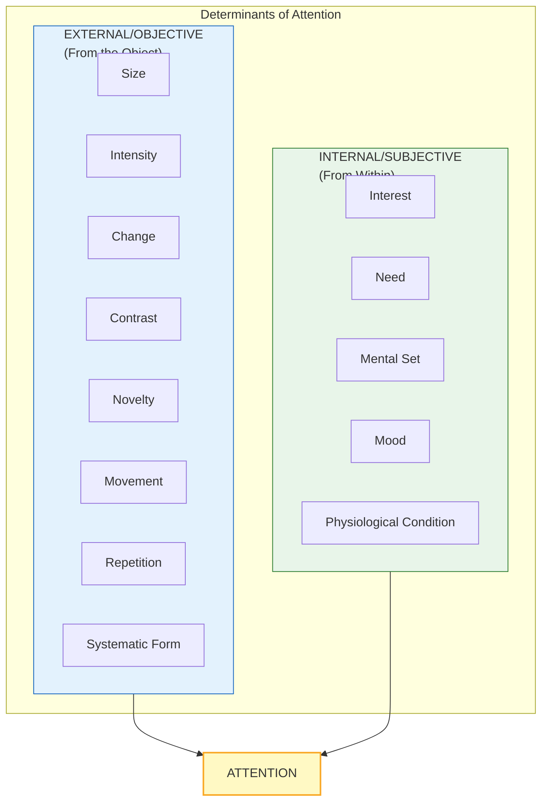

# 2:04 Determinants of Attention

!!! abstract "Section Overview"
    This section examines the **factors that determine attention**, classified into **external (objective) factors** residing in the stimulus and **internal (subjective) factors** operating from within the individual. Understanding these determinants is crucial for teachers to capture and maintain students' attention.

---

## 🎯 What Determines Attention?

If attention is a **process of selection**, then the question arises: **On what basis is this selection made?**

---

## 📊 Quick Comparison Table

| **External (Objective) Factors** | **Internal (Subjective) Factors** |
|----------------------------------|-----------------------------------|
| 1. Size | 1. Interest |
| 2. Intensity | 2. Need |
| 3. Change | 3. Mental Set |
| 4. Contrast | 4. Mood |
| 5. Novelty | 5. Physiological Condition |
| 6. Movement | |
| 7. Repetition | |
| 8. Systematic Form | |

!!! note "Key Points 📌"
    - **Objective factors**: Reside in the object attended to; operate from **outside**
    - **Subjective factors**: Operate from **within** the individual
    - **Psychology of advertising** makes good use of objective factors
    - **Teachers** must use both types of factors profitably in the classroom

---

## 2:04:1 External Factors of Attention

!!! quote "Definition"
    **External factors** are object-related factors that can **compel a person to attend** even if they are not initially interested in the event or object.

---

### i. Size 📏

!!! info "Principle"
    **Objects of big size arrest our attention immediately.**

| Example | Application |
|---------|-------------|
| Full page advertisements vs. quarter page | Full page captures more attention |
| Large cut-outs of political leaders | Roadside visibility |
| Big advertisement hoardings | Commercial visibility |

!!! tip "Classroom Application 📝"
    Use large charts, big letters on the blackboard, and prominent visual aids to capture students' attention.

---

### ii. Intensity 🔊

!!! info "Principle"
    **As size is to figure, so is intensity to the quality of the stimulus.** Stimuli with high intensity are highly successful in attracting attention.

| Intense Stimulus | Effect |
|------------------|--------|
| **Loud sound** | Immediately noticed |
| **Deep striking colours** | Visually compelling |
| **Pungent smell** | Unavoidable notice |

!!! example "Classroom Example"
    If the teacher **raises his tone**, he can overcome disturbing noises from outside and retain the attention of pupils on the ongoing lesson.

---

### iii. Change 🔄

!!! info "Principle"
    **Sudden change in a stimulus immediately attracts attention.**

| Example | What Happens |
|---------|--------------|
| Fan suddenly stops | Everyone looks up at the fan |
| Silence descends suddenly | Sleeping student wakes up |
| Furniture rearranged | Immediately noticed upon entering |

!!! tip "Classroom Application 📝"
    If a teacher talks with **proper modulation in voice**, they can easily capture students' attention. Vary your tone!

---

### iv. Contrast ⚫⚪

!!! info "Principle"
    **When a stimulus presents itself as a contrast in the midst of other stimuli, it becomes an attention winner.**

| Example | Contrast Effect |
|---------|-----------------|
| Black dot on white shirt | Looks predominant |
| Yellow median line on tar road | High visibility |
| Deep trouser + light shirt | Visual contrast |
| White chalk on blackboard | Clear visibility |

!!! tip "Classroom Application 📝"
    Use **contrasting activities** like:
    
    - Lecturing → Questioning
    - Using charts → Writing on blackboard
    - Silent reading → Discussion

---

### v. Novelty 🆕

!!! info "Principle"
    **When a stimulus is presented in a novel or unusual way, it attracts everyone's attention.**

| Usual Notice | Novel Alternative | Effect |
|--------------|-------------------|--------|
| "No admission" | "Admission with permission only" | More memorable |
| "Keep sufficient distance" | "Don't kiss me please" (on lorry) | Immediately noticed |
| Textbook examples | Teacher's personal experiences | Greater engagement |

!!! tip "Classroom Application 📝"
    Instead of using textbook examples, present illustrations from **personal experiences** relating to pupils' immediate environment.

---

### vi. Movement 🏃

!!! info "Principle"
    **Moving objects easily attract attention compared to stationary objects.**

| Example | Application |
|---------|-------------|
| Mother diverting crying child | Points to moving crow, car, aeroplane |
| Neon light hoardings | Alternate lighting creates appearance of movement |
| Animated advertisements | More engaging than static images |

!!! tip "Classroom Application 📝"
    Present **stimulus variation**:
    
    - Move to the blackboard to write
    - Move towards students while questioning
    - Use appropriate gestures while talking

---

### vii. Repetition 🔁

!!! info "Principle"
    **A stimulus, even of low intensity, if repeated, succeeds in winning attention.**

| Example | Effect |
|---------|--------|
| TV advertisements repeated many times | Product remembered |
| Radio jingles played frequently | Brand recalled |
| Newspaper ads appearing daily | Consumer awareness |

!!! note "Key Points 📌"
    Human nature is to notice stimuli that appear **again and again**.

!!! tip "Classroom Application 📝"
    To focus attention on important concepts:
    
    - Explain **two or three times**
    - Use **different illustrations**
    - Express through **different words**

---

### viii. Systematic Form 📐

!!! info "Principle"
    **Objects with systematic form are easily attended to and retained longer** compared to incomplete or irregular forms.

| Systematic | Irregular |
|------------|-----------|
| Complete tune | Random sounds |
| Organized content | Scattered information |
| Structured lesson | Disjointed teaching |

!!! example "Example"
    We can listen to a **faint tune even in noisy surroundings** because of its systematic form.

!!! tip "Classroom Application 📝"
    Before starting a lesson, give an **overview of the entire lesson** so that students get a proper and complete idea of what's to come.

---

## 📊 Summary: External Factors

| Factor | Key Principle | Classroom Application |
|--------|---------------|----------------------|
| **Size** | Big things attract | Large visual aids |
| **Intensity** | Loud/bright captures | Raise voice when needed |
| **Change** | Sudden changes noticed | Vary teaching style |
| **Contrast** | Differences stand out | Mix activities |
| **Novelty** | Unusual is memorable | Fresh examples |
| **Movement** | Motion draws eyes | Use gestures, movement |
| **Repetition** | Repeated = remembered | Review key concepts |
| **Systematic Form** | Organized = retained | Give lesson overview |

---

## 2:04:2 Internal Factors of Attention

!!! quote "Definition"
    **Internal factors** operate from **within** the individual and can make one attend to objects even when most objective factors are absent.

---

### i. Interest 💡

!!! info "Principle"
    **Interest plays an important role in eliciting attention of grown-up adults.** One attends to something when it matters intensely, even if no objective factors are present.

!!! quote "Key Insight"
    One's interest, which composes one's **dominant motivational system**, determines what one attends to.

| Example | Interest Drives Attention |
|---------|---------------------------|
| Violinist in bazaar | Attention struck at shop selling musical instruments |
| College admission | Students apply to courses of their interest |
| Skill development | Based on individual interest (music, vocational, mathematics, science) |

!!! tip "Classroom Application 📝"
    Teachers should always teach in such a way as to **kindle the interest** of the students.

---

### ii. Need or Value 🎯

!!! info "Principle"
    **Need** is an important subjective factor. We attend to things that fulfill our immediate needs.

| Situation | What Gets Attention |
|-----------|---------------------|
| Person waiting for specific bus | Only buses of that route noticed |
| Hungry person | Small restaurant name board noticed, big bookshop ignored |
| Student needing a pen | Stationery shops noticed |

!!! tip "Classroom Application 📝"
    Before starting a lesson, **point out the utility of concepts** to be taught. When students see the need/value, they will follow with much attention.

---

### iii. Mental Set 🧠

!!! info "Principle"
    **Mental set** is a disposition of readiness to react to a particular stimulus.

!!! example "Example"
    A person at railway station to receive a friend:
    
    - Attention **only on spotting the friend**
    - May not hear if someone nearby calls
    - Mind is **set** specifically for that task

!!! note "Herbart's Emphasis"
    **Herbart** stressed the importance of **preparing students for the lesson** at the start of the class, before actually teaching—this creates the right mental set.

---

### iv. Mood 😊😔

!!! info "Principle"
    One's current **emotional state or mood** affects the level and direction of attention.

| Mood | Effect on Attention |
|------|---------------------|
| Happy/Positive | More receptive, broader attention |
| Sad/Anxious | Narrowed focus, distracted |
| Stressed | Difficulty concentrating |

---

### v. Physiological Condition 🏥

!!! info "Principle"
    The **physiological condition of one's body** determines the level of attention.

| Condition | Effect |
|-----------|--------|
| Headache | Unable to attend to lesson |
| Stomachache | Distracted, uncomfortable |
| Fever | Reduced concentration |
| Fatigue | Diminished attention |

!!! warning "Teacher's Note"
    It is always better to **provide rest** for students who do not feel well, instead of compelling them to attend the class.

---

## 📊 Summary: Internal Factors

| Factor | Key Principle | Classroom Application |
|--------|---------------|----------------------|
| **Interest** | Drives motivated attention | Make lessons interesting |
| **Need** | Value-driven focus | Show utility of concepts |
| **Mental Set** | Readiness to receive | Prepare students before teaching |
| **Mood** | Emotional state affects focus | Create positive atmosphere |
| **Physiological Condition** | Health impacts attention | Allow rest when unwell |

---

## 🧠 Memory Aid: External Factors - **SICNMRS**

!!! note "Mnemonic"
    **S-I-C-N-M-R-S** (Think: "SICK MRS" needs attention!)
    
    - **S** - Size
    - **I** - Intensity
    - **C** - Change & Contrast
    - **N** - Novelty
    - **M** - Movement
    - **R** - Repetition
    - **S** - Systematic Form

## 🧠 Memory Aid: Internal Factors - **IN-MMP**

!!! note "Mnemonic"
    **IN-MMP** (Think: "IN My Mind & Physical")
    
    - **I** - Interest
    - **N** - Need
    - **M** - Mental Set
    - **M** - Mood
    - **P** - Physiological Condition

---

!!! tip "Exam Tip 📝"
    This is a **high-weightage topic**. Questions often ask you to:
    
    1. List and explain objective/subjective factors
    2. Give suitable illustrations
    3. State how this knowledge is useful to classroom teachers
    
    Always include **practical classroom applications** in your answers!

---

> **Bridge →** Now that we understand what determines attention, let's explore **practical strategies for securing better attention in the classroom** in the next section.
