# 2:05 Ways and Means of Securing Better Attention in the Class

!!! abstract "Section Overview"
    This section provides **practical strategies** for teachers to secure and maintain students' attention in the classroom. It covers removing obstacles to attention, using objective factors effectively, and applying age-appropriate techniques.

---

## 🎯 Five Key Strategies for Securing Attention

---

## 1️⃣ Remove Obstacles to Attention

!!! warning "First Step"
    To secure attention, the teacher must **first remove certain obstacles** to attention.

### Obstacles to Remove

| Category | Obstacles | Solution |
|----------|-----------|----------|
| **Physical Conditions** | Poor health, fatigue | Ensure students are rested |
| **Sensory Defects** | Vision/hearing problems | Seating arrangements |
| **Seating** | Unhygienic conditions | Clean, comfortable environment |
| **Furniture** | Uncomfortable chairs/desks | Appropriate furniture |
| **Lighting** | Inadequate illumination | Proper lighting |
| **Ventilation** | Stuffy rooms | Fresh air circulation |

!!! tip "Exam Tip 📝"
    Remember: **Remove obstacles FIRST** before applying attention-gaining strategies.

---

## 2️⃣ Use Objective Factors of Attention

!!! note "Key Points 📌"
    The teacher must make **good use of the objective factors** of attention in class.

| Objective Factor | Classroom Application |
|------------------|----------------------|
| **Loud Voice** | Project voice clearly |
| **Striking Diagrams** | Use visual representations |
| **Clear Blackboard Work** | Write legibly and organize content |
| **Coloured Chalks** | Highlight important points |
| **Varied Activities** | Mix teaching methods |
| **Novel Illustrations** | Use fresh, engaging examples |
| **Repetition of Basic Ideas** | Reinforce key concepts |

---

## 3️⃣ Age-Appropriate Techniques

### Elementary Stage 👶

!!! info "Appeal to Involuntary Attention"
    At the elementary stage, teachers must appeal to **involuntary attention**.

| Technique | Description |
|-----------|-------------|
| **Concrete Aids** | Physical objects students can see and touch |
| **Direct Experiences** | Hands-on activities |
| **Play Activities** | Learning through play |
| **Curiosity** | Appeal to children's natural curiosity |

---

### Middle School Level 🧒

!!! info "Evoke Voluntary Attention"
    At the middle school level, use **suitable techniques of motivation**.

| Technique | Description |
|-----------|-------------|
| **Acquired Interests** | Build on existing interests |
| **Hobbies** | Connect lessons to hobbies |
| **Sentiments** | Foster love for various subjects |
| **Activities** | Engage in school activities |

---

### Adolescent Level 👦

!!! info "Appeal to Long-Term Interests"
    At the adolescent level, **voluntary attention** must be evoked through:

| Technique | Description |
|-----------|-------------|
| **Long-term Interests** | Career goals, future plans |
| **Self-regard** | Appeal to sense of identity |
| **Intrinsic Motivation** | Internal drive to learn |

```mermaid
flowchart TB
    subgraph STAGES["Age-Appropriate Attention Strategies"]
        E["ELEMENTARY\n👶"]
        M["MIDDLE SCHOOL\n🧒"]
        A["ADOLESCENT\n👦"]
    end
    
    E -->|"Involuntary Attention"| ET["Concrete aids\nDirect experiences\nPlay activities\nCuriosity"]
    
    M -->|"Voluntary Attention"| MT["Acquired interests\nHobbies\nSentiments"]
    
    A -->|"Voluntary Attention"| AT["Long-term interests\nSelf-regard"]
    
    style E fill:#ffebee,stroke:#c62828
    style M fill:#fff9c4,stroke:#f9a825
    style A fill:#e8f5e9,stroke:#2e7d32
```

---

## 4️⃣ Guide What to Attend To

!!! note "Key Points 📌"
    During classroom teaching, the teacher must **tell pupils what to attend to**.

### At the Stage of Introduction

| Strategy | How to Apply |
|----------|--------------|
| **Provide Overview** | Give a bird's eye view of the lesson |
| **State Objectives** | Tell students what they will learn |
| **Preview Key Points** | Highlight important concepts |

### While Explaining New Concepts

| Strategy | How to Apply |
|----------|--------------|
| **Relate to Previous Knowledge** | Connect new concepts to what students already know |
| **Give Familiar Examples** | Use examples from day-to-day life situations |
| **Use Analogies** | Make abstract concepts concrete |

!!! example "Example"
    When teaching about "evaporation," relate it to:
    
    - Wet clothes drying on a clothesline (familiar experience)
    - Water disappearing from a puddle after rain (day-to-day observation)

---

## 5️⃣ Harness Natural Interests

!!! note "Key Points 📌"
    Teachers should **harness natural interests** of pupils and also **create new interests** of educational value.

### Children's Universal Interests

| Interest Type | Description |
|---------------|-------------|
| **Creative** | Making and creating things |
| **Productive** | Achieving tangible outcomes |
| **Free** | Autonomy and choice |
| **Life-like** | Real-world connections |

### Teaching Methods That Harness Interests

| Method | How It Appeals to Interest |
|--------|---------------------------|
| **Play Way Methods** | Makes learning enjoyable |
| **Projects** | Productive, creative outcomes |
| **Discovery Approach** | Student-led exploration |
| **Activity-Based Curriculum** | Hands-on, engaging |

!!! info "Information"
    Children's interests **vary with age**, but the above interests are generally universal across age groups.

---

## 📊 Summary Table: Securing Attention in Class

| Strategy | Key Actions | Target |
|----------|-------------|--------|
| **Remove Obstacles** | Address physical, sensory, environmental issues | All students |
| **Use Objective Factors** | Voice, visuals, variety, novelty, repetition | All students |
| **Elementary Stage** | Concrete aids, play, curiosity | Young children |
| **Middle School** | Interests, hobbies, sentiments | Pre-adolescents |
| **Adolescent Stage** | Long-term goals, self-regard | Teenagers |
| **Guide Attention** | Overview, relate to prior knowledge | During teaching |
| **Harness Interests** | Projects, discovery, activities | Create engagement |

---

## 🧠 Memory Aid: **ROUGE** 

!!! note "Mnemonic"
    Remember the 5 strategies with **ROUGE**:
    
    - **R** - Remove obstacles
    - **O** - Objective factors (use them)
    - **U** - Use age-appropriate techniques
    - **G** - Guide what to attend to
    - **E** - Engage natural interests

---

## 🏫 Practical Checklist for Teachers

!!! success "Before Class"
    - [ ] Check physical conditions (lighting, ventilation, furniture)
    - [ ] Prepare visual aids (diagrams, charts, colored chalks)
    - [ ] Plan varied activities
    - [ ] Prepare overview of the lesson
    - [ ] Gather familiar examples from daily life

!!! success "During Class"
    - [ ] Start with lesson overview
    - [ ] Use loud, clear voice with modulation
    - [ ] Write clearly on the board
    - [ ] Connect new concepts to prior knowledge
    - [ ] Use varied activities (lecture, questioning, writing)
    - [ ] Repeat important points

!!! success "For Different Age Groups"
    - [ ] Elementary: Use play, concrete objects, curiosity
    - [ ] Middle School: Connect to hobbies, interests
    - [ ] Adolescent: Appeal to future goals, self-regard

---

!!! tip "Exam Tip 📝"
    When answering questions about "Ways and Means of Securing Better Attention," structure your answer around these **five key strategies**. Always include:
    
    1. Specific examples
    2. Age-appropriate modifications
    3. Practical classroom applications

---

> **Bridge →** Now that we've covered attention comprehensively, let's move to the next cognitive process: **Sensation and Perception**. We'll begin by understanding the sensory organs and how sensations are produced.
