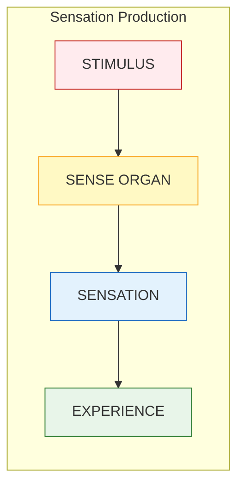
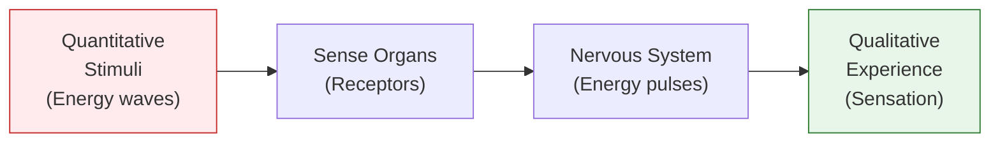
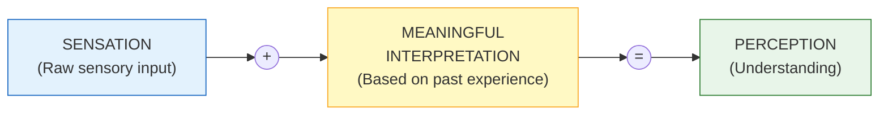
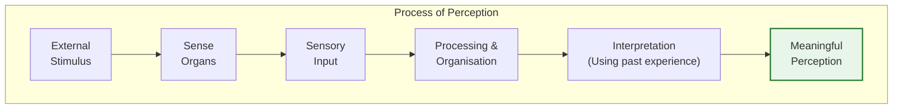
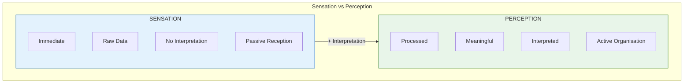

# 2:06 Sensory Organs and Sensations & 2:07 Perception

!!! abstract "Section Overview"
    This section explores the **sensory organs** as gateways of knowledge, the nature of **sensation**, and the process of **perception**. It clarifies the crucial relationship between sensation and perception, showing how raw sensory input is transformed into meaningful understanding.

---

## 🚪 Sensory Organs: Gateways of Knowledge

!!! quote "Key Principle"
    **Sense organs are the gateways of human knowledge**, as we get information and knowledge about the external world only through our sense organs.

### How We Connect with the World

We establish contact with the world around us through:

| Sense | Activity | Adaptation |
|-------|----------|------------|
| Seeing | Visual perception | Responding to objects, people |
| Hearing | Auditory perception | Responding to sounds, speech |
| Smelling | Olfactory perception | Detecting odours, fragrances |
| Tasting | Gustatory perception | Identifying flavours |
| Touching | Tactile perception | Feeling textures, temperatures |

---

## 📊 Sensation Production Process

### The Five Senses

| Stimulus Type | Sense Organ | Sensation Type | Experience |
|---------------|-------------|----------------|------------|
| **Visual stimuli** | Eyes | Aural/Visual sensation | Seeing |
| **Auditory stimuli** | Ears | Auditory sensation | Hearing |
| **Fragrance/Odour** | Nose | Olfactory sensation | Smelling |
| **Taste stimuli** | Tongue | Gustatory sensation | Tasting |
| **Tactile stimuli** | Skin | Tactile sensation | Feeling of touch |

---

## 2:06:1 Sensation

!!! quote "Definition"
    **Sensation** is the **immediate result** of a sense organ being acted upon by appropriate stimuli. Sensations are the various **qualities of experience** derived from the stimulation of sense organs or receptors.

### Key Characteristics of Sensation

| Characteristic | Description |
|----------------|-------------|
| **Immediate** | Direct result of stimulation |
| **Qualitative** | Different qualities experienced |
| **Energy Transformation** | Stimuli (energy waves) transformed by sense organs into nervous system pulses |
| **Raw Input** | Unprocessed sensory data |

!!! info "Information"
    Sensations are **qualitative differences** experienced by us with reference to **quantitative stimuli** that impinge on our sense organs.

---

## 2:07 Perception

!!! quote "Definition"
    **Perception** is a psychological process in which the sensory inputs received from the sense organs are **processed, organised, and interpreted** based on the **past experiences** of the organism so that the nature of the stimuli are meaningfully understood.

### Alternative Definition

!!! quote "Definition"
    Perception is the process of **transforming sensory inputs** to which we attend, into **organised impressions** that we experience.

---

## 🔑 The Key Formula

!!! success "Perception Formula"
    **Perception = Sensation + Meaningful Interpretation**

---

## 📊 Sensation vs Perception

| Aspect | Sensation | Perception |
|--------|-----------|------------|
| **Nature** | Raw sensory input | Interpreted experience |
| **Process** | Immediate reception | Mental interpretation |
| **Role of Past Experience** | Not required | Essential |
| **Result** | Awareness of stimuli | Understanding of stimuli |
| **Example** | Experiencing a smell | Recognizing it as burning rubber |

!!! example "Illustrative Example"
    | Stage | What Happens |
    |-------|--------------|
    | **Sensation** | Experiencing a smell due to burning of an object |
    | **Perception** | Understanding that the burning object is **rubber** |
    | **Requirement** | Must have already experienced the smell of burning rubber before (past experience) |

---

## 🔄 Process of Perception

### Steps in Perception

| Step | Process | Description |
|------|---------|-------------|
| 1 | **Reception** | Stimulus reaches sense organs |
| 2 | **Transduction** | Sense organs convert stimulus to neural signals |
| 3 | **Transmission** | Signals sent to brain |
| 4 | **Processing** | Brain organizes the sensory input |
| 5 | **Interpretation** | Brain gives meaning using past experience |
| 6 | **Perception** | Meaningful understanding achieved |

---

## 🧠 Role of Memory in Perception

!!! note "Key Points 📌"
    For perception to occur, we must:
    
    1. Have **already experienced** similar sensations before
    2. **Retain** those experiences in our memory
    3. **Retrieve** and apply those experiences to interpret current sensations

!!! example "Example"
    To perceive the smell of burning rubber:
    
    - You must have smelled burning rubber **before**
    - That experience must be **stored** in memory
    - When you smell it again, memory helps you **identify** it

---

## 📊 Summary Comparison

---

## 🧠 Memory Aid

!!! note "Mnemonic"
    **"Sensation is Simple, Perception is Processed"**
    
    - **S**ensation = **S**imple, **S**ensory, **S**timulus-based
    - **P**erception = **P**rocessed, **P**ast experience, **P**urposeful meaning

---

!!! tip "Exam Tip 📝"
    A common question asks you to **differentiate perception from sensation**. Always:
    
    1. Define both terms
    2. Provide the formula: Perception = Sensation + Meaningful Interpretation
    3. Give a clear example (like the burning rubber example)
    4. Create a comparison table

---

> **Bridge →** Now that we understand what perception is and how it differs from sensation, let's explore the **factors that determine our perception** in the next section.
