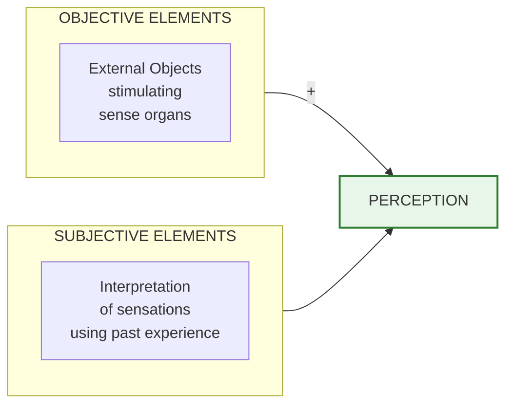
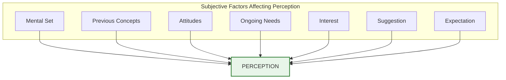
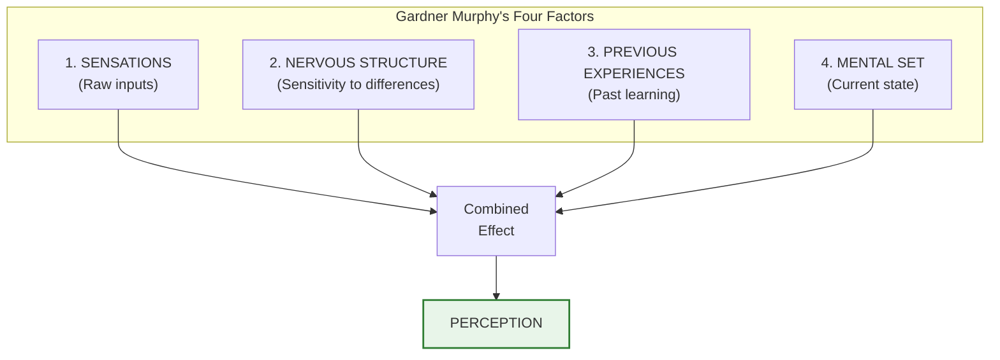
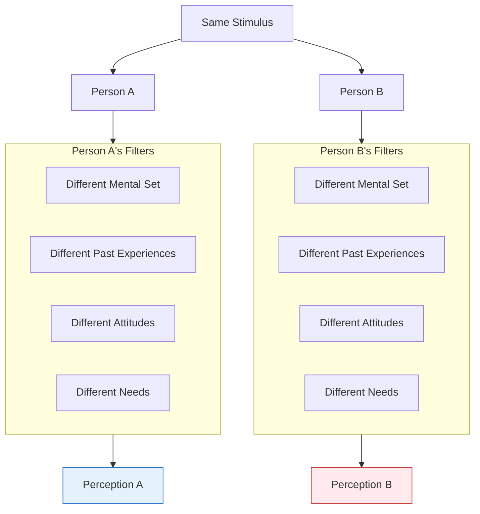

# 2:08 Determinants of Perception

!!! abstract "Section Overview"
    This section explores the **factors that determine perception**, including both objective (stimulus-related) and subjective (individual-related) elements. It also presents **Gardner Murphy's four factors** of perception.

---

## 🎯 What Determines Perception?

!!! quote "Key Principle"
    Perception has both **objective elements** (stimuli from the environment producing sensations) and **subjective elements** (interpretations based on internal factors).

---

## 📊 The Perception Equation

!!! success "Formula"
    **External objects stimulating sense organs (Objective factors) + Subjective interpretation of sensations received from sense organs (Subjective factors) = PERCEPTION**

---

## 🧠 Subjective Factors Influencing Perception

| Factor | Description | Effect on Perception |
|--------|-------------|---------------------|
| **Mental Set** | Predisposition to perceive in certain way | Shapes what we expect to see |
| **Previous Concepts** | Ideas associated with sensory input | Provides framework for interpretation |
| **Attitudes** | Positive/negative predispositions | Colours our perception |
| **Ongoing Needs** | Current requirements | Heightens perception of need-related stimuli |
| **Interest** | What matters to us | Directs perceptual focus |
| **Suggestion** | External influences | Can alter perception |
| **Expectation** | What we anticipate | We tend to perceive what we expect |

!!! note "Key Points 📌"
    **That is why the same stimulus is perceived differently by different persons.**
    
    Example: A half-filled glass may be perceived as "half full" by an optimist and "half empty" by a pessimist.

---

## 🎓 Gardner Murphy's Four Factors of Perception

!!! quote "Gardner Murphy's Theory"
    **Gardner Murphy** identified **four factors** that constitute perception.

| Factor # | Factor | Description |
|----------|--------|-------------|
| 1 | **Sensations** | Raw sensory inputs received |
| 2 | **Nervous Structure** | Capable of or sensitive to differences in nature and strength of sensations |
| 3 | **Previous Experiences** | Past experiences that provide meaning |
| 4 | **Mental Set** | State of mind at the time of experiencing sensations |

---

## 📋 Detailed Analysis of Murphy's Factors

### 1. Sensations

!!! info "Factor 1"
    The **raw sensory inputs** from the environment—visual, auditory, olfactory, gustatory, and tactile.

| Sense | Sensation Type |
|-------|----------------|
| Eyes | Visual sensations |
| Ears | Auditory sensations |
| Nose | Olfactory sensations |
| Tongue | Gustatory sensations |
| Skin | Tactile sensations |

---

### 2. Nervous Structure

!!! info "Factor 2"
    The **nervous system's capacity** to detect and respond to differences in the **nature** and **strength** of sensations.

| Aspect | Description |
|--------|-------------|
| **Sensitivity** | Ability to detect subtle differences |
| **Nature Detection** | Distinguishing types of stimuli |
| **Strength Detection** | Distinguishing intensity levels |

---

### 3. Previous Experiences

!!! info "Factor 3"
    Our **past experiences** provide the framework for interpreting current sensations.

| Role | Description |
|------|-------------|
| **Memory Store** | Repository of past experiences |
| **Reference Point** | Comparison with previous encounters |
| **Meaning Provider** | Gives significance to sensations |

---

### 4. Mental Set

!!! info "Factor 4"
    The **mental state or readiness** at the time of experiencing sensations.

| Aspect | Effect |
|--------|--------|
| **Expectation** | What we're prepared to perceive |
| **Focus** | Where attention is directed |
| **Mood** | Emotional colouring of perception |

---

## 🔄 Why Same Stimulus, Different Perceptions?

!!! example "Example Scenarios"
    | Stimulus | Person A | Person B |
    |----------|----------|----------|
    | Abstract painting | "Beautiful art" | "Random mess" |
    | Spicy food | "Delicious" | "Too hot" |
    | Classical music | "Soothing" | "Boring" |
    | Crowded market | "Exciting" | "Overwhelming" |

### Factors Contributing to Differences

---

## 📊 Summary: Determinants of Perception

| Category | Factors | Source |
|----------|---------|--------|
| **Objective** | External stimuli, sensory input | Environment |
| **Subjective** | Mental set, attitudes, needs, interests, expectations | Individual |
| **Murphy's Factors** | Sensations, Nervous structure, Past experiences, Mental set | Both |

---

## 🧠 Memory Aid: **SNPM**

!!! note "Mnemonic for Murphy's Factors"
    Remember Gardner Murphy's factors with **SNPM**:
    
    - **S** - Sensations
    - **N** - Nervous structure
    - **P** - Previous experiences
    - **M** - Mental set

---

!!! tip "Exam Tip 📝"
    When asked about **factors that determine perception**:
    
    1. First explain the objective vs subjective distinction
    2. List the subjective factors (mental set, attitudes, needs, interests, expectations, suggestion)
    3. Present Gardner Murphy's four factors
    4. Explain why the same stimulus is perceived differently by different people

---

> **Bridge →** Now that we understand what determines perception, let's explore the **laws that govern how we organize perceptions** according to Gestalt psychologists in the next section.
