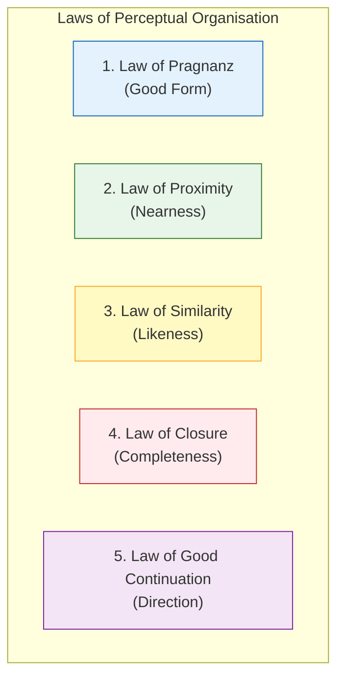
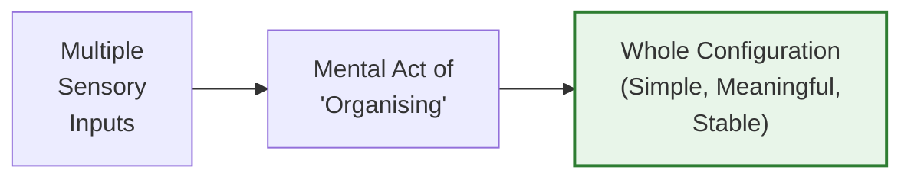
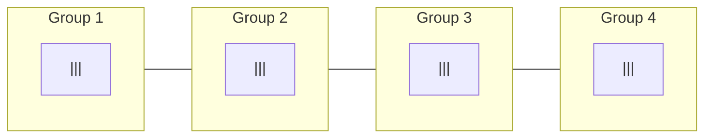
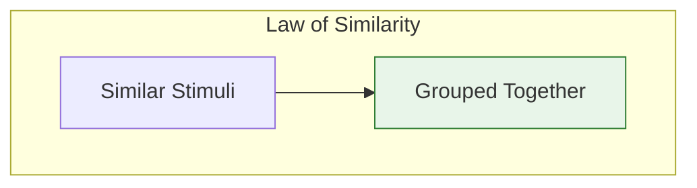
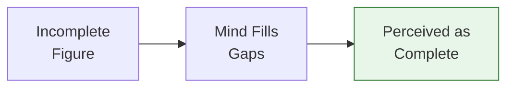
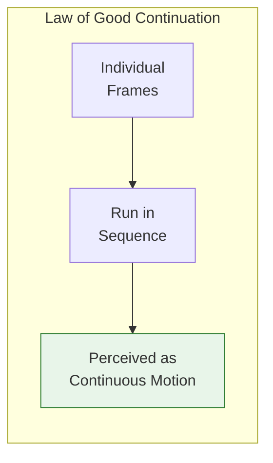
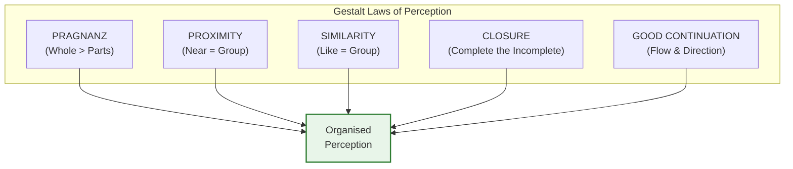

# 2:09 Laws of Perceptual Organisation

!!! abstract "Section Overview"
    This section explores the **five fundamental laws** governing how we organize perceptions, as proposed by **Gestalt psychologists**. These laws explain how the mind naturally groups and organizes sensory information into meaningful wholes.

---

## 📚 The Five Laws of Perceptual Organisation



---

## 2:09:1 Law of Pragnanz (Law of Good Form)

!!! quote "Definition"
    According to Gestalt psychologists, perceptual organisation is governed by the **Law of Pragnanz**. **'Pragnanz'** means **'compact but significant'**.

### Key Principle

!!! note "Key Points 📌"
    In perceiving, we do **NOT** add different sensations and edit them to get at the meaningful interpretation. We always perceive anything as a **whole configuration or pattern** so that it is:
    
    - **Simple**
    - **Meaningful**
    - **Stable**

### How It Works



!!! example "Example 1: Man on Bicycle"
    When we see a man riding a cycle:
    
    | What We DON'T Do | What We DO |
    |------------------|------------|
    | Perceive cycle separately | See it as a whole unit |
    | Perceive rider separately | See "man riding cycle" |
    | Add parts together | Perceive complete pattern |

!!! example "Example 2: Face Recognition"
    When we see a figure made of:
    
    - A circle
    - Triangles
    - Squares
    - Rectangle
    - Arc
    
    We **don't** say "collection of shapes"—we say it's a **human face**.

### Core Insight

!!! success "Summary"
    **We perceive everything as a WHOLE and not its parts and bits.**

---

## 2:09:2 Law of Proximity (Nearness)

!!! quote "Definition"
    According to the Law of Proximity, **perceptual groups are favoured according to the nearness of the parts**. We perceive all **closely situated or located things as a group**.

### Illustration

```
||| ||| ||| |||
```

!!! example "Example"
    The 12 parallel lines above are perceived as **four groups of 3 lines each** because of their proximity to each other.



### Practical Applications

| Context | Application |
|---------|-------------|
| **Design** | Group related items together |
| **Text Layout** | Paragraphs, spacing |
| **Classroom** | Seating arrangements |

---

## 2:09:3 Law of Similarity

!!! quote "Wertheimer's Statement"
    **"Other things being equal, the stimuli that are similar will have greater tendency to be grouped as a single unit."**

### Illustration

**Figure A (Horizontal Grouping)**
```
△ △ △ △ △
○ ○ ○ ○ ○
□ □ □ □ □
```

**Figure B (Vertical Grouping)**
```
△ ○ □ △ ○ □
△ ○ □ △ ○ □
```

!!! example "Example"
    | Figure | Grouping Pattern | Why |
    |--------|-----------------|-----|
    | **Figure A** | Three **horizontal** groups | Similar shapes in rows (triangles, circles, squares) |
    | **Figure B** | Three **vertical** groups | Similar shapes in columns |

### Key Insight



---

## 2:09:4 Law of Closure

!!! quote "Definition"
    **Closed or completed figures are more stable than incomplete or unclosed figures**, hence our mind **fills up the gaps** and perceives the object as **whole and complete**.

### Illustration

```
    /\
   /  \
  /    \
 /......\
```
(Imagine a triangle with gaps in its sides)

!!! example "Example"
    We perceive the figure as a **triangle**, even though there are gaps between the lines.

### Practical Applications

| Situation | How Closure Works |
|-----------|-------------------|
| **Proofreading** | Missing letters escape attention because mind fills gaps |
| **Reading own letter** | Overlook mistakes as mind completes words |
| **Others reading** | They notice mistakes more easily |

!!! note "Key Points 📌"
    This is why:
    
    - When we **proofread our own writing**, we miss errors
    - When **others read** our writing, they immediately notice mistakes
    
    Our mind automatically "closes" the gaps based on expectation.



---

## 2:09:5 Law of Good Continuation

!!! quote "Definition"
    Organisation in perception appears to be **going infinitely in the same direction**. There is a tendency for factors to give **direction, movement, and continuation**.

### Illustration

```
• • • • • • • • • • • • • • • • • • • •
```

!!! example "Example 1: Dots as Line"
    A series of dots appears to be a **straight line** because of the law of good continuation.

!!! example "Example 2: Cinema"
    Cinema scenes, though shot individually, when run in sequence at the rate of **15 frames per second**, appear to be **one and continuous**.

### How It Works



| Application | How Continuation Works |
|-------------|------------------------|
| **Movies** | Individual frames seen as continuous motion |
| **Animation** | Separate images create fluid movement |
| **Reading** | Letters flow into words |

---

## 📊 Summary Table: Five Laws of Perceptual Organisation

| Law | Meaning | Key Phrase | Example |
|-----|---------|------------|---------|
| **Pragnanz** | Perceive as whole, simple, stable pattern | "Compact but significant" | Face = whole, not shapes |
| **Proximity** | Near things grouped together | "Closeness creates groups" | \\|\\|\\| \\|\\|\\| = two groups |
| **Similarity** | Similar things grouped together | "Like attracts like" | △△△ ○○○ = two groups |
| **Closure** | Mind completes incomplete figures | "Fill the gaps" | Broken triangle = triangle |
| **Good Continuation** | Perceive continuous flow | "Keep going" | Dots = line, frames = movie |

---

## 🎨 Visual Summary



---

## 🧠 Memory Aid: **PPSCC**

!!! note "Mnemonic"
    Remember the five laws with **"People Prefer Simple, Closed, Continuous"**:
    
    - **P** - Pragnanz (simple, meaningful, stable)
    - **P** - Proximity (near = group)
    - **S** - Similarity (alike = group)
    - **C** - Closure (complete the incomplete)
    - **C** - Continuation (flow and direction)

---

## 🏫 Educational Implications

| Law | Classroom Application |
|-----|----------------------|
| **Pragnanz** | Present lessons as organized wholes |
| **Proximity** | Group related concepts together |
| **Similarity** | Use similar formats for related content |
| **Closure** | Let students complete patterns (inquiry learning) |
| **Good Continuation** | Maintain logical flow in lessons |

---

!!! tip "Exam Tip 📝"
    When asked to **explain the laws of perception with suitable illustrations**:
    
    1. Name all five laws
    2. Define each law clearly
    3. Provide a visual or practical example for each
    4. Mention educational implications where relevant

---

> **Bridge →** Now that we understand how perception is organized, let's explore what happens when perception goes wrong—**errors in perception** including illusions and hallucinations.
