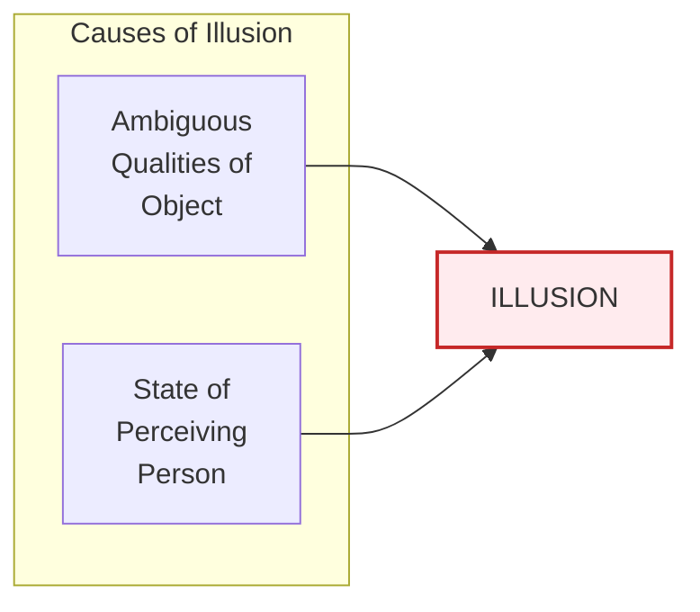
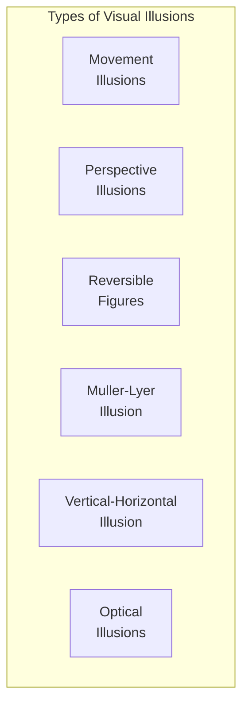
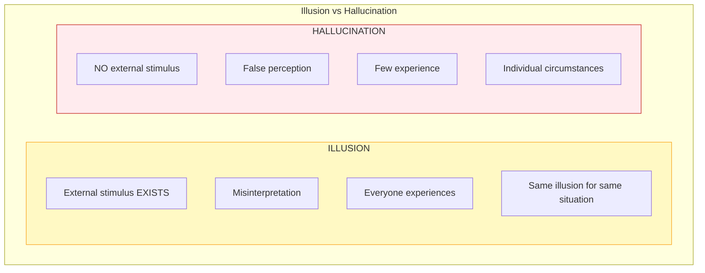

# 2:10 Errors in Perception

!!! abstract "Section Overview"
    This section explores **errors in perception**—situations where our perception does not accurately represent reality. It covers the two main types of perceptual errors: **Illusion** and **Hallucination**, their differences, and various examples.

---

## ⚠️ When Perception Goes Wrong

!!! warning "Key Point"
    Our perception is **not always true and accurate**. Sometimes errors creep into our perception when our mind **wrongly interprets the sensory input**.

---

## 2:10:1 Illusion

!!! quote "Definition"
    **Illusions** are **wrong or mistaken perceptions** which fail to correspond with the situation as objectively assessed.

### Causes of Illusion

| Cause | Description |
|-------|-------------|
| **Ambiguous qualities** | What is perceived has unclear features |
| **State of perceiving person** | Mental condition affects interpretation |
| **Both combined** | Ambiguity + mental state together |

### Common Examples of Illusion

| Example | Illusion |
|---------|----------|
| **Rope in dark** | Mistaken for a snake |
| **Searching for coin** | Small round tin plate appears to be the coin |
| **Passenger in train** | Trees appear to be moving around |
| **Stationary train** | Appears to move when nearby train starts |

---

### Types of Illusion

| Type | Description | Example |
|------|-------------|---------|
| **Illusion of Movement** | Stationary objects appear moving | Spot of light in dark appears to move around |
| **Illusion of Perspective** | Distance distorts appearance | Two parallel lines appear to meet at a distance |
| **Reversible Perspective Figures** | Images that flip between interpretations | Necker cube, vase-faces illusion |
| **Muller-Lyer Illusion** | Lines of equal length appear different | Lines with arrows in/out |
| **Vertical-Horizontal Illusion** | Vertical lines appear longer | Same length lines in different orientations |
| **Optical Illusions** | Visual tricks | Various geometric patterns |

---

### Visual Illusions

!!! example "Test Your Perception"
    
    **Classic Illusion Questions:**
    
    | Figure | Question |
    |--------|----------|
    | Figures 1, 2, 3, 4 | Between AB and CD, which straight line is longer? |
    | Figure 5 | Between A and B, which is longer? |
    | Figure 6 | Are AB and CD parts of the same straight line? |
    
    *(Try to decide by seeing alone!)*

---

## 2:10:2 Hallucination

!!! quote "Definition"
    **Hallucination** is a **false perception** that is different from illusion in that it has **no sensory basis** and is a **dream-like image** often mistaken for perception.

### Key Characteristics

| Characteristic | Description |
|----------------|-------------|
| **No external stimulus** | No real object triggering the perception |
| **Dream-like** | Similar to experiences during dreams |
| **Mistaken for reality** | Person believes it is real perception |
| **No sensory basis** | Not based on actual sensory input |

### Examples of Hallucination

| Example | Description |
|---------|-------------|
| **Mirage** | Seeing water in a desert where none exists |
| **Ghost sightings** | Spotting a ghost on a tamarind tree |
| **Auditory hallucination** | Hearing tapping sound at door when none occurs |
| **Angel sounds** | Hearing the anklet sound of an angel |

---

## 📊 Illusion vs Hallucination

!!! note "Critical Difference"
    Understanding the difference between illusion and hallucination is essential!

| Aspect | Illusion | Hallucination |
|--------|----------|---------------|
| **External Stimulus** | ✅ Present (apparent) | ❌ Absent |
| **Sensory Basis** | ✅ Has sensory basis | ❌ No sensory basis |
| **Nature** | Misinterpretation of real stimulus | Perception without stimulus |
| **Who Experiences** | **All people** | **Few** (mentally ill, drug users) |
| **Situational** | Same situation = same illusion for all | Different circumstances for different individuals |
| **Reality** | Object exists but misperceived | No object exists |

---

## 🔍 Detailed Comparison Table

| Feature | Illusion | Hallucination |
|---------|----------|---------------|
| **Definition** | Wrong perception of existing stimulus | False perception without stimulus |
| **Stimulus** | Present but misperceived | Absent |
| **Common to** | All normal individuals | Generally mentally ill or under drug influence |
| **Predictability** | Same illusion occurs for same stimulus | Unpredictable, varies by individual |
| **Example** | Rope looks like snake | Seeing ghosts, hearing voices |
| **Treatment needed** | No (normal phenomenon) | Often yes (indicates underlying issue) |

---

## 🧠 Memory Aid

!!! note "Mnemonic"
    **"I have an S, H has None"**
    
    - **I**llusion has a **S**timulus (external object present)
    - **H**allucination has **None** (no external stimulus)

---

## 📋 Quick Reference

### Illusion Examples

| Category | Example |
|----------|---------|
| **Object misidentification** | Rope → Snake |
| **Motion illusion** | Trees moving (from train) |
| **Search-related** | Tin plate → Coin (when searching) |
| **Relative motion** | Own train moving (when other starts) |

### Hallucination Examples

| Category | Example |
|----------|---------|
| **Visual** | Mirage, ghost sighting |
| **Auditory** | Hearing door knock, angel sounds |
| **Tactile** | Feeling insects on skin |

---

## 🏥 Who Experiences Hallucinations?

| Group | Context |
|-------|---------|
| **Mentally ill patients** | Psychiatric conditions like schizophrenia |
| **Drug users** | Under influence of hallucinogenic substances |
| **Severely fatigued** | Extreme sleep deprivation |
| **High fever** | Delirium states |

!!! warning "Important Note"
    While illusions are **normal** and experienced by **everyone**, hallucinations often indicate an underlying mental health issue or substance influence and may require professional attention.

---

!!! tip "Exam Tip 📝"
    A common exam question asks you to **differentiate illusion from hallucination with examples**. Always:
    
    1. Define both terms clearly
    2. State the key difference (stimulus presence/absence)
    3. Mention who experiences each
    4. Provide 2-3 examples of each
    5. Use a comparison table

---

> **Bridge →** Now that we've completed the study of **Perception**, let's move to the third cognitive process: **Memory**. We'll begin by understanding what memory means and its different phases.
