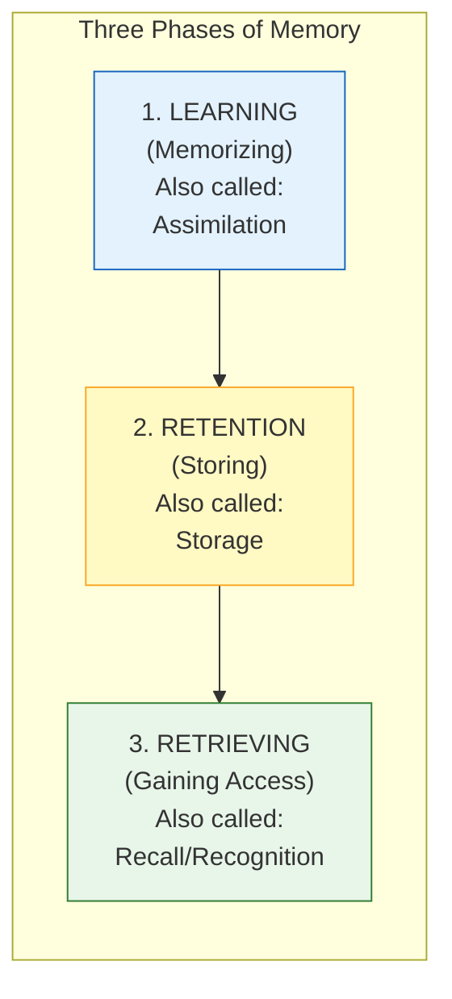
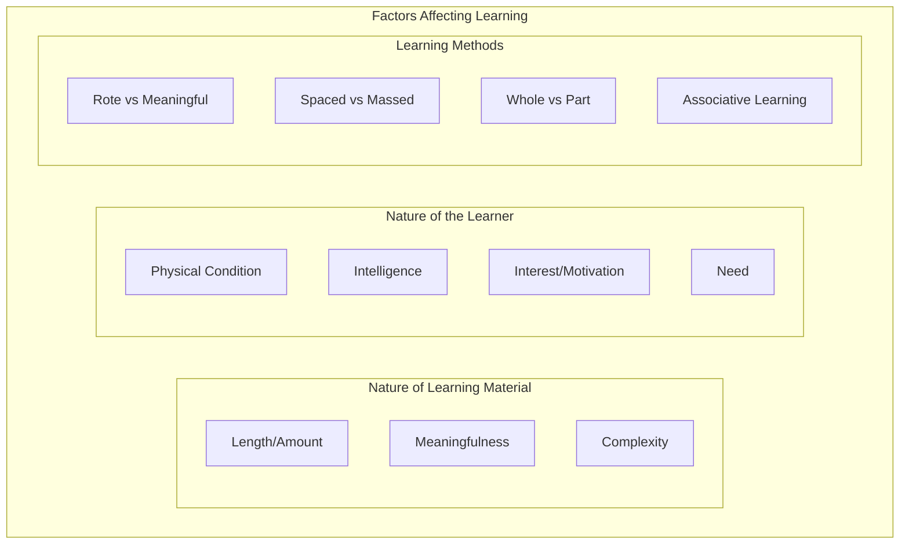
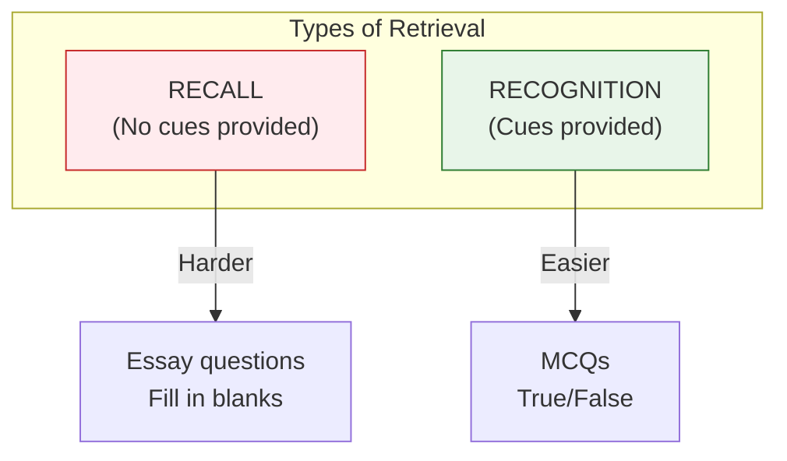
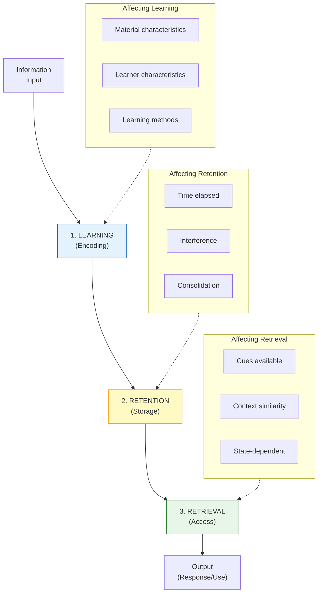

# 2:11 Meaning of Memory

!!! abstract "Section Overview"
    This section explores the **meaning of memory** from both layman and psychological perspectives. It introduces the concept of **remembering** as an active process and outlines the **three phases of memory**: Learning/Memorizing, Retention/Storing, and Retrieving.

---

## 📚 What is Memory?

### Layman's Definition

!!! quote "Simple Definition"
    A layman may define memory simply as the **capacity to reproduce what is learnt**.

### Psychological Definition

!!! quote "Psychological Perspective"
    Psychologically, memory is **much more complex**. Psychologists prefer the word **'remembering'** to 'memory' because **remembering is an active process of mental search**.

!!! info "Key Insight"
    **Remembering** refers to:
    
    1. **Retention** of what is learnt
    2. **Retrieving** it when required for subsequent use

---

## 🔄 The Three Phases of Memory

Memory/Remembering consists of **three stages or phases**:

| Phase | Alternative Name | Process |
|-------|------------------|---------|
| **1. Learning/Memorizing** | Assimilation | Taking in information |
| **2. Retention/Storing** | Storage | Keeping information |
| **3. Retrieving** | Recall/Recognition | Bringing back information |

---

## 📊 Phase 1: Learning (Memorizing/Assimilation)

!!! note "Key Points 📌"
    The first phase involves **taking in and encoding information**. Several factors affect this phase.

### Factors Affecting Learning/Memorizing

#### A. Nature of Learning Material

| Factor | Effect on Learning |
|--------|-------------------|
| **Length/Amount** | More material = more time and effort |
| **Meaningfulness** | Meaningful material learned faster |
| **Complexity** | Complex material requires more processing |

#### B. Nature of the Learner

| Factor | Effect on Learning |
|--------|-------------------|
| **Physical Condition** | Good health aids learning |
| **Intelligence** | Higher intelligence facilitates learning |
| **Interest/Motivation** | Greater interest = better learning |
| **Need** | Perceived need increases attention |

#### C. Learning Methods

| Method | Description |
|--------|-------------|
| **Rote Learning** | Memorizing by repetition |
| **Meaningful Learning** | Understanding and connecting to prior knowledge |
| **Spaced Learning** | Distributed practice over time |
| **Massed Learning** | Concentrated practice in one session |
| **Whole Learning** | Learning entire material at once |
| **Part Learning** | Breaking material into sections |
| **Associative Learning** | Connecting new with known information |

---

## 📊 Phase 2: Retention (Storing)

!!! quote "Definition"
    **Retention** is the process of **holding or maintaining** learned information in memory over time.

### Key Aspects

| Aspect | Description |
|--------|-------------|
| **Storage** | Information is stored in the brain |
| **Duration** | Can be short-term or long-term |
| **Stability** | Depends on encoding and rehearsal |

---

## 📊 Phase 3: Retrieving (Recall/Recognition)

!!! quote "Definition"
    **Retrieving** is the process of **gaining access** to stored information when it is required.

### Two Types of Retrieval

| Type | Description | Example |
|------|-------------|---------|
| **Recall** | Bringing back information without cues | Writing an essay answer |
| **Recognition** | Identifying previously learned information | Multiple choice questions |

---

## 🔄 Complete Memory Process

---

## 📊 Summary: Three Phases of Memory

| Phase | Process | Alternative Terms | Key Question |
|-------|---------|-------------------|--------------|
| **1. Learning** | Taking in information | Memorizing, Assimilation, Encoding | How is information acquired? |
| **2. Retention** | Holding information | Storing, Storage | How is information kept? |
| **3. Retrieving** | Accessing information | Recall, Recognition, Retrieval | How is information brought back? |

---

## 🧠 Memory Aid: **LRR**

!!! note "Mnemonic"
    Remember the three phases with **LRR**:
    
    - **L** - Learning (Memorizing)
    - **R** - Retention (Storing)
    - **R** - Retrieval (Recall/Recognition)
    
    Think: "**L**earn, **R**etain, **R**etrieve"

---

## 🎓 Remembering vs Memory

| Aspect | Memory | Remembering |
|--------|--------|-------------|
| **Nature** | Capacity/System | Active Process |
| **Type** | Noun | Verb (action) |
| **Focus** | Storage capability | Mental search activity |
| **Psychologists prefer** | - | ✅ Remembering |

!!! tip "Exam Tip 📝"
    When defining memory, mention that psychologists prefer **'remembering'** because it emphasizes the **active, dynamic nature** of the process rather than viewing memory as a static storage system.

---

> **Bridge →** Now that we understand what memory is and its three phases, let's explore the **different kinds of memory** in the next section.
