# 2:12 Kinds of Memory

!!! abstract "Section Overview"
    This section explores the **different classifications of memory**, including incidental vs intentional, vivid vs indistinct, observational vs rote, and the crucial distinction between **Short-Term Memory (STM)** and **Long-Term Memory (LTM)**.

---

## 📊 Classification of Memory

Memory can be classified in several ways:

---

## 1️⃣ Incidental vs Intentional Memory

| Type | Description | Characteristics |
|------|-------------|-----------------|
| **Incidental Memory** | Casual remembrance of observed events | Without deliberate effort |
| **Intentional Memory** | Deliberate effort to remember | Superior retention |

### Why Intentional Memory is Superior

!!! note "Key Points 📌"
    Intentional memory involves:
    
    - **Closer attention** paid to material
    - **Greater rehearsal** of information
    - **Greater tendency to categorize** material
    - **Finding relationships** and associations between items

---

## 2️⃣ Vivid vs Indistinct Memory

| Type | Description | Resemblance to Original |
|------|-------------|------------------------|
| **Vivid Memory** | Clear, detailed recollection | High resemblance |
| **Indistinct Memory** | Vague, unclear recollection | Low resemblance |

!!! warning "Important Note"
    **Indistinct memories** can influence our behaviour **without our awareness**—they operate subconsciously.

---

## 3️⃣ Observational vs Rote Memory

| Type | Focus | Example |
|------|-------|---------|
| **Observational Memory** | Concrete objects and events | Witness testimony of bomb explosion |
| **Rote Memory** | Words and symbols | Memorized poems, multiplication tables |

!!! info "Information"
    Generally, when we refer to 'memory', we mean **rote memory**. **Verbal learning** implies this aspect of memory.

---

## 4️⃣ Short-Term vs Long-Term Memory

!!! note "Most Important Classification"
    This is the most significant classification based on **duration of retention**.

---

## 2:12:1 Short-Term Memory (STM) and Long-Term Memory (LTM)

### Short-Term Memory (STM)

!!! quote "Definition"
    **Short-Term Memory (STM)**, also called **Primary Memory** or **Working Memory**, lasts for **15 to 30 seconds**.

#### Characteristics of STM

| Feature | Description |
|---------|-------------|
| **Duration** | 15-30 seconds |
| **Capacity** | **7 ± 2** separate items (Memory Span) |
| **Alternative Names** | Primary Memory, Working Memory |
| **Function** | Temporary holding of information |

!!! example "Example"
    We remember a **telephone number** only till we get the connection. We have to look at the directory again if we want to phone after a few hours.

### Long-Term Memory (LTM)

!!! quote "Definition"
    **Long-Term Memory (LTM)** stores information **permanently** (from over one minute up to many years).

#### Characteristics of LTM

| Feature | Description |
|---------|-------------|
| **Duration** | Over 1 minute to many years |
| **Capacity** | **Unlimited** |
| **Storage** | Organized into categories |
| **Permanence** | Almost permanent |

!!! example "Examples of LTM"
    - Multiplication tables we have learnt
    - Poems we have memorised
    - Our date of birth
    - Wedding day
    - Our telephone number
    - Residential address

---

## 📊 STM vs LTM Comparison

| Feature | Short-Term Memory (STM) | Long-Term Memory (LTM) |
|---------|------------------------|------------------------|
| **Duration** | 15-30 seconds | Minutes to years |
| **Capacity** | Limited (7 ± 2 items) | Unlimited |
| **Effort Required** | Less | More time and effort |
| **Organization** | Not organized | Organized into categories |
| **Permanence** | Temporary | Almost permanent |
| **Brain Processes** | Different | Different |

```mermaid
flowchart TB
    subgraph COMPARISON["STM vs LTM"]
        subgraph STM["SHORT-TERM MEMORY"]
            S1["Duration: 15-30 sec"]
            S2["Capacity: 7±2 items"]
            S3["Temporary"]
            S4["Working/Primary"]
        end
        
        subgraph LTM["LONG-TERM MEMORY"]
            L1["Duration: Years"]
            L2["Capacity: Unlimited"]
            L3["Permanent"]
            L4["Organized Categories"]
        end
    end
    
    STM -->|"Transfer through\nRehearsal & Coding"| LTM
    
    style STM fill:#fff9c4,stroke:#f9a825
    style LTM fill:#e8f5e9,stroke:#2e7d32
```

---

## 🔄 Transfer from STM to LTM

### How Information Moves to LTM

!!! note "Key Points 📌"
    The transfer from STM to LTM occurs through:
    
    1. **Rehearsal** - Repetition of information
    2. **Repetition** - Reviewing multiple times
    3. **Coding** - Analyzing and compressing into abbreviated form

!!! quote "Definition of Coding"
    **Coding** is the process of **analyzing information and compressing it into abbreviated form** for efficient storage.

### Time Required for Transfer

!!! info "Information"
    A certain amount of time (about **30 minutes**) appears to be needed in transferring information from STM to LTM.

!!! example "Example"
    One who has received a **jolt of the brain** (brain injury) often does not remember events that just preceded the accident but will remember those that happened **30 minutes earlier**.

---

## 📊 Memory Model: Information Processing System

### Analogy: Visitors to a House

!!! example "Analogy"
    | House Visitors | Memory System |
    |----------------|---------------|
    | Most visitors allowed up to reception hall, then sent back | Incoming info filtered, only significant reaches STM |
    | Special guests invited further inside | Important info transferred to LTM |
    | Regular family members | Permanently stored information |

---

## 🔄 Brain Processes for STM and LTM

!!! note "Key Points 📌"
    There appear to be **different brain processes** for STM and LTM.

### Operations

| Memory Type | Operations |
|-------------|------------|
| **STM** | Immediate use, temporary holding |
| **LTM** | Organized into categories, codified, permanent storage |

!!! example "Example: Phone Numbers"
    | Type of Phone Number | Storage Location |
    |---------------------|------------------|
    | Other people's numbers | STM (temporary) |
    | Our own residence/office | LTM (permanent) |

---

## 🔁 Retrieval Process

!!! info "When We Remember"
    - Information is **retrieved from LTM**
    - Put back into **STM for further processing** (rehearsal, repetition)
    - May result in a **response/output**
    - May be put **back in LTM**

---

## 📊 Summary: Kinds of Memory

| Classification | Types | Key Distinction |
|----------------|-------|-----------------|
| **Purpose** | Incidental vs Intentional | With/without deliberate effort |
| **Clarity** | Vivid vs Indistinct | Clear vs vague recollection |
| **Content** | Observational vs Rote | Objects/events vs words/symbols |
| **Duration** | STM vs LTM | Seconds vs years |

---

## 🧠 Memory Aid: **Magic Number 7 ± 2**

!!! tip "Remember!"
    STM capacity: **7 ± 2** items (Memory Span)
    
    This is why:
    
    - Phone numbers are grouped (e.g., 123-456-7890)
    - Chunks of information are easier to remember
    - We can hold 5-9 items at once

---

!!! tip "Exam Tip 📝"
    When asked about **kinds of memory**:
    
    1. Present all four classification systems
    2. Focus on **STM vs LTM** as the most important
    3. Mention specific numbers: 15-30 seconds (STM), 7±2 items (capacity), 30 minutes (transfer time)
    4. Use the Information Processing Model diagram

---

> **Bridge →** Now that we understand the kinds of memory, let's explore the **factors that affect memory** in the next section.
