# 2:13 Factors Affecting Memory

!!! abstract "Section Overview"
    This section explores the various **neurological and psychological factors** that affect memory and retentive capacity. Understanding these factors is crucial for optimizing learning and retention.

---

## 🧠 Two Categories of Factors

---

## 🔬 Neurological Factors

!!! info "Brain-Based Factors"
    Neurological factors relate to the physical processes in the brain.

| Factor | Description |
|--------|-------------|
| **Formation of Engram** | Memory traces formed in the brain |
| **Reduction of Synaptic Resistance** | Easier neural transmission with practice |

---

## 🧩 Psychological Factors

!!! note "Key Points 📌"
    Psychological factors play a **vital part in retentive capacity** for learned material. The **conditions under which material is learned affect retention**.

### Learning Conditions That Affect Retention

---

### 1. Scope of Learning Material

| Aspect | Effect |
|--------|--------|
| **Amount** | More material = more effort needed |
| **Complexity** | Complex material requires more processing |
| **Organization** | Well-organized material retained better |

---

### 2. Learning Time

| Aspect | Effect |
|--------|--------|
| **Adequate time** | Better encoding and retention |
| **Rushed learning** | Poor retention |
| **Time for processing** | Allows for deeper encoding |

---

### 3. Number of Repetitions

| Aspect | Effect |
|--------|--------|
| **More repetitions** | Stronger memory traces |
| **Over-learning** | Better retention beyond just knowing |
| **Practice** | Strengthens connections |

---

### 4. Distribution of Learning

| Type | Description | Effect |
|------|-------------|--------|
| **Spaced Learning** | Practice distributed over time | Better retention |
| **Massed Learning** | Practice concentrated in one session | Poorer retention |

---

### 5. Age of Memory Content

| Aspect | Effect |
|--------|--------|
| **Recent memories** | Usually more accessible |
| **Older memories** | May fade but some remain strong |
| **Consolidation** | Time helps strengthen important memories |

---

### 6. Interruption (Zeigarnik Effect)

!!! quote "Zeigarnik Effect"
    **Interrupted tasks are retained and recalled better than completed tasks.**

!!! example "Example"
    - A waiter remembers unpaid orders better than paid ones
    - Unfinished tasks stay on our mind
    - Incomplete puzzles are remembered longer

---

## 💪 Motivational Factors

!!! note "Key Points 📌"
    Motivational factors significantly influence retentivity.

| Motivational Factor | Effect on Memory |
|--------------------|------------------|
| **Fatigue** | Reduces retention capacity |
| **Attitude** | Positive attitude aids memory |
| **Concentration** | Better focus = better retention |
| **Interest** | Interested material remembered better |
| **Degree of Anxiety** | Moderate anxiety helps; high anxiety hinders |
| **Achievement Motivation** | Drive to succeed improves memory |

```mermaid
flowchart TB
    subgraph MOTIVATION["Motivational Factors"]
        M1["Fatigue ⬇️"]
        M2["Positive Attitude ⬆️"]
        M3["Concentration ⬆️"]
        M4["Interest ⬆️"]
        M5["Moderate Anxiety ⬆️"]
        M6["Achievement Motivation ⬆️"]
    end
    
    MOTIVATION --> RET["RETENTIVITY"]
    
    style RET fill:#e3f2fd,stroke:#1565c0
```

---

## 📊 Complete Summary of Factors

### Neurological Factors

| Factor | Description |
|--------|-------------|
| Formation of Engram | Memory trace creation |
| Synaptic Resistance | Neural pathway efficiency |

### Psychological Factors (Learning Conditions)

| Factor | Better When... |
|--------|---------------|
| Scope of Material | Appropriate amount, well-organized |
| Learning Time | Adequate, not rushed |
| Repetitions | Sufficient practice |
| Distribution | Spaced over time |
| Age of Content | Consolidated over time |
| Interruption | Tasks left incomplete (Zeigarnik) |

### Motivational Factors

| Factor | Better When... |
|--------|---------------|
| Fatigue | Minimal |
| Attitude | Positive |
| Concentration | High |
| Interest | Strong |
| Anxiety | Moderate (not too high/low) |
| Achievement Motivation | Present |

---

## ⚠️ The Complexity of Retentivity

!!! warning "Important Note"
    **Retentivity, the core of memory, continues to be puzzling and not fully understood yet.**
    
    Despite identifying these factors, the exact mechanisms of how we retain information remain an area of ongoing research.

---

## 🧠 Memory Aid: **SLIM-FAC**

!!! note "Mnemonic for Psychological Factors"
    Remember the learning conditions with **SLIM-FAC**:
    
    - **S** - Scope of material
    - **L** - Learning time
    - **I** - (Number of) Iterations/Repetitions
    - **M** - Method (distribution - spaced vs massed)
    - **F** - Freshness (age of content)
    - **A** - Abrupt ending (Zeigarnik - interruption)
    - **C** - Completion status

---

## 🏫 Educational Implications

| Factor | Teaching Strategy |
|--------|-------------------|
| **Scope** | Break content into manageable units |
| **Time** | Allow sufficient learning time |
| **Repetitions** | Review key concepts multiple times |
| **Distribution** | Spread practice sessions |
| **Zeigarnik Effect** | Use "cliff-hangers" to maintain interest |
| **Motivation** | Create interest, reduce anxiety |
| **Concentration** | Minimize distractions |

---

!!! tip "Exam Tip 📝"
    When asked about **factors affecting memory**:
    
    1. Mention both neurological and psychological factors
    2. List the learning conditions
    3. Include motivational factors
    4. Explain the **Zeigarnik Effect** (commonly asked)
    5. Note that retentivity is "not fully understood yet"

---

> **Bridge →** Now that we understand what affects memory, let's explore the **signs of good memory** in the next section.
