# 2:14 Signs of Good Memory

!!! abstract "Section Overview"
    This section presents the **five characteristics** that psychologists identify as **hallmarks of good memory**: Rapidity, Accuracy, Length of Time, Promptness of Retrieval, and Serviceableness.

---

## 🏆 The Five Signs of Good Memory

!!! note "Key Points 📌"
    Psychologists point out the following **five characteristics** as hall marks of good memory.

---

## 1️⃣ Rapidity (Speed)

!!! quote "Definition"
    One is said to have good memory if he could **recollect his past experiences very quickly**.

| Indicator | Good Memory | Poor Memory |
|-----------|-------------|-------------|
| Recall Speed | Fast | Slow |
| Response Time | Quick | Delayed |
| Access to Information | Immediate | Takes time |

!!! example "Example"
    When asked about a historical date, a person with good memory recalls it instantly without hesitation.

---

## 2️⃣ Accuracy (Correctness)

!!! quote "Definition"
    If one could bring back the learned materials **without any distortion**, he is said to have good memory.

| Indicator | Good Memory | Poor Memory |
|-----------|-------------|-------------|
| Information Quality | Accurate | Distorted |
| Details | Preserved | Mixed up |
| Facts | Correct | Errors present |

!!! example "Example"
    Recalling a phone number exactly as it was learned, without mixing up digits.

---

## 3️⃣ Length of Time (Duration)

!!! quote "Definition"
    **How long one could retain the learned materials in memory** before retrieving them is also taken as a measure of good memory.

| Indicator | Good Memory | Poor Memory |
|-----------|-------------|-------------|
| Retention Period | Long | Short |
| Stability | Stable over time | Fades quickly |
| Persistence | Enduring | Temporary |

!!! example "Example"
    Remembering childhood events, school lessons, or important dates years after they occurred.

---

## 4️⃣ Promptness of Retrieval (Ease)

!!! quote "Definition"
    If one is able to bring back the learned materials **instantly with ease without requiring any help**, he is said to have good memory.

| Indicator | Good Memory | Poor Memory |
|-----------|-------------|-------------|
| Need for Cues | None | Requires hints |
| Effort Required | Effortless | Struggle |
| Independence | Self-sufficient | Needs assistance |

!!! example "Example"
    Answering questions without needing prompts or reminders from others.

---

## 5️⃣ Serviceableness (Utility)

!!! quote "Definition"
    This refers to the **recall of right thing at the right place** and right time.

| Indicator | Good Memory | Poor Memory |
|-----------|-------------|-------------|
| Timing | When needed | After the moment has passed |
| Relevance | Appropriate | Irrelevant |
| Context | Right situation | Wrong situation |

!!! warning "Critical Example"
    If a candidate is **not able to tell the correct answer at the time of interview**, what will be of use if he could recollect the correct answer **after coming out of the interview**?

!!! example "Interview Scenario"
    | Situation | Good Memory | Poor Memory |
    |-----------|-------------|-------------|
    | During Interview | Recalls answers immediately | Mind goes blank |
    | After Interview | Already answered | "Oh! I knew that!" |
    | Result | Success | Missed opportunity |

---

## 📊 Summary Table: Five Signs

| # | Sign | Key Question | Measure |
|---|------|--------------|---------|
| 1 | **Rapidity** | How fast? | Speed of recall |
| 2 | **Accuracy** | How correct? | Freedom from errors |
| 3 | **Length of Time** | How long retained? | Duration of storage |
| 4 | **Promptness** | How easily? | Ease without help |
| 5 | **Serviceableness** | When and where? | Right time, right place |

---

## 🧠 Memory Aid: **RALPS**

!!! note "Mnemonic"
    Remember the five signs with **RALPS**:
    
    - **R** - Rapidity (Quick recall)
    - **A** - Accuracy (No distortion)
    - **L** - Length (Long retention)
    - **P** - Promptness (Easy retrieval)
    - **S** - Serviceableness (Right time, right place)

---

## 📈 Visual Comparison

```mermaid
flowchart TB
    subgraph GOOD["Good Memory ✅"]
        G1["Fast Recall"]
        G2["Accurate Information"]
        G3["Long Retention"]
        G4["Easy Retrieval"]
        G5["Available When Needed"]
    end
    
    subgraph POOR["Poor Memory ❌"]
        P1["Slow Recall"]
        P2["Distorted Information"]
        P3["Quick Forgetting"]
        P4["Difficult Retrieval"]
        P5["Unavailable When Needed"]
    end
    
    style GOOD fill:#e8f5e9,stroke:#2e7d32
    style POOR fill:#ffebee,stroke:#c62828
```

---

## 🎓 Educational Implications

| Sign | How Teachers Can Help |
|------|----------------------|
| **Rapidity** | Regular practice, drills, quick recall exercises |
| **Accuracy** | Correct information from start, verify learning |
| **Length** | Spaced repetition, periodic review |
| **Promptness** | Build strong associations, reduce reliance on cues |
| **Serviceableness** | Practice in exam-like conditions, contextual learning |

---

## 🔍 Self-Assessment Questions

!!! tip "Test Your Memory"
    Ask yourself:
    
    1. **Rapidity**: Can I recall learned information quickly?
    2. **Accuracy**: Is my recall free from errors?
    3. **Length**: Can I remember things for a long time?
    4. **Promptness**: Can I recall without needing hints?
    5. **Serviceableness**: Can I recall information when I actually need it?

---

!!! tip "Exam Tip 📝"
    This is a straightforward question often asked in exams: **"What are the signs of good memory?"**
    
    Simply list and explain all five signs with brief examples. The **Serviceableness** example (interview scenario) is particularly memorable and worth including.

---

> **Bridge →** Now that we know what constitutes good memory, let's explore **techniques for promoting better memory** in the final section.
