# 2:15 Techniques of Promoting Better Memory

!!! abstract "Section Overview"
    This section provides **twelve practical techniques** for improving memory through better memorizing methods. These strategies are backed by psychological research and are applicable in educational settings.

---

## 🧠 Can Memory Be Improved?

!!! warning "Important Clarification"
    The **capacity to retain cannot be improved** by any intrinsic manner. All that can be done is to **improve the methods of memorising**.

### Foundation for Good Memory

!!! note "Key Points 📌"
    - **A good memory depends upon a good brain**
    - We should try to keep the **metabolism of the brain in good condition**
    - Our diet should contain **calcium and phosphorous-rich products**

---

## 📋 Twelve Techniques for Better Memory

---

## 1️⃣ Desire or Motivation to Learn

!!! quote "Technique"
    **Have the desire or motivation to learn** whatever is learnt.

| Aspect | Benefit |
|--------|---------|
| Interest | Drives attention |
| Purpose | Provides focus |
| Goal-setting | Creates direction |

---

## 2️⃣ Meaningful Material

!!! quote "Technique"
    **Meaningful material is learnt quickly and retained longer.**

| Type | Learning Speed | Retention |
|------|---------------|-----------|
| Meaningful | Fast | Long |
| Meaningless | Slow | Short |

!!! tip "Application"
    Connect new information to what you already know to make it meaningful.

---

## 3️⃣ SQ3R Method

!!! quote "Technique"
    Follow the **SQ3R method** while learning.

| Step | Activity | Purpose |
|------|----------|---------|
| **S** - Survey | Get an overview | Understand structure |
| **Q** - Question | Form questions | Active learning |
| **R** - Read | Study the content | Acquire information |
| **R** - Recite | Say aloud/explain | Reinforce learning |
| **R** - Review | Check understanding | Consolidate memory |

---

## 4️⃣ Spaced Learning

!!! quote "Technique"
    **Spacing the learning periods appropriately** will help effective learning.

```mermaid
flowchart LR
    subgraph SPACED["Spaced Learning ✅"]
        SP1["Day 1"] --> SP2["Day 3"] --> SP3["Day 7"] --> SP4["Day 14"]
    end
    
    subgraph MASSED["Massed Learning ❌"]
        MA["All at once"]
    end
    
    SPACED -->|"Better retention"| RET["Memory"]
    MASSED -->|"Quick forgetting"| RET
    
    style SPACED fill:#e8f5e9,stroke:#2e7d32
    style MASSED fill:#ffebee,stroke:#c62828
```

---

## 5️⃣ Recitation During Learning

!!! quote "Technique"
    **Recitation during the course of learning helps self-evaluation.** This is very useful in memorizing, **particularly in children**.

| Benefit | Description |
|---------|-------------|
| Self-evaluation | Know what you've learned |
| Active engagement | More than passive reading |
| Immediate feedback | Identify gaps |

---

## 6️⃣ Over-learning

!!! quote "Technique"
    **Over-learning** (learning beyond the point of forgetting) **aids retention**.

!!! example "Example"
    If you can recite a poem once correctly, continue practicing 5-10 more times. This over-learning makes the memory stronger.

---

## 7️⃣ Rhymes and Logical Associations

!!! quote "Technique"
    **Rhymes and logical associations** between different parts of the material help remembering.

| Method | Example |
|--------|---------|
| **Rhymes** | "Thirty days hath September..." |
| **Associations** | Linking new concepts to familiar ones |
| **Patterns** | Finding logical connections |

---

## 8️⃣ Mnemonic Devices

!!! quote "Technique"
    **Mnemonic devices** (artificial associations like abbreviations) are useful when no inherent organisation could be seen in the material.

!!! example "Example: VIBGYOR"
    To remember the colours in a rainbow in order:
    
    | Letter | Colour |
    |--------|--------|
    | **V** | Violet |
    | **I** | Indigo |
    | **B** | Blue |
    | **G** | Green |
    | **Y** | Yellow |
    | **O** | Orange |
    | **R** | Red |

---

## 9️⃣ Multisensory Learning

!!! quote "Technique"
    **Multisensory learning is more effectively remembered.**

```mermaid
flowchart TB
    subgraph SENSES["Multiple Senses"]
        SEE["👁️ See"]
        HEAR["👂 Hear"]
        SAY["🗣️ Say"]
        DO["✋ Do"]
    end
    
    SENSES --> BETTER["Better\nRetention"]
    
    style BETTER fill:#e8f5e9,stroke:#2e7d32
```

!!! example "Example"
    **TV advertisements** are remembered better than **Radio advertisements** because TV engages both visual and auditory senses.

---

## 🔟 Rest and Sleep After Learning

!!! quote "Technique"
    **Periodical rest and sleep immediately after learning** improve retention by helping consolidation of memory traces.

| Timing | Benefit |
|--------|---------|
| Rest after study | Allows consolidation |
| Sleep after learning | Strengthens memory traces |
| Avoid immediate other activities | Reduces interference |

---

## 1️⃣1️⃣ Avoid Interference

!!! quote "Technique"
    **Subjects which interfere with each other should not be learnt in succession.**

### Types of Interference

| Type | Description | Example |
|------|-------------|---------|
| **Pro-active Inhibition** | Old learning interferes with new | Old phone number blocks new one |
| **Retro-active Inhibition** | New learning interferes with old | New password blocks old one |

### Recommended Subject Sequence

!!! tip "Study Order"
    After learning one subject, study a different type:
    
    1. **Mathematics** (numerical)
    2. ↓ then **Tamil/English** (language)
    3. ↓ then **Science** (conceptual)
    4. ↓ then **Social Studies** (light subject)

---

## 1️⃣2️⃣ Organized Information

!!! quote "Technique"
    Teachers should plan instruction such that information is provided in an **organised manner** (grouping them in suitable clusters or categories).

### Key Concepts

| Theorist | Concept |
|----------|---------|
| **Mandler** | Organization in memory |
| **Herbart** | Structured instruction |
| **Ausubel** | Advanced Organisers |

!!! info "Advanced Organisers (Ausubel)"
    **Advanced organisers** are introductory material that bridges the gap between what learner already knows and what they need to learn.

### Concept Maps

!!! note "Learning Through Concept Maps"
    Learning through **concept maps** is an attempt under this principle of organisation.

---

## 📊 Summary Table: 12 Techniques

| # | Technique | Key Action |
|---|-----------|------------|
| 1 | **Motivation** | Have desire to learn |
| 2 | **Meaningful Material** | Connect to prior knowledge |
| 3 | **SQ3R** | Survey, Question, Read, Recite, Review |
| 4 | **Spaced Learning** | Distribute practice over time |
| 5 | **Recitation** | Say aloud for self-evaluation |
| 6 | **Over-learning** | Practice beyond minimum |
| 7 | **Rhymes & Associations** | Use patterns and connections |
| 8 | **Mnemonics** | Use artificial memory aids |
| 9 | **Multisensory** | Engage multiple senses |
| 10 | **Rest & Sleep** | Allow consolidation |
| 11 | **Avoid Interference** | Vary subject sequence |
| 12 | **Organization** | Use concept maps, advanced organisers |

---

## 🧠 Memory Aid: **MSSR-ORMA-OS**

!!! note "Mnemonic for 12 Techniques"
    **M-S-S-R-O-R-M-A-O-S** (Think: "Miss Roma Reads OS")
    
    - **M** - Motivation
    - **S** - (Meaningful material) Sense
    - **S** - SQ3R
    - **R** - Rest (Spaced learning)
    - **O** - Oral (Recitation)
    - **R** - Repetition (Over-learning)
    - **M** - Memory aids (Rhymes)
    - **A** - Abbreviations (Mnemonics)
    - **O** - Many senses (Multisensory)
    - **S** - Sleep & Avoid interference & Organization

---

## 🏫 Quick Reference for Teachers

| Technique | Classroom Application |
|-----------|----------------------|
| Motivation | Make lessons relevant, show utility |
| Meaningful | Connect to students' experiences |
| SQ3R | Teach as study skill |
| Spacing | Spread reviews over days/weeks |
| Recitation | Have students explain concepts |
| Over-learning | Practice beyond mastery |
| Rhymes | Create memorable phrases |
| Mnemonics | Teach abbreviation techniques |
| Multisensory | Use audio, visual, kinesthetic |
| Rest | Allow processing time |
| Interference | Plan subject sequence carefully |
| Organization | Use graphic organizers, concept maps |

---

!!! tip "Exam Tip 📝"
    This is a frequently asked question: **"Discuss the techniques of promoting better memory in pupils through classroom instruction."**
    
    - List all 12 techniques
    - Explain each briefly
    - Give practical examples
    - Mention theorists (Mandler, Herbart, Ausubel) for the organization technique
    - Include the SQ3R method explanation

---

> **Bridge →** This concludes the study of Memory. Now let's proceed to the **Unit Conclusion** and review questions.
