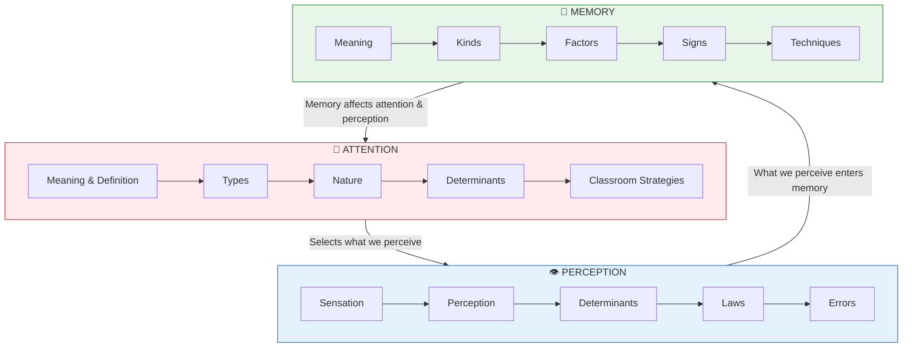

# 📋 Unit II: Conclusion and Review

!!! success "Unit Complete"
    Congratulations! You have completed **Unit II: Attention, Perception and Memory**. This unit covered three fundamental cognitive processes that are essential for understanding how learning occurs.

---

## ✅ What Was Covered in This Unit

### 📍 Attention (Sections 2:00 - 2:05)

| Topic | Key Concepts |
|-------|--------------|
| **Meaning of Attention** | Mental activity of focusing; focus vs margin |
| **Definition** | "Striving to cognize" (McDougall) |
| **Types** | Voluntary (Implicit/Explicit), Involuntary, Habitual |
| **Nature** | 9 characteristics including selective, three-dimensional, fluctuating |
| **Determinants** | External (8 factors) and Internal (5 factors) |
| **Classroom Strategies** | Remove obstacles, use factors, age-appropriate techniques |

### 👁️ Perception (Sections 2:06 - 2:10)

| Topic | Key Concepts |
|-------|--------------|
| **Sensation** | Immediate result of sense organ stimulation |
| **Perception** | Sensation + Meaningful interpretation |
| **Determinants** | Gardner Murphy's four factors |
| **Laws of Perceptual Organisation** | Pragnanz, Proximity, Similarity, Closure, Good Continuation |
| **Errors in Perception** | Illusion (with stimulus) vs Hallucination (without stimulus) |

### 💾 Memory (Sections 2:11 - 2:15)

| Topic | Key Concepts |
|-------|--------------|
| **Meaning** | Remembering = active process of mental search |
| **Three Phases** | Learning (Assimilation), Retention (Storing), Retrieval |
| **Kinds** | Incidental/Intentional, Vivid/Indistinct, Observational/Rote, STM/LTM |
| **STM vs LTM** | 15-30 sec vs permanent; 7±2 items vs unlimited |
| **Factors Affecting** | Neurological, Psychological, Motivational |
| **Signs of Good Memory** | RALPS: Rapidity, Accuracy, Length, Promptness, Serviceableness |
| **Techniques** | 12 techniques including SQ3R, mnemonics, spaced learning |

---

## 📝 Quick Revision Table

| Section | Topic | Key Point to Remember |
|---------|-------|----------------------|
| 2:01 | Meaning of Attention | Focus vs Margin; Figure vs Ground |
| 2:01:1 | Definition | "Striving to cognize" - McDougall |
| 2:02 | Types | Voluntary (Implicit/Explicit), Involuntary, Habitual |
| 2:03 | Nature | 9 characteristics; Span = 6-8; Fluctuates every 10 sec |
| 2:04 | Determinants | External (SICNMRS) + Internal (IN-MMP) |
| 2:05 | Classroom Strategies | ROUGE: Remove, Objective, Use, Guide, Engage |
| 2:06 | Sensation | Immediate result of stimulation |
| 2:07 | Perception | Sensation + Meaningful Interpretation |
| 2:08 | Determinants | Gardner Murphy's 4 factors (SNPM) |
| 2:09 | Laws | PPSCC: Pragnanz, Proximity, Similarity, Closure, Continuation |
| 2:10 | Errors | Illusion (has stimulus) vs Hallucination (no stimulus) |
| 2:11 | Memory Meaning | LRR: Learn, Retain, Retrieve |
| 2:12 | Kinds | STM (15-30 sec, 7±2) vs LTM (permanent, unlimited) |
| 2:13 | Factors | Zeigarnik Effect: Interrupted tasks remembered better |
| 2:14 | Signs | RALPS: Rapidity, Accuracy, Length, Promptness, Serviceableness |
| 2:15 | Techniques | 12 techniques including SQ3R, mnemonics |

---

## 🧠 Memory Mnemonics Summary

| Topic | Mnemonic | Stands For |
|-------|----------|------------|
| **Characteristics of Attention** | SFTM-DFLI | Selective, First step, Three-dimensional, Motor, Divisibility, Fluctuating, Limited, Determinants, Interest |
| **External Factors** | SICNMRS | Size, Intensity, Change/Contrast, Novelty, Movement, Repetition, Systematic Form |
| **Internal Factors** | IN-MMP | Interest, Need, Mental set, Mood, Physiological |
| **Murphy's Factors** | SNPM | Sensations, Nervous structure, Previous experiences, Mental set |
| **Laws of Perception** | PPSCC | Pragnanz, Proximity, Similarity, Closure, Continuation |
| **Memory Phases** | LRR | Learn, Retain, Retrieve |
| **Signs of Good Memory** | RALPS | Rapidity, Accuracy, Length, Promptness, Serviceableness |

---

## ❓ Review Questions

### Category C (Short Answer) Questions

| # | Question | Reference |
|---|----------|-----------|
| 1 | Define the term 'attention'. | [2:01:1] |
| 2 | Explain with a suitable illustration the meaning of the term 'Perception'. | [2:07] |
| 3 | Differentiate perception from sensation. | [2:06:1 + 2:07] |
| 4 | Mention the factors that determine our perception. | [2:08] |
| 5 | Differentiate illusion from hallucination, with suitable examples. | [2:10:1 + 2:10:2] |
| 6 | What is memory? | [First paragraph of 2:11] |
| 7 | State and illustrate the different kinds of memory. | [2:12] |
| 8 | Mention the factors that affect memory. | [2:13] |
| 9 | What are the signs of good memory? | [2:14] |

### Category B (Medium Answer) Questions

| # | Question | Reference |
|---|----------|-----------|
| 1 | Explain the different kinds of attention and their importance in education. | [2:02] |
| 2 | Write short note on the Nature of Attention. | [2:03] |
| 3 | Explain the ways and means of securing better attention in the class. | [2:05] |
| 4 | Explain the laws of perception with suitable illustrations. | [2:09 + 2:09:1 to 2:09:5] |
| 5 | Explain the different phases of remembering. | [Whole of 2:11] |
| 6 | Discuss the techniques of promoting better memory in pupils through classroom instruction. | [2:15] |

### Category A (Long Answer) Questions

| # | Question | Reference |
|---|----------|-----------|
| 1 | Discuss the objective and subjective factors of attention with suitable illustrations and state how the knowledge of this would be of use to a classroom teacher. | [2:04 + 2:04:1 + 2:04:2 + 2:05] |

---

## 🔗 Key Connections in This Unit

---

## 📚 Key Theorists in This Unit

| Theorist | Contribution |
|----------|--------------|
| **William James** | Field of attention vs consciousness distinction |
| **McDougall** | Defined attending as "striving to cognize" |
| **Wertheimer** | Law of Similarity |
| **Gestalt Psychologists** | Figure-Ground concept, Laws of Perceptual Organisation |
| **Gardner Murphy** | Four factors of perception |
| **Zeigarnik** | Zeigarnik Effect (interrupted tasks remembered better) |
| **Herbart** | Importance of mental set; organized instruction |
| **Mandler** | Organization in memory |
| **Ausubel** | Advanced Organisers |

---

## 🎯 Exam Preparation Tips

!!! tip "Focus Areas"
    
    ### Most Likely Long Answer Questions
    1. Determinants of attention with classroom applications
    2. Laws of perceptual organisation with illustrations
    3. STM vs LTM comparison
    4. Techniques of promoting better memory
    
    ### Most Likely Short Answer Questions
    1. Define attention
    2. Differentiate illusion from hallucination
    3. Signs of good memory
    4. Perception = Sensation + Meaningful Interpretation
    
    ### Key Numbers to Remember
    - Attention span: **6-8 items**
    - Attention fluctuation: **10 seconds**
    - STM duration: **15-30 seconds**
    - STM capacity: **7 ± 2 items**
    - Transfer time to LTM: **~30 minutes**
    - Cinema frame rate: **15 frames/second**

---

## 🔄 Connection to Next Unit

!!! info "Looking Ahead"
    **Unit III: Motivation and Learning** will build upon the concepts of attention and memory covered in this unit. You will learn:
    
    - How motivation affects attention
    - The relationship between motivation and memory
    - Theories of learning
    - Types of learning

---

!!! success "Congratulations!"
    You have completed Unit II: Attention, Perception and Memory. Use the review questions and mnemonics to test your understanding before moving to Unit III.
