# Unit III: Motivation and Learning

---

## 📋 Abstract

!!! abstract "Unit Overview"
    This unit delves into two pivotal concepts in Educational Psychology: **Motivation** and **Learning**. It explores the driving forces behind behavior (motivation), theories of needs (Maslow), and the nature of aspiration. The unit then transitions to Learning, examining its definition, nature, and factors influencing it. It provides a comprehensive analysis of major learning theories including Associationism (Thorndike, Pavlov, Skinner) and Cognitive/Field Theories (Piaget, Dewey, Humanistic approaches), along with their educational implications.

---

## 🎯 Introduction

**Motivation and Learning** are the heart of the educational process. Understanding why students behave the way they do and how they acquire new knowledge is essential for effective teaching.

**Why this unit matters:**
- **Motivation** is the "why" of behavior; without it, learning is inefficient.
- **Learning theories** provide frameworks for teachers to design effective instruction.
- Understanding **cognitive development** (Piaget) helps structure content appropriate for the child's age.
- **Constructivist** and **Humanistic** approaches shift focus to the learner's active role and holistic development.

**Key Learnings in this Unit:**
- The process and characteristics of motivation.
- Maslow’s Hierarchy of Needs and its classroom application.
- Intrinsic vs. Extrinsic motivation.
- The nature and definition of Learning.
- Differences between Classical (Pavlov) and Operant (Skinner) conditioning.
- Thorndike’s Laws of Learning.
- Piaget’s Stages of Cognitive Development.
- Constructivism and knowledge construction (Dewey).
- Humanistic views on learning (Carl Rogers).

---

## 🔗 Connection to Other Units

| Connected Unit | Connection Point | Relationship |
|----------------|------------------|--------------|
| **Unit I** | Growth & Development | Maturation is a prerequisite for learning; developmental stages (Piaget) link to growth. |
| **Unit II** | Attention & Perception | Attention is a prerequisite for learning; perception sets the stage for cognitive processing. |
| **Unit IV** | Intelligence | Learning capability is often linked to intelligence; cognitive theories overlap. |
| **Unit V** | Personality | Motivation drives personality development; self-actualization is a key personality concept. |

---

## 📚 Unit Overview

### Topics at a Glance

| Section | Topic | Focus |
|---------|-------|-------|
| 3:00 | **Introduction** | Overview of the unit |
| 3:01 | **Motivation Meaning** | Definition and significance |
| 3:04 | **Kinds of Motives** | Biogenic vs. Sociogenic |
| 3:05 | **Styles of Motivation** | Maslow's Hierarchy of Needs |
| 3:06 | **Level of Aspiration** | Goal setting and discrepancy |
| 3:07 | **Types of Motivation** | Intrinsic vs. Extrinsic |
| 3:09 | **Learning Meaning** | Definition and key elements |
| 3:12 | **Learning Theories** | Association vs. Field Theories |
| 3:13 | **Thorndike** | Trial and Error Learning |
| 3:14 | **Pavlov** | Classical Conditioning |
| 3:17 | **Skinner** | Operant Conditioning |
| 3:20 | **Piaget** | Cognitive Development |
| 3:22 | **Dewey** | Constructivism |
| 3:23 | **Humanistic** | Rogers' Fully Functioning Person |

### Key Framework: Maslow's Hierarchy

### Learning Outcomes
By the end of this unit, you will be able to:
1. **Define** motivation and learning.
2. **Explain** Maslow's theory and its implication in the classroom.
3. **Compare** intrinsic and extrinsic motivation.
4. **Distinguish** between classical and operant conditioning.
5. **Analyze** Thorndike’s laws of learning.
6. **Describe** Piaget’s stages of cognitive development.
7. **Discuss** the role of the teacher in a constructivist classroom.

---

## 🗺️ Topic Connection Map

```mermaid
flowchart TB
    subgraph MOTIVATION["🔥 MOTIVATION"]
        M1[Meaning & Motives]
        M2[Maslow's Hierarchy]
        M3[Intrinsic/Extrinsic]
        M4[Strategies]
        M1 --> M2 --> M3 --> M4
    end
    
    subgraph LEARNING["🧠 LEARNING"]
        L1[Nature & Factors]
        L2[Behaviorist Theories]
        L3[Cognitive Theories]
        L4[Constructivist/Humanistic]
        
        L1 --> L2
        L2 --> L3
        L3 --> L4
    end

    subgraph BEHAVIORISM["Association Theories"]
        B1[Thorndike: Trial & Error]
        B2[Pavlov: Classical]
        B3[Skinner: Operant]
    end

    subgraph COGNITIVE["Cognitive/Field Theories"]
        C1[Piaget: Development]
        C2[Dewey: Constructivism]
        C3[Rogers: Humanistic]
    end
    
    MOTIVATION --> LEARNING
    L2 --- BEHAVIORISM
    L3 --- COGNITIVE
    L4 --- COGNITIVE
```

---

## 📖 CONTENT

---

### 3:01 Meaning and Definition of Motivation

!!! quote "Definition"
    **Motivation** is the process of arousing, maintaining, and controlling interest in a goal-directed pattern of behavior. It is concerned with the 'why' of behavior.

According to **Crow and Crow**, "Motivation is considered with the arousal of the interest in learning and to the extent is basic to learning."

**Key Functions:**
- Stimulates and directs behavior.
- Ensures interest and attention.
- Increases efficiency and performance.

> **Bridge →** Motivation is driven by motives. Let's understand what motives are.

---

### 3:02 Definition of Motives

!!! quote "Definition"
    **Motives** refer to biological, social, and learned factors that initiate, sustain, and stop goal-directed behavior. The term comes from the Latin root 'to move' or 'to impel'.

**Tolman** speaks of motives as tendencies to strive for goals.
**Hebb** defines them as events which arouse an organism to action.

Motives create a state of **disequilibrium** or **tension** which leads to activity to restore equilibrium (goal attainment).

---

### 3:03 Characteristics of Motives

!!! note "Key Points 📌"
    1.  **Psychological Process**: It is internal.
    2.  **Initiated by Need**: Starts with a want or need.
    3.  **Directs Effort**: Selects appropriate behavior towards a goal.
    4.  **Energy Mobilisation**: Energises the individual.
    5.  **Sustains Attention**: Keeps focus on the task.
    6.  **Stops at Goal**: Restlessness ceases after goal achievement.

---

### 3:04 Kinds of Motives

Motives are broadly classified into two categories:

| Type | Also Known As | Description | Examples |
|------|---------------|-------------|----------|
| **Primary** | Biogenic / Unlearned | Basic biological needs essential for survival. | Hunger, thirst, sex, escape from pain. |
| **Secondary** | Sociogenic / Acquired | Learned social needs; play a significant role in human behavior. | Achievement, power, affiliation. |

**Classification of Secondary Motives:**
1.  **Psychological Needs**: Security, freedom, adventure.
2.  **Social Needs**: Social approval, gregariousness.
3.  **Personal Needs**: Competency, self-concept, values, achievement.

---

### 3:05 Theories of Motivation

Several theories explain motivation, including:
- Instinct Theory (McDougall)
- Physiological Theory (Morgan)
- Drive-reduction Theory (Hull)
- Need Theory (Murray)
- **Hierarchical Needs Theory (Maslow)**

#### 3:05:1 Maslow’s Theory of Hierarchical Needs

**Abraham Maslow** proposed that human needs are arranged in a hierarchy. Higher-order needs (growth needs) can only be attended to when lower-order needs (deficiency needs) are satisfied.

**The Hierarchy (Low to High):**

1.  **Physiological Needs**: Food, water, sleep, sex (Survival).
2.  **Safety and Security Needs**: Shelter, protection, order, stability.
3.  **Affiliational Needs**: Love, belonging, affection.
4.  **Self-Esteem Needs**: Competency, independence, recognition, worth.
5.  **Achievement Needs**: Knowledge, understanding, cognitive competencies.
6.  **Aesthetic Needs**: Appreciation of order and beauty.
7.  **Self-Actualisation Needs**: Fulfilling one's potential, becoming what one is capable of becoming.

#### 3:05:1:01 Educational Implications

!!! tip "Exam Tip 📝"
    Remember: **Hungry children cannot learn.** Basic needs must be met before academic needs.

-   **Meet Deficiency Needs**: Teachers must understand that disadvantaged children may lack motivation due to unsatisfied physiological or safety needs.
-   **Physical Environment**: Ventilation, lighting, midday meals.
-   **Psychological Safety**: Promoting a sense of belonging.
-   **Realistic Goals**: Maintain realistic levels of aspiration to ensure success.
-   **Curriculum Relevance**: Relate curriculum to societal demands to reduce unrest.

#### 3:05:1:02 Differences Between Deficiency and Growth Needs

| Feature | Deficiency Needs (D-Needs) | Growth Needs (G-Needs) |
|---------|----------------------------|------------------------|
| **Source** | External sources (environment) | Within the individual |
| **Effect of Fulfillment** | Temporary relief; tension reduction | Productive tension; leads to further desire |
| **Reaction to Denial** | Grow stronger when denied | May weaken if not nurtured |
| **Focus** | Self-centered | Self-direction, self-transcendence |
| **Nature** | Episodic; selfish | Continuous; never-ending |

#### 3:05:1:03 Characteristics of Self-Actualisers

-   Acceptance of self and others.
-   Problem-centered (not ego-centered).
-   Spontaneity and creativity.
-   Need for privacy/detachment.
-   Resistant to enculturation (non-conformist).
-   Sense of humour.

---

### 3:06 Concept of 'Level of Aspiration'

!!! quote "Definition"
    **Level of Aspiration** is the level of future performance in a familiar task which an individual, knowing their past performance, explicitly undertakes to reach.

**Formulas:**
-   **Goal Discrepancy (G.D)** = Present Aspiration - Previous Attainment
-   **Attainment Discrepancy (A.D)** = Present Attainment - Previous Aspiration

!!! note "Key Points 📌"
    -   **Normal persons**: Set aspirations slightly above present performance (Positive G.D).
    -   **Fear of failure**: Set unrealistic goals (too high or too low).

---

### 3:07 Two Types of Motivation

#### 3:07:1 Extrinsic Motivation
-   **Definition**: Motivation arising from external incentives or reinforcements.
-   **Examples**: Money, toys, sweets, grades, praise.
-   **Mechanism**: Task is a means to an end.

#### 3:07:2 Intrinsic Motivation
-   **Definition**: Motivation inherent in the activity itself.
-   **Examples**: Play, hobbies, reading for pleasure.
-   **Mechanism**: Task is an end in itself; performance is satisfying.

#### 3:07:3 Comparison

| Extrinsic | Intrinsic |
|-----------|-----------|
| Task undertaken for reward | Task undertaken for satisfaction |
| Can lead to negative attitude if overused | Leads to permanent involvement |
| **Limitation**: Depends on external agent | **Merit**: Self-sustaining |

---

### 3:08 Motivational Strategies in the Classroom

1.  **Rewards**: Appeal to ego-involvement (Prizes, distinctions).
2.  **Incentives**: Appropriate to age (Primary: Rewards; High School: Praise/Blame).
3.  **Utility**: Relate learning to practical life.
4.  **Feedback**: Immediate knowledge of results (Test results, verbal appreciation).
5.  **Goal Setting**: Clear and attainable goals.
6.  **Success**: Ensure some success for all (Graded assignments).
7.  **Competition/Cooperation**: Healthy group competition.
8.  **AV Aids**: Use of audio-visual instructional aids.

> **Bridge →** Motivation leads to action, and action leads to learning. Let's explore Learning.

---

### 3:09 Meaning and Definition of 'Learning'

!!! quote "Definition"
    **Learning** is a relatively permanent change in behavior which occurs as a result of activity, training, practice, or experience.

**Key Elements:**
1.  **Change in behavior**: Observable improvement.
2.  **Practice/Experience**: Not due to maturation or growth.
3.  **Relatively Permanent**: Not due to fatigue, drugs, or illness.

**Simple Definition**: "Profiting from experience."

---

### 3:10 Nature of Learning

-   **Universal**: All living beings learn.
-   **Continuous**: From "womb to tomb".
-   **Purposive**: Linked to goals.
-   **Multiple & Integrative**: Involves verbal, motor, conceptual, and emotional aspects.
-   **Contingent on Experience**: Result of self-experience.

---

### 3:11 Factors Influencing Learning

1.  **Motivation**: Driving force.
2.  **Needs**: Stimulate learning.
3.  **Maturation**: Provides readiness.
4.  **Feedback**: Accelerates consolidation.
5.  **Intelligence**: Determines rate and method.
6.  **Attention**: Pre-requisite.
7.  **Audio-visual aids**: Retain attention.
8.  **Quality of Instruction**: Guidance from teachers.

---

### 3:12 Learning Theories

Theories are classified into two major systems:

1.  **Association Theories (S-R Theories)**: Connection between Stimulus and Response.
    -   Thorndike (Connectionism)
    -   Pavlov (Classical Conditioning)
    -   Skinner (Operant Conditioning)
    -   Hull (Drive reduction)
2.  **Field or Cognitive Theories**: Emphasis on internal mental processes, perception, and insight.
    -   Gestalt Theory (Kohler)
    -   Field Theory (Lewin)
    -   Sign Gestalt (Tolman)
    -   Piaget, Bruner, Gagne, Ausubel

#### 3:12:2 Differences between Association and Field Theories

| Association Theories (S-R) | Field Theories (Cognitive) |
|----------------------------|----------------------------|
| Strengthening S-R connections | Organization of experiences into cognitive structures |
| Proceed from simple to complex | Proceed from whole to parts |
| Mechanistic | Dynamic, cognitive, purposeful |
| Emphasis on drill and practice | Emphasis on insight and understanding |
| Transfer via identical elements | Transfer via transposition of relationships |

---

### 3:13 Thorndike’s Connectionism (Trial and Error)

**Experiment**: Hungry cat in a **Puzzle Box**.
-   **Motive**: Hunger (Fish outside).
-   **Trial & Error**: Random movements (biting, clawing).
-   **Success**: Accidental latch opening.
-   **Learning**: Progressive elimination of errors and "stamping in" of the correct response.

**Characteristics:**
1.  Introduction of motive (Need).
2.  Varied responses.
3.  Elimination of wrong responses.
4.  Fixation of correct response.

#### 3:13:3 Thorndike’s Laws of Learning

1.  **Law of Readiness**: Preparation to act. "When a conducting unit is ready to conduct, to allow it to do so is satisfying."
    -   *Implication*: Motivate child before teaching.
2.  **Law of Exercise**: "Practice makes perfect." divided into Law of Frequency and Law of Recency.
    -   *Implication*: Drill, review, practice.
3.  **Law of Effect**: Connection strengthened if followed by satisfaction (Reward), weakened if followed by annoyance (Punishment).
    -   *Implication*: Use praise and encouragement; ensure success.

**Limitations**: Mechanical; ignores insight; not suitable for complex learning.

---

### 3:14 Classical Conditioning (Pavlov)

**Concept**: A process where a neutral stimulus acquires the characteristics of a natural stimulus by pairing. "Stimulus Substitution."

**The Experiment:**
-   **UCS (Unconditioned Stimulus)**: Food.
-   **UCR (Unconditioned Response)**: Salivation (Natural).
-   **CS (Conditioned Stimulus)**: Bell Sound.
-   **CR (Conditioned Response)**: Salivation to Bell.

**Process:**
1.  Food (UCS) -> Saliva (UCR)
2.  Bell (CS) + Food (UCS) -> Saliva (UCR) [Conditioning]
3.  Bell (CS) -> Saliva (CR) [After Conditioning]

#### 3:14:4 Laws of Conditioning
1.  **Law of Causation**: Contiguity of CS and UCS.
2.  **Law of Extinction**: CR weakens if CS is presented without UCS repeatedly.
3.  **Law of Generalisation**: Response extends to similar stimuli.
4.  **Law of Discrimination**: Responding only to specific stimuli via selective reinforcement.
5.  **Law of Higher Order Conditioning**: CS becomes a reinforcer for another stimulus.

**Educational Implications**: Language learning, habit formation, developing attitudes, deconditioning fears.

---

### 3:15 & 3:16 Reinforcement

!!! quote "Definition"
    **Reinforcement**: Phenomenon where a desired response is strengthened by presenting a reinforcer.

| Type | Definition | Example |
|------|------------|---------|
| **Positive Reinforcer** | Stimulus that *strengthens* response when *added*. | Food, Praise, Money. |
| **Negative Reinforcer** | Stimulus that *strengthens* response when *removed*. | Removing loud noise, stopping shock. |

!!! warning "Note"
    **Punishment** is NOT negative reinforcement. Punishment suppresses behavior; Negative reinforcement increases behavior (by escape/avoidance).

---

### 3:17 Skinner's Operant Conditioning

**Concept**: **Reinforcement of emitted responses**. Organism "operates" on environment.
-   **Type-R Conditioning** (Response-oriented).
-   Contrast with Pavlov's Type-S (Stimulus-oriented).

**Experiment (Skinner Box)**: Rat presses lever -> Food pellet (Reinforcement).
-   Behavior is shaped by consequences.

**Educational Implications**:
-   Programmed Learning.
-   Computer Assisted Instruction (CAI).
-   Behavior Modification (Shaping).

---

### 3:20 Jean Piaget's Theory of Cognitive Development

**Key Concepts**:
-   **Schemas**: Cognitive structures for processing information.
-   **Assimilation & Accommodation**: Processes of adaptation.

**Stages of Development:**

| Stage | Age | Key Characteristics |
|-------|-----|---------------------|
| **Sensory-Motor** | 0-2 yrs | Object permanence (18m), Reflex to intentional behavior, Physical interaction. |
| **Pre-Operational** | 2-7 yrs | Ego-centrism, Animism, Centering (one aspect), Irreversibility, No conservation. |
| **Concrete Operational** | 7-11 yrs | Conservation mastered, Classification, Seriation, Logical thinking (concrete objects only). |
| **Formal Operational** | 11+ yrs | Abstract thinking, Hypothetical-deductive reasoning, Systematic problem solving. |

**Educational Implications**:
-   Activity-based learning.
-   Discovery approach.
-   Curriculum matched to developmental level.
-   Accept individual differences.

---

### 3:22 John Dewey's Theory of Constructivism

**Meaning**: Learning is **constructing knowledge**, not just copying it. Learners interpret new info based on existing knowledge (SOI: Selecting, Organizing, Integrating).

**Teacher's Role**:
-   **Facilitator/Guide**: Not a dispenser of knowledge.
-   **Environment**: Encourage inquiry, questions, and collaboration.
-   **Methods**: Group discussion, cooperative learning, problem-solving.

**Phases of Cooperative Learning**:
1. Make decisions (objectives).
2. Set learning tasks.
3. Monitor and intervene.
4. Evaluate product and process.

---

### 3:23 - 3:25 Humanistic Psychology (Carl Rogers)

**Focus**: The **whole person**, potential, growth, self-actualization.
**View of Learning**: Conscious choices, felt needs, emotional + cognitive development.

**Rogers' Fully Functioning Person**:
1.  **Open to experience**: Accepts both positive/negative emotions.
2.  **Existential outlook**: Living in the moment.
3.  **Trust feelings**: Trusting one's gut/instincts.
4.  **Creativity**: Risk-taking, adaptability.
5.  **Fulfilled life**: Satisfaction and seeking new challenges.

---

## 📝 Quick Revision Table

| Theory/Concept | Proponent | Key Idea | Keywords |
|----------------|-----------|----------|----------|
| **Hierarchy of Needs** | Maslow | Needs arranged low to high; D-needs vs G-needs | Self-actualization, Physiological |
| **Connectionism** | Thorndike | Learning is S-R bond formation via Trial & Error | Puzzle Box, Readiness, Exercise, Effect |
| **Classical Cond.** | Pavlov | Stimulus Substitution | Bell, Dog, Saliva, UCS, CS, CR |
| **Operant Cond.** | Skinner | Response Modification via Reinforcement | Rat, Lever, Shaping, Reinforcement |
| **Cognitive Dev.** | Piaget | Stages of intellectual growth | Sensorimotor, Concrete, Formal, Schema |
| **Constructivism** | Dewey | Knowledge construction | SOI, Active learning, Facilitator |
| **Humanistic** | Rogers | Self-actualization, Fully Functioning Person | Experiential learning, Whole person |

---

## 🧠 Memory Mnemonics

-   **Maslow's Hierarchy**: **PS Love Self-A** (Physiological, Safety, Love/Belonging, Self-esteem, Self-Actualization).
-   **Thorndike's Laws**: **REE** (Readiness, Exercise, Effect).
-   **Piaget's Stages**: **SPCF** (Sensorimotor, Pre-operational, Concrete, Formal).
    -   *Mnemonic*: **S**ome **P**eople **C**an't **F**ocus.
-   **Conditioning**: **P**avlov = **P**assive (Classical); **S**kinner = **S**trategy/Active (Operant).

---

## ❓ Review Questions

1.  **[3:01]** Define motivation and explain its significance in learning.
2.  **[3:05]** Describe Maslow’s Hierarchy of Needs with a diagram.
3.  **[3:07]** Differentiate between Intrinsic and Extrinsic motivation.
4.  **[3:13]** Explain Thorndike's Law of Effect with educational implications.
5.  **[3:14]** What is 'Stimulus Substitution' in Pavlov's theory?
6.  **[3:17]** How does Operant Conditioning differ from Classical Conditioning?
7.  **[3:20]** List the characteristics of the Concrete Operational Stage.
8.  **[3:22]** What is the role of a teacher in a Constructivist classroom?

---

!!! success "Unit Complete"
    You have completed **Unit III: Motivation and Learning**. You now understand the psychological drives behind behavior and the major theories explaining how we learn. Use this knowledge to motivate learners and design effective instruction!
