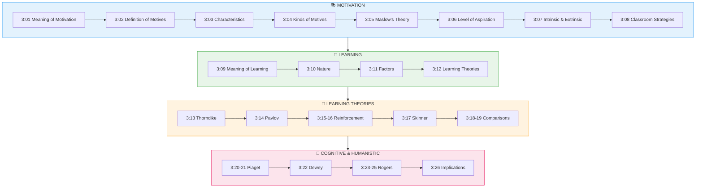

# 3:00 Introduction

!!! abstract "Section Overview"
    This introduction provides an overview of **Unit III: Motivation and Learning**, covering the essential concepts of motivation, types of motives, learning theories, and their educational implications.

---

## 📋 Unit III Overview

In this unit, the following topics are taken up for detailed discussion:

### **Motivation Topics**

| Section | Topic | Focus |
|---------|-------|-------|
| 3:01 | **Meaning and Definition of Motivation** | Understanding what motivation is |
| 3:02 | **Definition of Motives** | Biological, social and learned factors |
| 3:03 | **Characteristics of Motivation** | Key features of motivated behaviour |
| 3:04 | **Kinds of Motives** | Primary and secondary motives |
| 3:05 | **Maslow's Theory of Hierarchical Needs** | Need hierarchy and educational implications |
| 3:06 | **Level of Aspiration** | Goal setting and achievement |
| 3:07 | **Intrinsic and Extrinsic Motives** | Internal vs external motivation |
| 3:08 | **Motivational Strategies in the Classroom** | Techniques for classroom motivation |

### **Learning Topics**

| Section | Topic | Focus |
|---------|-------|-------|
| 3:09 | **Meaning and Definition of Learning** | What is learning? |
| 3:10 | **Nature of Learning** | Characteristics of learning |
| 3:11 | **Factors Influencing Learning** | What affects learning |
| 3:12 | **Two Major Classifications of Learning Theories** | Association vs Field theories |
| 3:13 | **Thorndike's Connectionism** | Trial and error learning |
| 3:14 | **Pavlov's Classical Conditioning** | Stimulus substitution |
| 3:15-3:16 | **Concept of Reinforcement** | Positive and negative reinforcers |
| 3:17 | **Skinner's Operant Conditioning** | Response modification |
| 3:18-3:19 | **Comparisons** | Classical vs Operant; Reinforcement vs Feedback |
| 3:20-3:21 | **Jean Piaget's Theory** | Cognitive development stages |
| 3:22 | **John Dewey's Constructivism** | Knowledge construction |
| 3:23-3:25 | **Carl Rogers' Humanistic Theory** | Fully functioning person |
| 3:26 | **Educational Implications** | Application of learning theories |

---

## 🗺️ Topic Connection Map

---

## 🎯 Learning Outcomes

By the end of this unit, you will be able to:

1. **Define** motivation and explain its role in learning
2. **Describe** different kinds of motives (primary and secondary)
3. **Explain** Maslow's hierarchy of needs and its educational implications
4. **Differentiate** between intrinsic and extrinsic motivation
5. **Apply** motivational strategies in classroom settings
6. **Define** learning and describe its characteristics
7. **Identify** factors that influence learning
8. **Compare** Association and Field theories of learning
9. **Explain** Thorndike's, Pavlov's, and Skinner's theories with experiments
10. **Describe** Piaget's stages of cognitive development
11. **Understand** Dewey's constructivism and Rogers' humanistic approach
12. **Apply** learning theories in educational practice

---

> **Bridge →** Now let's begin with understanding what motivation means and why it is fundamental to all behaviour including learning...
