# 3:01 Meaning and Definition of Motivation

!!! abstract "Section Overview"
    This section explores the **meaning and definition of motivation**, explaining how it is the process of arousing, maintaining, and controlling interest in goal-directed behaviour, and why it is basic to all behaviour including learning.

---

## 📋 What is Motivation?

!!! quote "Definition"
    **Motivation** is the process of **arousing**, **maintaining**, and **controlling interest** in a goal-directed pattern of behaviour.

### Key Points

| Aspect | Description |
|--------|-------------|
| **Basic to** | All behaviour including learning |
| **Concerned with** | The **'why'** of behaviour |
| **Determines** | Success in life and learning |
| **Function** | Stimulates and directs behaviour |

---

## 🎯 Role of Motivation in Activities

```mermaid
flowchart TB
    subgraph GOOD["✅ Good Motivation"]
        G1[Develop Interest in Activity]
        G2[Feel Urge to Do It]
        G3[Pay Attention]
        G4[Quick & Efficient Performance]
    end
    
    subgraph POOR["❌ Poor Motivation"]
        P1[Activity Feels Forced]
        P2[Haphazard Learning]
        P3[Minimum Attention]
        P4[Many Mistakes & Poor Performance]
    end
    
    style GOOD fill:#e8f5e9,stroke:#4caf50
    style POOR fill:#ffebee,stroke:#f44336
```

### Comparison: Good vs Poor Motivation

| Aspect | Good Motivation | Poor Motivation |
|--------|-----------------|-----------------|
| **Interest** | Develops naturally | Feels forced |
| **Urge** | Strong urge to do it | Against desire |
| **Attention** | Full attention | Minimum attention |
| **Learning** | Systematic learning | Haphazard learning |
| **Mistakes** | Few errors | Plenty of mistakes |
| **Performance** | Quick and efficient | Poor performance |

---

## 📚 Expert Definition

!!! quote "Crow and Crow's Definition"
    "Motivation is considered with the **arousal of the interest in learning** and to the extent is **basic to learning**."

---

## 🎯 The Achievement Gap

!!! note "Key Points 📌"
    The most important reason for the **gap between pupil's potential and current level of achievement** lies in the area of **motivation**.

---

## 👨‍🏫 Importance for Teachers

Understanding motivation helps teachers in:

| Function | Benefit |
|----------|---------|
| **Nature of motivation** | Understand what drives students |
| **Types of motivation** | Know different motivational approaches |
| **Innovative ability** | Use motivating influences effectively |
| **Foster pupils' learning** | Help each pupil maximize their talents |
| **Know pupils' appetites and desires** | Become sensitive to pupils' needs |

---

## 🧠 Memory Mnemonic

!!! tip "Exam Tip 📝"
    Remember **"ARM-G"** for Motivation:
    
    - **A**rousing interest
    - **R**etaining/maintaining interest
    - **M**otivation controls behaviour
    - **G**oal-directed pattern

---

## ❓ Review Questions

1. What is meant by Motivation? Define it. **(C)** [Ans. 3:01]
2. What do you understand by Motivation? Explain the various kinds of Motivation. **(A)** [Ans. 3:01 + 3:07]

---

> **Bridge →** Having understood motivation, let's now explore what **motives** are and how they initiate, sustain, and stop goal-directed behaviour...
