# 3:03 Characteristics of Motives

!!! abstract "Section Overview"
    This section outlines the **six key characteristics of motivation** derived from analysing various psychologists' definitions, explaining how motivation functions as a psychological process directed towards goals.

---

## 📋 Key Characteristics of Motivation

By analysing the definitions of motivation given by different psychologists, we can infer the following characteristics:

```mermaid
flowchart TB
    subgraph CHARACTERISTICS["📌 Six Characteristics of Motivation"]
        direction TB
        C1["1️⃣ Psychological Process<br/>(Internal)"]
        C2["2️⃣ Initiated by Need/Want"]
        C3["3️⃣ Directs Efforts<br/>Towards Goal"]
        C4["4️⃣ Energy Mobilisation"]
        C5["5️⃣ Sustains Attention"]
        C6["6️⃣ Restlessness Stops<br/>After Goal Achievement"]
    end
    
    C1 --> C2 --> C3 --> C4 --> C5 --> C6
    
    style CHARACTERISTICS fill:#e3f2fd,stroke:#2196f3
```

---

## 📊 Detailed Characteristics Table

| # | Characteristic | Description |
|---|----------------|-------------|
| **i** | **Psychological Process** | Motivation is an internal process |
| **ii** | **Need-Initiated** | This internal process is initiated by some **need** or **want** |
| **iii** | **Goal-Directed** | It directs our efforts towards the goal that satisfies the need; helps us **select the appropriate behaviour** to reach the goal |
| **iv** | **Energy Mobilisation** | It brings **energy mobilisation** in us |
| **v** | **Sustained Attention** | It helps to **sustain attention** in one's efforts or task |
| **vi** | **Goal Satisfaction** | Restlessness to achieve the goal **stops after the goal is reached** |

---

## 🔄 The Motivation Process Flow

---

## 🌾 Analogy: The Farmer

!!! example "Example"
    Motivation **creates interest in learners** just as **a farmer develops interest in his farming**. It energises man to act and to make **constant efforts** in order to satisfy his basic motive.

---

## 🧠 Memory Mnemonic

!!! tip "Exam Tip 📝"
    Remember **"PINES-R"** for Characteristics of Motivation:
    
    - **P**sychological process (internal)
    - **I**nitiated by need/want
    - **N**avigates towards goal (directs efforts)
    - **E**nergy mobilisation
    - **S**ustains attention
    - **R**estlessness stops after goal achievement

---

## 📝 Quick Revision

| Characteristic | Key Word |
|----------------|----------|
| Internal process | **Psychological** |
| Started by | **Need/Want** |
| Directs to | **Goal** |
| Provides | **Energy** |
| Maintains | **Attention** |
| Ends when | **Goal reached** |

---

## ❓ Review Questions

1. Mention the characteristics of Motives. **(C)** [Ans. 3:03]

---

> **Bridge →** Having understood the characteristics of motivation, let's now explore the different **kinds of motives** - primary and secondary...
